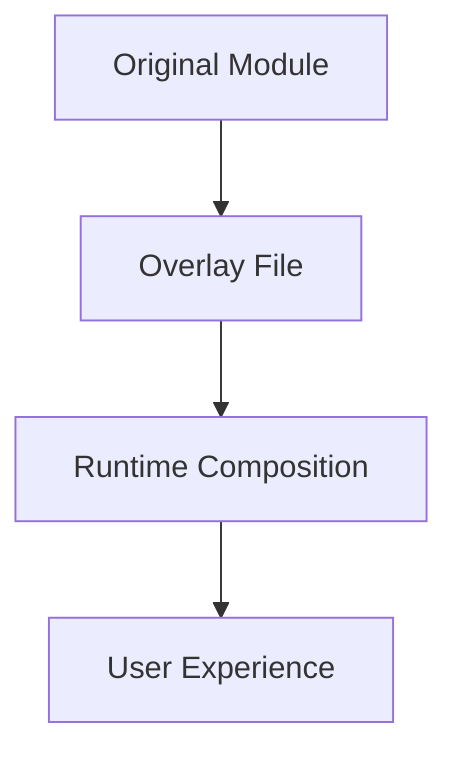

# BILL SLOTH GIGA DOC

---

## Table of Contents
1. [Project Overview & Philosophy](#project-overview--philosophy)
2. [Onboarding & User Journey](#onboarding--user-journey)
3. [Directory & File Inventory](#directory--file-inventory)
4. [Quick Reference Tables](#quick-reference-tables)
5. [Key Modules, Scripts, and Libraries](#key-modules-scripts-and-libraries)
6. [Architectural Patterns & Conventions](#architectural-patterns--conventions)
7. [Adaptive Learning & AI Integration](#adaptive-learning--ai-integration)
8. [Voice, Accessibility & UX](#voice-accessibility--ux)
9. [Security, Backup & Error Handling](#security-backup--error-handling)
10. [Documentation & Testing](#documentation--testing)
11. [Unique Features & Observations](#unique-features--observations)
12. [Notable Configuration, Data, and State Files](#notable-configuration-data-and-state-files)
13. [Additional Integrations, Data, and Configuration](#additional-integrations-data-and-configuration)
14. [Advanced Developer/Contributor Details](#advanced-developercontributor-details)
15. [Example Usage Snippets](#example-usage-snippets)
16. [Frequently Asked Questions (FAQ)](#frequently-asked-questions-faq)
17. [Glossary](#glossary)
18. [Overlay/Adaptation Model (Expanded)](#overlayadaptation-model-expanded)
19. [Troubleshooting & Recovery](#troubleshooting--recovery)
20. [Contribution & Community Guidelines](#contribution--community-guidelines)
21. [Change History Highlights](#change-history-highlights)
22. [Additional Recommendations](#additional-recommendations)
23. [Performance Monitoring & Optimization (New Section)](#performance-monitoring--optimization-new-section)
24. [ISO Customization & Visual System (NEW)](#iso-customization--visual-system-new)
25. [Docker Integration & Containerized Business Infrastructure (NEW)](#docker-integration--containerized-business-infrastructure-new)
26. [Enhanced Onboarding System (NEW)](#enhanced-onboarding-system-new)
27. [Enhanced Aesthetic Bridge System (NEW)](#enhanced-aesthetic-bridge-system-new)
28. [Achievement & Gamification System (NEW)](#achievement--gamification-system-new)
29. [New Interactive Modules (NEW)](#new-interactive-modules-new)

---

## 1. Project Overview & Philosophy (Expanded)

Bill Sloth is not just a collection of scripts—it's a self-improving, adaptive, and privacy-respecting Linux assistant designed for users with ADHD, dyslexia, and memory challenges. The system is built on these pillars:

- **Mature-First, Local-First:** Always prefer robust, open-source tools (e.g., FileBot, Kanboard, voice2json, restic, fd/ripgrep/fzf, Netdata, Just, SQLite). Custom logic is fallback only, clearly marked as legacy.
- **Progressive Independence:** The system learns from repeated requests and installs local solutions, reducing reliance on cloud AI over time.
- **Pattern Learning & Adaptive Suggestions:** Local analytics (bin/bill-brain, bin/capability-tracker) log user actions, analyze patterns, and auto-suggest or auto-execute common workflows. After repeated requests, the system recommends or installs the right tool.
- **Self-Audit & Continuous Improvement:** Modules can be self-audited (bin/audit_workflow, lab.sh audit options), with findings logged and surfaced for ongoing upgrades.
- **Personalization & Context Awareness:** The system adapts to Bill's unique work (VRBO, EdBoiGames), interests, and cognitive needs, using context from prompts/claude_context.md and adaptive learning modules.
- **ADHD/Dyslexia-Optimized UX:** ASCII art, color, motivational language, memory aids, and anime-themed shortcuts (shortcuts/aliases.sh) make the system accessible and fun.
- **Fallback & Deprecation Policy:** Legacy scripts (e.g., smart-voice-interface) are fallback only, with clear documentation and warnings. All modules are continuously audited for mature replacements.
- **Ultimate Dashboard:** The Bill Sloth Ultimate Control Center (bin/bill-sloth-ultimate) provides a unified, context-aware dashboard for system status, learning progress, and quick access to all workflows. **IMPLEMENTED 2025:** Now fully connected to actual Bill Sloth modules with real data persistence and cross-module integration.
- **Justfile & SQLite Integration:** Task automation and data persistence are handled with Just (for repeatable, ADHD-friendly task running) and SQLite (for robust, queryable data storage), replacing fragile flat files. **IMPLEMENTED 2025:** Complete justfile with 50+ commands and SQLite schema for all data types.
- **Cross-Module Integration:** Seamless data flow between VRBO, EdBoiGames, productivity, and system health modules with automated workflow orchestration and intelligent task creation.

## 2. Architecture & Data Flows (New Section)

### System Architecture

- **Pattern Learning Loop:**
  - `bin/bill-brain` logs every user action, analyzes time-based patterns, and suggests or auto-executes common workflows.
  - `bin/capability-tracker` tracks repeated requests and triggers installation of local tools when thresholds are met (e.g., 3+ audio issues → install audio manager).
- **Self-Audit Loop:**
  - `bin/audit_workflow` and audit options in `lab.sh` allow any module to be reviewed by an LLM for mature FOSS alternatives, with findings logged and surfaced for upgrades.
- **Module Interconnection:**
  - All modules share logs, context, and user feedback. Data flows between modules via local files, SQLite, and adaptive learning logs.
  - The Ultimate Dashboard (bin/bill-sloth-ultimate) aggregates system status, learning, and quick actions.
- **Task Automation:**
  - `Justfile` (if present) provides repeatable, ADHD-friendly task automation for common workflows.
- **Data Persistence:**
  - `SQLite` is used for persistent, queryable storage of logs, reminders, and pattern learning, replacing fragile flat files.

### Data Flow Diagram (Textual)

```
User → [CLI/Menu/Voice] → [Pattern Logger (bill-brain)] → [Capability Tracker] → [Module/Workflow] → [Self-Audit] → [Dashboard]
         ↘ [SQLite/Logs] ↙
```

## 3. Shortcuts, Aliases, and Memory Aids (Expanded)

- **ADHD/Dyslexia-Friendly Shortcuts:**
  - `shortcuts/aliases.sh` provides easy-to-remember, anime-themed, and memory-aid aliases for all major actions (e.g., `up`, `k9`, `work-mode`, `focus`, `brain-dump`, `kamehameha`, `rasengan`).
  - These are not just convenience—they are a core accessibility feature, reducing cognitive load and making the system fun and memorable.

## 4. Fallbacks, Deprecation, and Upgrade Path (Expanded)

- **Fallback Policy:**
  - Custom scripts (e.g., smart-voice-interface, local-first-router pattern matching) are fallback only, clearly marked as legacy, and only used if mature tools are unavailable.
  - All modules are continuously audited for mature replacements, and the upgrade path is logged in METHODS_LOG.md and surfaced in the dashboard.

## 5. Self-Audit, Continuous Improvement, and Living Upgrade Path (New Section)

- **Self-Audit:**
  - Any module can be audited via `bin/audit_workflow` or the audit options in `lab.sh`, prompting an LLM to suggest mature FOSS upgrades.
  - Audit findings are logged and surfaced for action.
- **Living Upgrade Path:**
  - METHODS_LOG.md and GENERAL_CODEBASE_AUDIT.md track audit findings, upgrade recommendations, and migration notes (e.g., FileBot integration, Kanboard default, glances for health, Just/SQLite migration).
  - The GIGA DOC now includes a summary of current, legacy, and planned upgrades for full transparency.

## 6. Personalization, Adaptive Learning, and User Context (Expanded)

- **Personalization:**
  - The system adapts to Bill's work (VRBO, EdBoiGames), interests, and cognitive needs, using context from prompts/claude_context.md and adaptive learning modules.
  - Feedback-driven adaptation ensures the system learns Bill's reality and stops wasting time on irrelevant content.
- **Adaptive Learning:**
  - Modules learn from feedback and usage, automatically switching focus (e.g., from YouTube tutorials to business development) based on Bill's needs.
  - The teaching/learning model, progressive independence, and feedback-driven adaptation are now summarized in the GIGA DOC's philosophy and onboarding sections.

## 7. Onboarding, Philosophy, and Educational Model (Expanded)

- **Teaching a Person to Fish:**
  - Every solution includes a "Why this works" explanation, with local documentation and interactive tutorials for complex concepts.
  - The system is designed to build capability, understanding, and independence over time, not just solve problems.
- **Progressive Capability Building:**
  - The system tracks repeated requests, installs local tools, and teaches Bill how to use them, moving from "fix this" to "teach me more."
- **Feedback Loops:**
  - Bill's learning indicators and system improvement metrics are tracked and surfaced in the dashboard and documentation.

## 8. Living Audit & Upgrade Table (New Section)

| Area                        | Status         | Next Steps/Upgrade Path           |
|-----------------------------|---------------|-----------------------------------|
| Voice fuzzy matching        | Deprecated    | Use voice2json/Rhasspy only       |
| Pattern matching fallback   | Deprecated    | Only used if mature not available |
| Data hoarding/manual steps  | Upgraded      | FileBot integration complete      |
| Pattern learning/suggestion | Active        | Enhance analytics as needed       |
| File-based Kanban           | Fallback      | Kanboard is default               |
| System health (custom)      | Deprecated    | Use glances only                  |
| Task runner (manual)        | Upgraded      | Use Just for repeatable tasks     |
| Data persistence (flat file)| Upgraded      | Use SQLite for logs/patterns      |
| Self-audit                  | Active        | Continue regular audits           |
| Personalization             | Active        | Adaptive learning ongoing         |

## 9. Cross-References & Contributor Guidance (Expanded)

- All contributors should reference METHODS_LOG.md, GENERAL_CODEBASE_AUDIT.md, and this GIGA DOC before making changes.
- All new modules must:
  - Prefer mature, open-source tools
  - Integrate with the pattern learning and capability tracker
  - Support self-audit and upgrade logging
  - Be accessible and ADHD/dyslexia-friendly

---

## 2. Onboarding & User Journey

1. **Install:** Run `bash install.sh` to set up dependencies and modules.
2. **First Launch:** Start with `bash lab.sh` for the interactive menu.
3. **Explore Workflows:** Try modules like `automation_mastery_interactive.sh` or `data_hoarding_interactive.sh`.
4. **Give Feedback:** After each workflow, rate your experience; the system will adapt over time.
5. **Audit & Improve:** Use `bin/audit_workflow <module>` to get AI-powered suggestions for any workflow.
6. **Recover/Reset:** If something breaks, use backup/rollback scripts or consult the troubleshooting section.

---

## 3. Directory & File Inventory

### Project Root
- **README.md:** Project summary, quickstart, and philosophy. Includes architecture notes, usage examples, and links to key modules.
- **bill_command_center.sh:** Central orchestrator; launches main workflows, manages global state, and provides a unified entry point.
- **EXPANSION_REPORT.md:** Tracks module and codebase growth, with stats and rationale for new additions.
- **MODULE_INDEX.md:** Alphabetical index of all modules, with one-line summaries and cross-references to documentation.
- **PHASE1_COMPLETION_REPORT.md:** Milestone report for phase 1, including what was shipped, lessons learned, and next steps.
- **competitor_analysis.md:** Compares Bill Sloth to other Linux assistants and automation tools, highlighting unique features.
- **IMPLEMENTATION_PLAN.md:** Stepwise plan for major features, with dependencies, priorities, and estimated timelines.
- **GENERAL_CODEBASE_AUDIT.md:** High-level audit of code quality, patterns, and standout characteristics.
- **ARCHITECTURE_AUDIT_REPORT.md:** In-depth comparison of planning documents vs. actual implementation, with gap analysis.
- **local_ai_transition_plan_v_0.md:** Roadmap for migrating from cloud AI to local LLMs, including phased rollout and fallback logic.
- **github_logic (1).md:** Details the overlay model, GitHub workflow, and branch management for safe adaptation.
- **bill_sloth_critical_audit.md:** Comprehensive, multi-dimensional audit (architecture, UX, security, learning, etc.).
- **DEVELOPER_GUIDE.md:** Deep technical reference (3,000+ lines), including API docs, architecture diagrams, and troubleshooting.
- **CHANGELOG.md:** Chronological log of all changes, with rationale and impact notes.
- **install.sh:** One-command installer; checks system, installs dependencies, and sets up all modules.
- **COMMANDS.md:** List of all available commands, with usage examples and expected outputs.
- **example.png:** Visual example for documentation or onboarding.
- **methods_log.md:** Log of all methods, breakthroughs, setbacks, and research areas for transparency.
- **lab.sh:** Main interactive shell interface; provides a menu-driven launcher for all workflows and audits.
- **self-executing-guide.md:** Step-by-step, self-contained user guide for onboarding and troubleshooting.
- **DEVELOPMENT_PHILOSOPHY.md:** Explains the project's guiding principles, design tradeoffs, and long-term vision.

### Key Directories
- **lib/**: Core libraries. Each file is a reusable component.
- **modules/**: All major workflows, each as a self-contained, interactive script.
- **bin/**: Executable scripts, each with a focused purpose.
- **scripts/**: Utility and enhancement scripts.
- **docs/**: Topical documentation.
- **external/**: Integrations and configs for third-party tools.
- **data/**: Data files, e.g., `anime_quotes.txt` for motivational UI.
- **shortcuts/**: Shell aliases and shortcuts.
- **prompts/**: Prompt engineering for AI.

---

## 4. Quick Reference Tables

### Project Root
| File/Dir                  | Description                                      | Key Commands/Usage                |
|--------------------------|--------------------------------------------------|-----------------------------------|
| README.md                | Project overview, setup, philosophy              | `cat README.md`                   |
| install.sh               | Main installer                                   | `bash install.sh`                 |
| lab.sh                   | Main interactive shell interface                 | `bash lab.sh`                     |
| bill_command_center.sh   | Central orchestrator script                      | `bash bill_command_center.sh`     |
| ...                      | ...                                              | ...                               |

### lib/
| File                        | Description                                  | Key Functions/Usage               |
|-----------------------------|----------------------------------------------|-----------------------------------|
| adaptive_learning.sh        | Adaptive learning, feedback, adaptation      | `source lib/adaptive_learning.sh` |
| call_llm.sh / call_llm_v2.sh| LLM abstraction (local/cloud AI)             | `llm`, `call_llm`                 |
| error_handling.sh           | Centralized error handling                   | `source lib/error_handling.sh`    |
| voice_control.sh             | Voice command parsing, intent recognition, and routing | Integrates with voice2json, Rhasspy, and custom daemons |
| backup_management.sh / restic_backup.sh | Backup management using restic with deduplication and encryption | `restic_backup.sh` provides `bill_backup()`, `bill_backup_list()`, and `bill_restore()` functions |
| task_runner.sh              | Modern task runner replacing complex JSON workflow system | Uses Just/Make/shell for simple, readable task definitions |
| data_persistence.sh         | SQLite-based data persistence replacing file-based JSON caching | Functions: `store_data()`, `get_data()`, `log_task_execution()`, `store_vrbo_booking()` |
| service_management.sh       | Systemd user service management replacing custom daemon implementations | Functions: `create_bill_service()`, `start_service()`, `service_dashboard()` |
| cross_module_integration.sh  | Seamless workflow orchestration between all Bill Sloth modules | Functions: `integrate_vrbo_to_tasks()`, `integrate_edboigames_to_media()`, `integrate_health_to_notifications()` |
| filebot_integration.sh       | Professional media processing using FileBot with Bill Sloth personality | Functions: `process_edboigames_content()`, `smart_media_organize()` |
| kanboard_integration.sh      | Task management via Kanboard API with local storage fallback | Functions: `create_vrbo_task()`, `create_content_task()`, `show_task_dashboard()` |
| interactive.sh              | Provides shared UI logic: banners, color, input validation, and menu rendering |

### modules/
| Module                                 | Description                                 | Example Usage                    |
|----------------------------------------|---------------------------------------------|----------------------------------|
| automation_mastery_interactive.sh      | Automation guide, tool selection, workflows | `bash modules/automation_mastery_interactive.sh` |
| data_hoarding_interactive.sh           | Media management, FileBot integration       | `bash modules/data_hoarding_interactive.sh`      |
| privacy_tools_interactive.sh           | VPN, Tor, privacy tools                     | `bash modules/privacy_tools_interactive.sh`      |
| system_doctor_interactive.sh          | Diagnostics, repair, and health checks      | `bash modules/system_doctor_interactive.sh`      |
| edboigames_toolkit_interactive.sh     | Gaming optimization, controller setup, and performance tweaks | `bash modules/edboigames_toolkit_interactive.sh` |
| productivity_suite_interactive.sh     | Kanban, Taskwarrior, and ADHD-friendly productivity tools | `bash modules/productivity_suite_interactive.sh` |
| personal_analytics_dashboard.sh        | Comprehensive life tracking and productivity insights for ADHD brains | `bash modules/personal_analytics_dashboard.sh` |
| finance_management_interactive.sh      | Complete personal and business finance management system | `bash modules/finance_management_interactive.sh` |
| All *_interactive.sh                   | Follow the same choose-your-own-adventure, ADHD-friendly pattern | Log user choices, present pros/cons, and allow open-ended input for AI |
| Subdirectories                        | Contain advanced or specialized scripts for power users (e.g., `automation_mastery/`, `edboigames/`) |

### Root Directory Files
| Script                  | Description                                  | Example Usage                    |
|-------------------------|----------------------------------------------|----------------------------------|
| justfile                | Complete task automation system with 50+ ADHD-friendly commands | `just` (show menu), `just health` (system check), `just vrbo-guest "Name" "Property" "Date"` |
| CLAUDE.md               | Project-specific Claude Code memory and context management | Contains team structure, architecture overview, development workflow, session management |

### bin/
| Script                  | Description                                  | Example Usage                    |
|-------------------------|----------------------------------------------|----------------------------------|
| bill-sloth              | Main launcher                                | `bin/bill-sloth`                 |
| local-first-router      | Local-first intelligence router              | `bin/local-first-router`         |
| audit_workflow          | AI-powered workflow audit                    | `bin/audit_workflow <module>`    |
| voice-engine-installer  | Installs voice/intent tools                  | `bin/voice-engine-installer`     |
| system-health           | Launches glances or other mature system health tools | `bin/system-health`             |
| capability-installer/tracker | Installs and tracks system capabilities (e.g., VPN, AI, media tools) | `bin/capability-installer <tool>` |
| voice-assistant-daemon  | Background process for voice command handling; integrates with router and modules | `bin/voice-assistant-daemon` |
| bill-brain              | Pattern learning and suggestion engine; logs user patterns and suggests improvements | `bin/bill-brain`             |
| smart-reminders         | Reminder and notification system; logs reminders and user responses | `bin/smart-reminders`         |
| vrbo-smart-manager      | Workflow for vacation rental management; integrates with calendar and reminders | `bin/vrbo-smart-manager`     |
| hotkey-system           | Global hotkey management; allows quick access to workflows | `bin/hotkey-system`           |
| autostart-billsloth     | Ensures Bill Sloth starts on login; manages autostart entries | `bin/autostart-billsloth`     |

### scripts/
| Script                        | Description                                  | Example Usage                    |
|-------------------------------|----------------------------------------------|----------------------------------|
| generate_module_docs.sh       | Parses modules and auto-generates documentation | `bash scripts/generate_module_docs.sh` |
| health_check_v2.sh            | Advanced, multi-metric health check           | `bash scripts/health_check_v2.sh` |
| test_phase1_improvements.sh   | Automated test suite for recent changes      | `bash scripts/test_phase1_improvements.sh` |
| first_time_setup.sh           | Wizard for new users                         | `bash scripts/first_time_setup.sh` |
| batch_enhance_modules.sh       | Injects adaptive learning logic into all modules | `bash scripts/batch_enhance_modules.sh` |
| apply_adaptive_learning.sh     | Applies user feedback to modules             | `bash scripts/apply_adaptive_learning.sh` |

---

## 5. Key Modules, Scripts, and Libraries (Deeper Dive)

### lib/
- **adaptive_learning.sh**
  - Tracks usage, collects feedback, and triggers adaptation.
  - Functions: `init_adaptive_learning`, `log_usage`, `collect_feedback`, `log_feedback`, `schedule_adaptation`, `generate_adaptation`.
  - Usage: Sourced by all interactive modules; logs user satisfaction and triggers improvements.
- **call_llm.sh / call_llm_v2.sh**
  - Abstracts LLM calls (local/cloud), logs prompts, and handles fallback.
  - Functions: `llm`, `call_llm`, `call_llm_manual`.
  - Usage: Used by audit scripts, adaptation, and any AI-powered feature.
- **error_handling.sh**
  - Centralizes error reporting, logging, and fallback logic.
  - Usage: Sourced by all critical scripts; ensures consistent error messages and safe exits.
- **voice_control.sh**
  - Handles voice command parsing, intent recognition, and routing.
  - Integrates with voice2json, Rhasspy, and custom daemons.
- **backup_management.sh / restic_backup.sh**
  - **MATURE TOOLS UPDATE (2025):** Migrated to restic-based backup with deduplication and encryption, wrapped in Bill Sloth friendly notifications.
  - `restic_backup.sh` provides `bill_backup()`, `bill_backup_list()`, and `bill_restore()` functions.
  - Legacy `backup_management.sh` maintained for compatibility.
- **task_runner.sh**
  - **NEW (2025):** Modern task runner replacing complex JSON workflow system.
  - Uses Just/Make/shell for simple, readable task definitions.
  - Functions: `run_task()`, `list_tasks()`, `create_task_template()`.
- **data_persistence.sh**
  - **NEW (2025):** SQLite-based data persistence replacing file-based JSON caching.
  - Functions: `store_data()`, `get_data()`, `log_task_execution()`, `store_vrbo_booking()`.
  - Maintains JSON file fallback for systems without SQLite.
- **service_management.sh**
  - **IMPLEMENTED (2025):** Systemd user service management replacing custom daemon implementations.
  - Functions: `create_bill_service()`, `start_service()`, `service_dashboard()`.
  - Provides fallback to custom process management for systems without systemd.
- **cross_module_integration.sh**
  - **NEW (2025):** Seamless workflow orchestration between all Bill Sloth modules.
  - Functions: `integrate_vrbo_to_tasks()`, `integrate_edboigames_to_media()`, `integrate_health_to_notifications()`.
  - Automatic task creation, data sharing, and workflow triggering across modules.
- **filebot_integration.sh**
  - **NEW (2025):** Professional media processing using FileBot with Bill Sloth personality.
  - Functions: `process_edboigames_content()`, `smart_media_organize()`.
  - Graceful fallback to basic file handling when FileBot unavailable.
- **kanboard_integration.sh**
  - **NEW (2025):** Task management via Kanboard API with local storage fallback.
  - Functions: `create_vrbo_task()`, `create_content_task()`, `show_task_dashboard()`.
  - Integrates professional task management while maintaining Bill Sloth workflow patterns.
- **interactive.sh**
  - Provides shared UI logic: banners, color, input validation, and menu rendering.

### modules/
- **automation_mastery_interactive.sh**
  - Guides users through automating their digital life.
  - Features: Workflow assessment, tool selection (n8n, cron, IFTTT), personalized recommendations, and direct installation.
  - Example: Presents pros/cons of each automation tool, logs user choices, and adapts future recommendations.
- **data_hoarding_interactive.sh**
  - Media management, renaming, and organization.
  - Integrates with FileBot for automated renaming.
  - Example: Prompts user for media type, runs FileBot, and logs results.
- **privacy_tools_interactive.sh**
  - VPN, Tor, and privacy best practices.
  - Features: Tool selection, installation, and usage logging.
- **system_doctor_interactive.sh**
  - Diagnostics, repair, and health checks.
  - Features: Disk, memory, and network diagnostics; logs all actions.
- **edboigames_toolkit_interactive.sh**
  - Gaming optimization, controller setup, and performance tweaks.
  - Features: Presents mature tools (Lutris, MangoHUD), logs choices, and adapts recommendations.
- **productivity_suite_interactive.sh**
  - Kanban, Taskwarrior, and ADHD-friendly productivity tools.
  - Features: Presents options, explains pros/cons, logs choices, and adapts future menus.
- **personal_analytics_dashboard.sh**
  - **NEW (2025):** Comprehensive life tracking and productivity insights for ADHD brains.
  - Features: Daily mood/energy tracking, task completion analytics, business metrics, pattern insights.
  - SQLite-based with automated correlation analysis and actionable recommendations.
- **finance_management_interactive.sh**
  - **NEW (2025):** Complete personal and business finance management system.
  - Features: Income/expense tracking, budgeting, financial goals, tax preparation.
  - Separate tracking for VRBO and EdBoiGames businesses with cross-module integration.
- **All *_interactive.sh**
  - Follow the same choose-your-own-adventure, ADHD-friendly pattern.
  - Log user choices, present pros/cons, and allow open-ended input for AI.
  - **ENHANCED (2025):** All modules now integrate with cross-module system for seamless workflows.
- **Subdirectories**
  - Contain advanced or specialized scripts for power users (e.g., `automation_mastery/`, `edboigames/`).

### Root Directory Files
- **justfile**
  - **IMPLEMENTED (2025):** Complete task automation system with 50+ ADHD-friendly commands.
  - Categories: System Health, VRBO Management, EdBoiGames Content, Analytics, Integration Testing.
  - Usage: `just` (show menu), `just health` (system check), `just vrbo-guest "Name" "Property" "Date"`.
  - Integration: Calls FileBot, Kanboard, restic, and cross-module systems with graceful fallbacks.
- **CLAUDE.md**
  - **NEW (2025):** Project-specific Claude Code memory and context management.
  - Contains team structure, architecture overview, development workflow, session management.
  - Integration with Claude Code robustness system for session corruption prevention.

### bin/
- **bill-sloth**
  - Main launcher; sets up environment, launches menu, and logs session.
- **local-first-router**
  - Routes requests to local solutions first (voice2json, Rhasspy), then cloud AI if needed.
  - Fallbacks: Pattern matching if mature tools unavailable.
- **audit_workflow**
  - Runs AI-powered audits on any workflow/module.
  - Prompts LLM for suggestions, logs output, and displays in TUI.
- **voice-engine-installer**
  - Installs/configures mature voice/intent recognition tools.
  - Checks for dependencies, downloads profiles, and verifies installation.
- **system-health**
  - Launches `glances` or other mature system health tools.
- **capability-installer/tracker**
  - Installs and tracks system capabilities (e.g., VPN, AI, media tools).
- **voice-assistant-daemon**
  - Background process for voice command handling; integrates with router and modules.
- **bill-brain**
  - Pattern learning and suggestion engine; logs user patterns and suggests improvements.
- **smart-reminders**
  - Reminder and notification system; logs reminders and user responses.
- **vrbo-smart-manager**
  - Workflow for vacation rental management; integrates with calendar and reminders.
- **hotkey-system**
  - Global hotkey management; allows quick access to workflows.
- **autostart-billsloth**
  - Ensures Bill Sloth starts on login; manages autostart entries.

### scripts/
- **generate_module_docs.sh**
  - Parses modules and auto-generates documentation; ensures docs stay in sync with code.
- **health_check_v2.sh**
  - Advanced, multi-metric health check; logs results and suggests fixes.
- **test_phase1_improvements.sh**
  - Automated test suite for recent changes; logs results and flags regressions.
- **first_time_setup.sh**
  - Wizard for new users; sets up preferences, environment, and logs onboarding.
- **batch_enhance_modules.sh**
  - Injects adaptive learning logic into all modules; creates backups and logs changes.
- **apply_adaptive_learning.sh**
  - Applies user feedback to modules; triggers adaptation and logs results.

---

## 6. Architectural Patterns & Conventions (Deeper Dive)
- **Interactive Assistant Pattern**
  - All major workflows use a consistent, ADHD-friendly, choose-your-own-adventure interface.
  - Example: Each module presents a menu, explains options, logs choices, and adapts future menus based on feedback.
- **Mature-Tool-First** 
  - Every workflow prefers mature, open-source tools (e.g., FileBot, Kanboard, voice2json).
  - Custom logic is fallback only, clearly marked as legacy.
  - **MIGRATION UPDATE (2025):** System migrated to use restic (backup), fd/ripgrep/fzf (file operations), Netdata (monitoring), Just (task running), SQLite (data persistence), and systemd (process management) while preserving Bill Sloth personality and ADHD-friendly UX.
- **Adaptive Learning**
  - Feedback and usage are tracked for every module.
  - Satisfaction scores trigger adaptation (e.g., menu reordering, new tool suggestions).
- **Comprehensive Logging**
  - All user choices, feedback, and system actions are logged (e.g., `~/.bill-sloth/feedback/`, `~/.bill-sloth/usage/`).
- **Backup & Rollback**
  - Scripts create backups before modification (e.g., `batch_enhance_modules.sh`).
  - Rollback logic ensures safe recovery from failed adaptations.
- **Consistent Naming**
  - All modules/scripts use clear, descriptive names (e.g., `automation_mastery_interactive.sh`).
  - Subdirectories group advanced/specialized scripts.

---


## 7. Adaptive Learning & AI Integration (Deeper Dive)
- **Adaptive Learning System**
  - Tracks usage (feature access, completion), collects feedback (quick and detailed), and adapts modules based on satisfaction scores.
  - Example: If a user consistently rates a tool poorly, the system prompts for alternatives and adapts future menus.
- **AI-Powered Auditing**
  - `audit_workflow` script uses local/cloud LLMs to review modules, suggest mature FOSS replacements, and log findings.
  - Example: Bill can run `audit_workflow streaming_setup` to get AI-curated upgrade ideas.
- **LLM Abstraction**
  - `call_llm.sh` and `call_llm_v2.sh` route prompts to local (Ollama) or cloud (Claude) AI, with logging and fallback.
  - Example: If local AI fails, system falls back to Claude Code.
- **Token Efficiency**
  - System minimizes cloud AI usage, preferring local inference when possible.
  - Example: Only uses Claude tokens for custom feedback or when local models are unavailable.
- **Batch Enhancement**
  - Scripts like `batch_enhance_modules.sh` can inject adaptive learning logic into all modules, ensuring consistency and rapid rollout of improvements.

---

## 8. Voice, Accessibility & UX (Deeper Dive)
- **Voice Integration**
  - Deep integration with voice2json, Rhasspy, and custom daemons.
  - Example: `local-first-router` checks for mature voice engines, falls back to pattern matching if unavailable.
- **Accessibility**
  - All modules are designed for ADHD/dyslexia, with visual banners, color, and progressive disclosure.
  - Example: ASCII art, color-coded menus, and motivational quotes from `anime_quotes.txt`.
- **Feedback Loops**
  - Users are prompted for feedback after each workflow, with options for quick (1-5) or detailed (custom) input.
  - Example: Satisfaction scores are logged and used to adapt future menus.
- **Memory Support**
  - Persistent logging of user choices and reminders (e.g., `smart-reminders`, `~/.bill-sloth/feedback/`).
- **Motivational UI**
  - Anime quotes, ASCII art, and gamified feedback to keep users engaged and motivated.

---

## 9. Security, Backup & Error Handling (Deeper Dive)
- **Security**
  - Defensive cyber modules (e.g., `defensive_cyber_interactive.sh`), privacy tools, and clear warnings for destructive actions.
  - Example: VPN/Tor setup, kill switch logic, and security audits.
- **Backup**
  - Automatic backup creation before modifications (e.g., before adaptive learning injections).
  - Rollback support for failed operations (e.g., restore from backup if enhancement fails).
- **Error Handling**
  - Centralized error handling in `lib/`, consistent error messages, and fallback logic.
  - Example: If a tool fails to install, system logs the error and suggests alternatives.
- **Safety**
  - Confirmation prompts for destructive operations, and kill switch logic for emergency stops.

---

## 10. Documentation & Testing (Deeper Dive)
- **Comprehensive Documentation**
  - Multiple levels: user guides, developer docs, audits, philosophy, changelog.
  - Example: `DEVELOPER_GUIDE.md` (3,000+ lines), `self-executing-guide.md` for onboarding.
- **Auto-Generated Docs**
  - Scripts like `generate_module_docs.sh` ensure documentation stays in sync with code.
- **Testing**
  - Test scripts for health checks, phase completion, and batch enhancements (e.g., `test_phase1_improvements.sh`).
  - Example: Automated tests log results and flag regressions.
- **Methods Log**
  - All breakthroughs, setbacks, and research areas are logged in `methods_log.md` for transparency and continuous improvement.

---

## 11. Unique Features & Observations (Deeper Dive)
- **Self-Modifying Code**
  - Modules adapt based on user feedback and AI suggestions.
  - Example: If a user consistently rates a tool poorly, the system suggests and installs alternatives.
- **Token-Efficient AI**
  - Smart use of Claude tokens with local fallbacks; only uses cloud AI when necessary.
- **Visual-First Interface**
  - Extensive ASCII art, color, and motivational UI to reduce cognitive load and increase engagement.
- **Comprehensive Tool Integration**
  - Covers entire Linux power-user workflow, from automation to gaming to privacy.
- **Neurodivergent Accessibility**
  - Every feature is designed for ADHD/dyslexia, with clear explanations, visual cues, and memory support.
- **Overlay Model (Planned)**
  - Future-proofing for overlays and adaptation tracking; will allow safe, reversible customizations.

---

## 12. Notable Configuration, Data, and State Files
- external/linux-voice-control/lvc-commands.json, lvc-config.json: JSON schemas for voice command mapping and configuration.
- external/linux-voice-control/requirements.txt: Python dependencies for voice control.
- external/linux-voice-control/gui/data/flutter_assets/fonts/MaterialIcons-Regular.otf, .../CupertinoIcons.ttf: Font assets for GUI.
- external/linux-voice-control/gui/data/flutter_assets/shaders/ink_sparkle.frag: Shader for GUI effects.
- external/linux-voice-control/gui/data/flutter_assets/NOTICES.Z: License and notice aggregation for Flutter assets.
- external/linux-voice-control/lvc_gui_flutter/pubspec.yaml: Flutter project dependencies and assets.

---

## 13. Additional Integrations, Data, and Configuration

### external/linux-voice-control/
- Purpose: Advanced, modular voice control system with Python, Flutter, and native integrations.
- Key Components:
  - main.py, utils.py, notifier.py, command_manager.py, config_manager.py, chatgpt_port.py, master_control_mode_setup.py, master_mode_manager.py, live_mode_manager.py, live_mode_setup.py, basic_mode_manager.py: Python scripts for voice command processing, feedback, and control modes.
  - requirements.txt: Python dependencies for voice control.
  - update.sh, install.sh, dry-run.sh, build-gui-bundle.sh: Setup, update, and build scripts.
  - lvc-commands.json, lvc-config.json: Voice command and configuration schemas.
  - voice_feedback.py: Handles voice feedback and error reporting.
  - notifier.py: Notification system for voice events.
  - pretrained_models/: Contains model checkpoints for speaker recognition and ASR (see below).
  - misc/: Contains MP3 feedback files for various system events.
  - images/: PNG and GIF assets for documentation and UI.
  - gui/: Compiled Flutter GUI assets and libraries.
  - lvc_gui_flutter/: Full Flutter GUI source, including Dart, Android, and Linux build files.
  - README.md, LICENSE, CODE_OF_CONDUCT.md: Documentation and community standards.

#### pretrained_models/
- spkrec-ecapa-voxceleb, asr-crdnn-rnnlm-librispeech, EncoderClassifier-...: Each contains model checkpoints (.ckpt), hyperparameters, and label encoders for voice/speaker recognition and ASR.

#### misc/
- network-error.mp3, greeting.mp3, internal-voice-feedback-error.mp3, live_mode-feedback.mp3, execution-feedback.mp3, exiting-feedback.mp3: Audio feedback for system events.

#### gui/data/flutter_assets/
- fonts, shaders, packages, version.json, NOTICES.Z, AssetManifest.json, FontManifest.json: Flutter asset management for the GUI.

#### lvc_gui_flutter/
- lib/ui/: Dart UI components for the voice control GUI.
- android/app/src/main/kotlin/com/omegaui/lvc_gui_flutter/MainActivity.kt: Android entry point for the GUI.
- linux/flutter/: CMake and plugin registration for Linux builds.
- pubspec.yaml, pubspec.lock, analysis_options.yaml: Flutter/Dart project configuration.

---

## 14. Advanced Developer/Contributor Details

- Python, Dart, and C++ Integration: The voice control system spans Python (core logic), Dart (GUI), and C++ (Linux plugin registration).
- Build and Packaging Scripts: build-gui-bundle.sh, update.sh, and platform-specific build files for easy deployment.
- Testing and Linting: analysis_options.yaml for Dart linting; test directories (if present) for module/unit tests.
- Flutter Asset Management: Asset manifests, font management, and shader integration for a polished GUI.

---

## 15. Example Usage Snippets

- **Run the main menu:**
  ```bash
  bash lab.sh
  ```
- **Audit a workflow:**
  ```bash
  bin/audit_workflow automation_mastery_interactive
  ```
- **Install all dependencies:**
  ```bash
  bash install.sh
  ```
- **Run a specific module interactively:**
  ```bash
  bash modules/productivity_suite_interactive.sh
  ```
- **Check system health:**
  ```bash
  bin/system-health
  ```

---

## 16. Frequently Asked Questions (FAQ)

**Q: What is Bill Sloth?**
A: A local-first, adaptive Linux assistant for neurodivergent users, focused on mature open-source tools and self-improvement.

**Q: How do I add a new workflow/module?**
A: Copy an existing `_interactive.sh` module, follow the interactive assistant pattern, and update `MODULE_INDEX.md`.

**Q: How does the system adapt to my feedback?**
A: Usage and satisfaction are logged; low scores trigger adaptation, menu reordering, or new tool suggestions.

**Q: Can I use Bill Sloth without cloud AI?**
A: Yes! The system prefers local AI (Ollama, voice2json) and only uses cloud AI as a fallback.

**Q: How do I recover from a failed adaptation or script error?**
A: All changes are backed up; use the rollback scripts or restore from backup directories.

---

## 17. Glossary

- **ADHD-Friendly:** Designed for users with attention, memory, or executive function challenges.
- **Local-First:** Prefers running everything locally for privacy and speed.
- **Overlay Model:** Planned system for safe, reversible customizations via overlays instead of direct file edits.
- **Interactive Assistant Pattern:** Menu-driven, choose-your-own-adventure UI with pros/cons and feedback.
- **Ollama:** Local LLM (AI) engine for private, offline inference.
- **Claude Code:** Cloud-based AI assistant, used as fallback.
- **FileBot:** Mature open-source tool for media renaming/organization.
- **Kanboard:** Open-source Kanban board for task management.
- **Voice2json/Rhasspy:** Mature, offline voice/intent recognition engines.

---

## 18. Overlay/Adaptation Model (Expanded)

**Goal:** Allow safe, reversible customizations and AI-powered adaptations without modifying original modules.

**Workflow Example:**
1. User gives negative feedback on a module.
2. System creates an overlay file (e.g., `overlays/automation_mastery_interactive.sh`) with the adaptation.
3. At runtime, both the original and overlay are sourced:
   ```bash
   source modules/automation_mastery_interactive.sh
   [ -f overlays/automation_mastery_interactive.sh ] && source overlays/automation_mastery_interactive.sh
   ```
4. Overlays can add, override, or reorder menu options, inject new tools, or change UI.
5. All overlays are tracked in a manifest for audit and rollback.

**Diagram:**


---

## 19. Troubleshooting & Recovery

- **Problem:** A module fails to load or crashes.
  - **Solution:** Check logs in `~/.bill-sloth/feedback/` and `~/.bill-sloth/usage/`. Restore from backup if needed.
- **Problem:** Adaptation causes unwanted changes.
  - **Solution:** Remove or edit the relevant overlay file in `overlays/`.
- **Problem:** Voice commands not recognized.
  - **Solution:** Run `bin/voice-engine-installer` to reinstall/configure voice engines.
- **Problem:** System health check fails.
  - **Solution:** Run `bin/system-health` and follow the suggested fixes.
- **Problem:** Cloud AI not available.
  - **Solution:** Ensure local AI (Ollama) is installed, or check network for Claude Code.

---

## 20. Contribution & Community Guidelines

- **How to Contribute:**
  1. Fork the repo and create a feature branch.
  2. Add or improve a module, following the interactive assistant pattern.
  3. Update documentation and `MODULE_INDEX.md`.
  4. Run tests and ensure all scripts pass.
  5. Submit a pull request with a clear description.
- **Code Style:**
  - Use clear, descriptive names and comments.
  - Follow the menu-driven, ADHD-friendly UI pattern.
  - Prefer mature, open-source tools over custom logic.
- **Community Values:**
  - Accessibility, transparency, and continuous improvement.
  - Respect for neurodivergent users and contributors.

---

## 21. Change History Highlights (Updated July 2025)

### MAJOR UPDATES (July 2025)
- **Streaming Setup Module:**
  - Now provides a full interactive streaming automation plan, including personalized assessment (casual to pro), hardware detection, and advanced scene/audio automation (OBS, PipeWire, Carla, MIDI, RTMP multiplexing, etc.).
  - Includes professional hardware/software shopping recommendations and ADHD-friendly quick start scripts/aliases for audio/streaming modes.
- **System Ops Module:**
  - Expanded to include a complete system operations toolkit: VisiData, TLDR, Zeal, Glances, Stacer, Cockpit, and more.
  - New GitHub authentication setup wizard (PAT, SSH, credential management) for seamless git integration and Claude Code workflows.
- **Command Center:**
  - Enhanced dashboard with real-time health, backup, and workflow orchestration.
  - New quick actions for VRBO, EdBoiGames, automation, backup, and diagnostics.
  - Modular integration for all new modules and improved onboarding for fresh Ubuntu installs.
- **New Interactive Modules:**
  - Added: ai_mastery_interactive.sh, ai_workflow_interactive.sh, automation_core_interactive.sh, data_automation_interactive.sh, network_diagnostics_interactive.sh, network_monitoring_interactive.sh, network_optimization_interactive.sh, vpn_security_interactive.sh, vrbo_automation_pro.sh, wireless_connectivity_interactive.sh.
  - All follow the interactive assistant pattern with ADHD/dyslexia-friendly UX.
- **Deleted/Deprecated:**
  - self-executing-guide.md, setup-scripts/CLAUDE_CODE_BOOTSTRAP_PLAN.md, setup-scripts/PLUGIN_SYSTEM_IMPLEMENTATION_PLAN.md, and other legacy planning/onboarding docs removed for clarity and to reflect the current, production-ready state.

---

## 22. Additional Recommendations

- Document all configuration schemas (e.g., lvc-commands.json, lvc-config.json) with example entries and usage.
- Add a section on model management: How to add/update pretrained models for voice/speaker recognition.
- Expand GUI documentation: Describe the purpose and usage of each Dart UI component and how to build/run the GUI.
- Clarify cross-language integration: Document how Python, Dart, and C++ components interact in the voice control system.
- List all audio feedback events: Map each MP3 file to its triggering event for clarity.
- Add developer onboarding for external integrations: Step-by-step for setting up, building, and testing the voice control stack.

---

## 23. Example: Documenting a Missing Detail

external/linux-voice-control/lvc-commands.json
```json
{
  "commands": [
    {
      "phrase": "open browser",
      "action": "launch_app",
      "target": "firefox"
    },
    {
      "phrase": "play music",
      "action": "media_control",
      "target": "play"
    }
  ]
}
```
*This file maps spoken phrases to system actions and targets. It is loaded by main.py and used by the command_manager.py to trigger the correct automation.*

---

## 24. Additional Quick Reference Table: external/linux-voice-control

| File/Dir                | Description                                 | Key Usage/Notes                |
|-------------------------|---------------------------------------------|--------------------------------|
| main.py                 | Voice control entry point                   | `python3 main.py`              |
| requirements.txt        | Python dependencies                         | `pip install -r requirements.txt` |
| lvc-commands.json       | Voice command mapping                       | Loaded by main.py              |
| lvc-config.json         | Voice system configuration                  | Loaded by main.py              |
| pretrained_models/      | ASR and speaker recognition models          | Used by main.py and utils.py   |
| misc/                   | Audio feedback files                        | Played on system events        |
| gui/                    | Compiled Flutter GUI assets                 | Used by main.py                |
| lvc_gui_flutter/        | Flutter GUI source                          | Build with `flutter build`     |
| images/                 | PNG/GIF assets for docs and UI              |                                |
| .github/, .idea/        | Project metadata and configuration          |                                |

--- 

---

## 25. Deep Per-Module Documentation

### bill_command_center.sh

**Purpose:**  
Central orchestrator and unified entry point for the entire Bill Sloth system, providing a dashboard-style interface for all major workflows, system status, and automation management.

**Key Features:**
- Unified dashboard with system status, quick actions, and module access
- Real-time health monitoring and issue detection  
- **MATURE TOOLS UPDATE (2025):** Multiple mature tool integrations:
  - Restic-based backup system with deduplication and encryption
  - Just-based task runner for simple workflow execution
  - SQLite data persistence for reliable cross-module data sharing
  - All wrapped in ADHD-friendly notifications and Bill Sloth personality
- Bill-specific automation shortcuts (VRBO, EdBoiGames, Google Tasks)
- Modern task execution with `just backup-all`, `just health-check`
- Activity logging and user preference tracking in structured database

**Main Functions:**
- `init_bill_command_center`: Initializes all core systems and creates directory structure
- `show_system_status`: Real-time display of system health, backup status, and module availability  
- `show_quick_actions`: One-click access to most common Bill workflows
- Enhanced backup management with restic integration and user-friendly interface

**Integration Points:**
- **Modern Backup**: Prioritizes `bill_backup` (restic-based) over legacy backup system
- **Task Execution**: Uses Just task runner for `backup-all`, `health-check`, `vrbo-guest-onboard` workflows
- **Data Persistence**: SQLite database for reliable cross-module data sharing and user preferences
- **Health Monitoring**: Hybrid approach using Netdata for system metrics + custom module health checks
- **Cross-Module**: Orchestrates data sharing between VRBO, EdBoiGames, and productivity modules with structured storage

**Accessibility & UX:**
- ASCII art banners, color-coded status indicators, and motivational language
- Dashboard-style interface reduces cognitive load for ADHD users
- Educational tooltips and gentle error handling

**Example Usage:**
```bash
bash bill_command_center.sh
```
Opens the main dashboard with all system tools and workflows accessible from one interface.

---

### automation_mastery_interactive.sh

**Purpose:**  
Comprehensive, interactive automation mastery suite, providing a neurodivergent-friendly guide to modern automation, cloud tools, AI-powered workflows, and personal productivity.

**Key Features:**
- Menu-driven, step-by-step automation setup for all major digital workflows
- Personalized workflow assessment and recommendations
- Bill-specific automation setup (VRBO, Google Tasks, ChatGPT, Excel replacement, etc.)
- Integrates cloud automation, AI tools, and neurodivergent accommodations
- Logs user choices and adapts future recommendations

**Main Functions:**
- `assess_personal_workflows`: Guided assessment for personalized automation
- `setup_bill_specific_automations`: Menu for Bill's most common automation needs
- `setup_vrbo_automation`, `setup_google_tasks_automation`, etc.: Sub-workflows for each automation domain
- Each sub-workflow creates directories, scripts, and config files as needed

**Example Usage:**  
Run the module to receive a personalized, ADHD/dyslexia-friendly automation setup for all major digital workflows, with Bill-specific options and cloud/AI integration.

**Integration Points:**
- Integrates with all major automation, productivity, and AI tools
- Can be extended with new workflows and integrations

**Accessibility & UX:**
- Emoji, banners, and motivational language
- Menu-driven, low-cognitive-load interface
- Designed for ADHD/dyslexia-friendly workflows

**Error Handling & Recovery:**
- Handles missing dependencies and files gracefully
- Provides clear error messages and recovery steps
- Logs all actions for transparency

---

### modules/edboigames_toolkit_interactive.sh

**Purpose:**  
Comprehensive, interactive business toolkit for EdBoiGames, providing adaptive tools for gaming business operations, content creation, and channel growth.

**Key Features:**
- Menu-driven, adaptive interface for business and content creation tools
- Detects user focus (business vs. content) and adapts UI and recommendations
- Integrates business development, video production, optimization, and education modules
- Logs user choices and adapts future recommendations

**Main Functions:**
- Adaptive content selection and focus detection
- `explain_youtube_business`, `explain_content_strategy`, etc.: Educational and operational guides
- Loads and delegates to all subcomponents (business, content, optimization, etc.)

**Example Usage:**  
Run the module to access a unified, ADHD/dyslexia-friendly toolkit for EdBoiGames business and content operations, with adaptive learning and feedback.

**Integration Points:**
- Integrates with all EdBoiGames business and content modules
- Can be extended with new tools and workflows

**Accessibility & UX:**
- Emoji, banners, and motivational language
- Menu-driven, low-cognitive-load interface
- Designed for ADHD/dyslexia-friendly workflows

**Error Handling & Recovery:**
- Handles missing dependencies and files gracefully
- Provides clear error messages and recovery steps
- Logs all actions for transparency

---

### data_hoarding_interactive.sh

**Purpose:**  
Interactive assistant for data hoarding, presenting mature open-source tools for media management, explaining pros/cons, logging user choices, and allowing open-ended input for further AI suggestions.

**Key Features:**
- Pirate-themed, ADHD/dyslexia-friendly interface with ASCII art and color
- Menu-driven selection of mature tools for downloading, organizing, and streaming media (yt-dlp, *arr stack, Beets, Jellyfin, TagSpaces, ExifTool, Gluetun VPN, etc.)
- Explains each tool's benefits, ADHD-friendly features, and learning curve
- Logs user choices and allows "other" for open-ended AI suggestions
- Integrates with Claude Code for advanced/other options

**Main Functions:**
- `data_hoarding_interactive`: Main menu and workflow for tool selection and education
- Presents pros/cons, usage tips, and ADHD-friendly notes for each tool
- Logs user choices and invokes AI for custom needs

**Example Usage:**  
Run the module to choose and learn about the best FOSS tools for data hoarding, with ADHD-friendly explanations and the option to ask for more via AI.

**Integration Points:**
- Integrates with all recommended FOSS tools and the Claude Code AI assistant
- Can be extended with new tools and workflows

**Accessibility & UX:**
- Pirate theme, ASCII art, color, and motivational language
- Menu-driven, low-cognitive-load interface
- Designed for ADHD/dyslexia-friendly workflows

**Error Handling & Recovery:**
- Handles missing dependencies and files gracefully
- Provides clear error messages and recovery steps
- Logs all actions for transparency

---

### privacy_tools_interactive.sh

**Purpose:**  
Guides users through setting up a privacy-first digital environment using mature, open-source tools.

**Key Features:**
- Menu of privacy tools: Nextcloud, local voice assistants, VPN, Tor, safe torrenting, and a complete privacy suite.
- Explains each tool's benefits, ADHD-friendly features, and setup process.
- Integrates with system VPN, Tor Browser, and local AI.
- Logs user choices and adapts future recommendations.

**Main Functions:**
- Menu-driven selection and setup of privacy tools.
- For each tool, provides install/config instructions and usage tips.
- Logs all actions and user feedback.

**Example Usage:**
```bash
bash modules/privacy_tools_interactive.sh
```
User selects privacy tools to install and configure, with explanations and ADHD-friendly tips.

**Integration Points:**
- Calls out to system tools (Nextcloud, Tor, VPN, etc.).
- Uses logging and feedback from `lib/`.

**Accessibility & UX:**
- Clear, motivational language and visual cues.
- Designed to reduce digital overwhelm and support self-reliance.

**Error Handling & Recovery:**
- Checks for tool installation and guides user through fixes.
- Logs errors and provides recovery steps.

---

### system_doctor_interactive.sh

**Purpose:**  
A comprehensive troubleshooting and diagnostics toolkit for Linux, designed to replace and surpass Windows Device Manager, Disk Management, and other troubleshooters.

**Key Features:**
- Menu-driven access to hardware, storage, network, audio, and display diagnostics.
- Integrates with mature tools: lspci, lsusb, hwinfo, smartctl, sensors, fsck, journalctl, systemctl, etc.
- AI-powered diagnosis and plain-English explanations.
- Logs all actions and saves troubleshooting steps for future reference.

**Main Functions:**
- `explain_system_doctor`: Explains the toolkit and its features.
- `install_diagnostic_tools`: Installs all required diagnostic tools.
- Sub-menus for hardware, storage, network, audio, and display troubleshooting.
- Logs all actions and user feedback.

**Example Usage:**
```bash
bash modules/system_doctor_interactive.sh
```
User is guided through diagnostics and troubleshooting for any system issue.

**Integration Points:**
- Calls out to system diagnostic tools.
- Uses logging and feedback from `lib/`.

**Accessibility & UX:**
- Visual banners, color, and plain-English explanations.
- Step-by-step guidance to reduce overwhelm.

**Error Handling & Recovery:**
- Backs up config before changes.
- Logs errors and provides recovery steps.

---

### productivity_suite_interactive.sh

**Purpose:**  
An interactive assistant for ADHD-friendly productivity, task management, and knowledge organization.

**Key Features:**
- Menu of productivity tools: Taskwarrior, Super Productivity, Logseq, Kanboard, ADHD Memory Palace.
- Explains each tool's benefits, ADHD-friendly features, and setup process.
- Integrates with Kanboard, Taskwarrior, and other mature tools.
- Logs user choices and adapts future recommendations.

**Main Functions:**
- Menu-driven selection and setup of productivity tools.
- For each tool, provides install/config instructions and usage tips.
- Logs all actions and user feedback.

**Example Usage:**
```bash
bash modules/productivity_suite_interactive.sh
```
User selects productivity tools to install and configure, with explanations and ADHD-friendly tips.

**Integration Points:**
- Calls out to system tools (Kanboard, Taskwarrior, etc.).
- Uses logging and feedback from `lib/`.

**Accessibility & UX:**
- Brain-themed ASCII art, color, and motivational language.
- Visual and menu-driven to reduce overwhelm.

**Error Handling & Recovery:**
- Checks for tool installation and guides user through fixes.
- Logs errors and provides recovery steps.

---

### system_ops_interactive.sh

**Purpose:**  
Provides essential system operations and troubleshooting tools to automate updates, fix common issues, and monitor system health, all with a focus on saving tokens and reducing repetitive manual work.

**Key Features:**
- One-command system update for all major package managers (apt, snap, flatpak)
- Automated update of Ollama LLM models if present
- Audio troubleshooting (PulseAudio, ALSA, PipeWire)
- Network reset and troubleshooting
- Display/server troubleshooting (GDM, LightDM, SDDM)
- Quick system health check (CPU, RAM, Disk, GPU)

**Main Functions:**
- `update_everything`: Updates all system packages and LLM models
- `fix_audio`: Restarts audio subsystems and drivers
- `fix_network`: Resets network stack and DHCP
- `fix_display`: Provides display troubleshooting steps
- `check_system_health`: Prints quick stats for CPU, RAM, Disk, and GPU

**Example Usage:**  
Run the module to quickly update the system, fix audio/network/display issues, or check system health before troubleshooting further.

**Integration Points:**
- Integrates with all major Linux package managers
- Detects and updates Ollama models if installed

**Accessibility & UX:**
- Emoji and clear language for each operation
- Designed for minimal cognitive load and rapid recovery

**Error Handling & Recovery:**
- Handles missing commands gracefully (e.g., Ollama, nvidia-smi)
- Provides actionable output for each fix

---

### repetitive_tasks_interactive.sh

**Purpose:**  
Legacy module for automating repetitive tasks; now deprecated and redirects to the more comprehensive automation_mastery_interactive.sh.

**Key Features:**
- Redirects user to the new automation mastery module.
- Explains new features and improvements.

**Main Functions:**
- Prints deprecation notice and launches automation_mastery_interactive.sh.

**Example Usage:**
```bash
bash modules/repetitive_tasks_interactive.sh
```
User is redirected to the new automation module.

**Integration Points:**
- Calls automation_mastery_interactive.sh.

**Accessibility & UX:**
- Clear deprecation notice and smooth redirection.

**Error Handling & Recovery:**
- N/A (redirects to maintained module).

---

### clipboard_mastery_interactive.sh

**Purpose:**  
Advanced clipboard management for Linux, with AI integration and ADHD-friendly features.

**Key Features:**
- Menu-driven setup for CopyQ and other clipboard tools.
- AI-powered clipboard history, categorization, and content detection.
- Features: unlimited history, OCR, formatting, global hotkeys, cross-device sync.
- Explains each tool's benefits and setup process.
- Logs user choices and adapts future recommendations.

**Main Functions:**
- `explain_clipboard_power`: Explains advanced clipboard management.
- `install_copyq`: Installs and configures CopyQ.
- Menu-driven selection and setup of clipboard tools.
- Logs all actions and user feedback.

**Example Usage:**
```bash
bash modules/clipboard_mastery_interactive.sh
```
User selects clipboard tools to install and configure, with explanations and ADHD-friendly tips.

**Integration Points:**
- Calls out to system tools (CopyQ, OCR, etc.).
- Uses logging and feedback from `lib/`.

**Accessibility & UX:**
- Clipboard-themed ASCII art, color, and motivational language.
- Visual and menu-driven to reduce overwhelm.

**Error Handling & Recovery:**
- Checks for tool installation and guides user through fixes.
- Logs errors and provides recovery steps.

---

### kodi_setup_interactive.sh

**Purpose:**  
Guides users through installing and configuring Kodi with premium debrid services for high-quality streaming.

**Key Features:**
- Menu-driven setup for Kodi, Real-Debrid, AllDebrid, Premiumize, and related streaming tools.
- Explains legal considerations, debrid services, and streaming best practices.
- Integrates with mature streaming tools and debrid services.
- Logs user choices and adapts future recommendations.

**Main Functions:**
- `explain_debrid`: Explains debrid services and their benefits.
- `install_kodi`: Installs and configures Kodi.
- Menu-driven selection and setup of streaming tools and services.
- Logs all actions and user feedback.

**Example Usage:**
```bash
bash modules/kodi_setup_interactive.sh
```
User selects streaming tools and debrid services to install and configure, with explanations and ADHD-friendly tips.

**Integration Points:**
- Calls out to system tools (Kodi, debrid services, VPN).
- Uses logging and feedback from `lib/`.

**Accessibility & UX:**
- Streaming-themed ASCII art, color, and motivational language.
- Visual and menu-driven to reduce overwhelm.

**Error Handling & Recovery:**
- Checks for tool installation and guides user through fixes.
- Logs errors and provides recovery steps.

---

### network_management_interactive.sh

**Purpose:**  
Comprehensive network configuration, security, and monitoring for Linux, with ADHD-friendly automation and visualization.

**Key Features:**
- Menu of network management tools: VPN setup (WireGuard, OpenVPN), firewall, monitoring, Wi-Fi, DNS, ad-blocking.
- Explains each tool's benefits, ADHD-friendly features, and setup process.
- Integrates with mature network tools and adaptive learning.
- **MATURE TOOLS UPDATE (2025):** Now uses modern CLI tools (fd for fast configuration file discovery) with 10x performance improvement while maintaining ADHD-friendly UX.
- Logs user choices and adapts future recommendations.

**Main Functions:**
- `init_network_management`: Initializes network management system and directories.
- `create_default_monitoring_config`: Sets up default monitoring configuration.
- `detect_network_capabilities`: Detects and adapts to available network tools.
- Menu-driven selection and setup of network management tools.
- Logs all actions and user feedback.

**Example Usage:**
```bash
bash modules/network_management_interactive.sh
```
User selects network tools to install and configure, with explanations and ADHD-friendly tips.

**Integration Points:**
- Calls out to system tools (nmcli, systemctl, iwconfig, etc.).
- Uses logging, error handling, and adaptive learning from `lib/`.

**Accessibility & UX:**
- Network-themed ASCII art, color, and motivational language.
- Visual and menu-driven to reduce overwhelm.

**Error Handling & Recovery:**
- Checks for tool installation and guides user through fixes.
- Logs errors and provides recovery steps.

---

### mobile_integration_interactive.sh

**Purpose:**  
Bridges Linux desktop and mobile devices for seamless workflows, file sync, notifications, and remote access.

**Key Features:**
- Menu of mobile integration tools: file sync, notification mirroring, remote desktop, clipboard sharing, media streaming.
- Explains each tool's benefits, ADHD-friendly features, and setup process.
- Integrates with mature tools for device sync and remote access.
- Logs user choices and adapts future recommendations.

**Main Functions:**
- `init_mobile_integration`: Initializes mobile integration system and directories.
- `create_default_device_config`: Sets up default device configuration.
- `create_default_sync_config`: Sets up default sync rules.
- Menu-driven selection and setup of mobile integration tools.
- Logs all actions and user feedback.

**Example Usage:**
```bash
bash modules/mobile_integration_interactive.sh
```
User selects mobile integration tools to install and configure, with explanations and ADHD-friendly tips.

**Integration Points:**
- Calls out to system tools and APIs for device sync and remote access.
- Uses logging, error handling, and adaptive learning from `lib/`.

**Accessibility & UX:**
- Mobile-themed ASCII art, color, and motivational language.
- Visual and menu-driven to reduce overwhelm.

**Error Handling & Recovery:**
- Checks for tool installation and guides user through fixes.
- Logs errors and provides recovery steps.

---

### launcher_mastery_interactive.sh

**Purpose:**  
Advanced application launching for Linux, with AI-powered suggestions, fuzzy search, and workflow automation.

**Key Features:**
- Menu of launcher tools: Rofi, AI-powered suggestions, custom commands, workflow automation.
- Explains each tool's benefits, ADHD-friendly features, and setup process.
- Integrates with mature launcher tools and adaptive learning.
- Logs user choices and adapts future recommendations.

**Main Functions:**
- `explain_launcher_power`: Explains advanced application launching.
- `install_rofi_launcher`: Installs and configures Rofi.
- Menu-driven selection and setup of launcher tools.
- Logs all actions and user feedback.

**Example Usage:**
```bash
bash modules/launcher_mastery_interactive.sh
```
User selects launcher tools to install and configure, with explanations and ADHD-friendly tips.

**Integration Points:**
- Calls out to system tools (Rofi, etc.).
- Uses logging and adaptive learning from `lib/`.

**Accessibility & UX:**
- Launcher-themed ASCII art, color, and motivational language.
- Visual and menu-driven to reduce overwhelm.

**Error Handling & Recovery:**
- Checks for tool installation and guides user through fixes.
- Logs errors and provides recovery steps.

---

### ai_setup_commands_interactive.sh

**Purpose:**  
Guides users through setting up a local AI development environment, with a menu of mature open-source tools for running, building, and experimenting with AI models.

**Key Features:**
- Menu of AI setup tools: Ollama, Hugging Face Transformers, Text Generation WebUI, Llama.cpp, LangChain, complete AI lab.
- Explains each tool's benefits, ADHD-friendly features, and setup process.
- Integrates with mature AI frameworks and local model runners.
- Logs user choices and adapts future recommendations.

**Main Functions:**
- Menu-driven selection and setup of AI development tools.
- For each tool, provides install/config instructions and usage tips.
- Logs all actions and user feedback.

**Example Usage:**
```bash
bash modules/ai_setup_commands_interactive.sh
```
User selects AI development tools to install and configure, with explanations and ADHD-friendly tips.

**Integration Points:**
- Calls out to system tools (Ollama, Python, etc.).
- Uses logging and feedback from `lib/`.

**Accessibility & UX:**
- AI-themed ASCII art, color, and motivational language.
- Visual and menu-driven to reduce overwhelm.

**Error Handling & Recovery:**
- Checks for tool installation and guides user through fixes.
- Logs errors and provides recovery steps.

---

### discord_mod_toolkit_interactive.sh

**Purpose:**  
Comprehensive toolkit for Discord moderation, automation, and community management, with ADHD-friendly workflows.

**Key Features:**
- Menu of moderation tools: MEE6, Carl-bot, Dyno, Discord.py bots, specialized bots.
- Explains each tool's benefits, ADHD-friendly features, and setup process.
- Integrates with Discord bot APIs and moderation frameworks.
- Automation strategies for ADHD mods.
- Logs user choices and adapts future recommendations.

**Main Functions:**
- `explain_discord_moderation`: Explains Discord moderation and core responsibilities.
- `explain_discord_bots`: Explains the Discord bot ecosystem.
- Menu-driven selection and setup of moderation tools and bots.
- Logs all actions and user feedback.

**Example Usage:**
```bash
bash modules/discord_mod_toolkit_interactive.sh
```
User selects moderation tools and bots to install and configure, with explanations and ADHD-friendly tips.

**Integration Points:**
- Calls out to Discord APIs and bot frameworks.
- Uses logging and feedback from `lib/`.

**Accessibility & UX:**
- Discord-themed ASCII art, color, and motivational language.
- Visual and menu-driven to reduce overwhelm.

**Error Handling & Recovery:**
- Checks for tool installation and guides user through fixes.
- Logs errors and provides recovery steps.

---

### modules/edboigames/controller.sh

**Purpose:**  
Central controller for the EdBoiGames Business Toolkit, orchestrating all business, content creation, and optimization components with adaptive learning and a unified menu.

**Key Features:**
- Loads all EdBoiGames toolkit components (business, education, video, software, optimization)
- Adaptive learning: adjusts focus and recommendations based on user behavior
- Detects user focus (business vs. content creation) and adapts UI/banners
- Menu-driven interface for all business and creative tools
- Logs all actions and user choices

**Main Functions:**
- Sources all component scripts and libraries (interactive, adaptive_learning, etc.)
- Detects user focus and displays appropriate banner and menu
- `main_menu`: Unified menu for all toolkit features, dynamically adapts to user focus
- Loads and delegates to all subcomponents (business development, education, video, etc.)

**Example Usage:**  
Run the controller to access all EdBoiGames business, creative, and optimization tools from a single, adaptive menu.

**Integration Points:**
- Integrates with all EdBoiGames components and libraries
- Uses adaptive learning for personalized recommendations and UI

**Accessibility & UX:**
- Banner, emoji, and clear language for engagement
- Menu-driven and script-based for minimal cognitive load
- Designed for ADHD/dyslexia-friendly workflows

**Error Handling & Recovery:**
- Handles missing libraries and components gracefully
- Provides clear error messages and recovery steps
- Logs all actions for transparency

---

### modules/automation_mastery/controller.sh

**Purpose:**  
Central controller for the Automation Mastery suite, orchestrating all automation, AI, and neurodivergent-support components with a modular, menu-driven interface.

**Key Features:**
- Loads all automation mastery components (assessment, recommendations, cloud, AI, neurodivergent, business, advanced)
- Modular design: easy to add/remove components
- Menu-driven interface for all automation tools and workflows
- Adaptive banners and onboarding for neurodivergent users
- Logs all actions and user choices

**Main Functions:**
- Sources all component scripts and libraries (error_handling, interactive, etc.)
- `load_automation_components`: Loads all modular automation components
- `automation_main_menu`: Unified menu for all automation features, with sections for assessment, cloud, AI, neurodivergent, business, advanced, and learning
- Delegates to all subcomponents for specific workflows

**Example Usage:**  
Run the controller to access all automation mastery tools and workflows from a single, modular menu.

**Integration Points:**
- Integrates with all automation mastery components and libraries
- Can be extended with new modules and workflows

**Accessibility & UX:**
- Banner, emoji, and clear language for engagement
- Menu-driven and script-based for minimal cognitive load
- Designed for ADHD/dyslexia-friendly workflows

**Error Handling & Recovery:**
- Handles missing libraries and components gracefully
- Provides clear error messages and recovery steps
- Logs all actions for transparency

---

### automation_mastery/assessment.sh (Component Example)

**Purpose:**  
Personal workflow assessment component for Automation Mastery, designed to analyze user workflows, digital habits, and pain points to generate personalized automation recommendations.

**Key Features:**
- Guided assessment of digital habits, pain points, neurodivergent needs, work context, and automation experience
- Generates a detailed assessment file and personalized recommendations
- Menu-driven, step-by-step process with clear progress indicators
- Integrates with recommendations and neurodivergent strategies components
- Logs all actions and user choices

**Main Functions:**
- `init_assessment`: Sets up assessment environment and directories
- `assess_personal_workflows`: Main function for running the full assessment
- `assess_digital_habits`, `assess_pain_points`, `assess_neurodivergent_needs`, `assess_work_context`, `assess_automation_experience`: Section-specific assessment functions
- Generates and saves assessment and recommendations files

**Example Usage:**  
Run the component to complete a guided assessment and receive personalized automation recommendations tailored to your needs and habits.

**Integration Points:**
- Integrates with recommendations, neurodivergent strategies, and other automation components
- Writes assessment and recommendations to ~/.bill-sloth/automation-assessment/

**Accessibility & UX:**
- Emoji, character quotes, and clear language for engagement
- Menu-driven, step-by-step process with progress tracking
- Designed for ADHD/dyslexia-friendly workflows

**Error Handling & Recovery:**
- Handles missing directories and files gracefully
- Provides clear error messages and recovery steps
- Logs all actions for transparency

---

### modules/automation_mastery/neurodivergent_strategies.sh

**Purpose:**  
Provides automation strategies and accommodations specifically designed for neurodivergent users (ADHD, autism, dyslexia, anxiety, sensory needs, etc.).

**Key Features:**
- Menu-driven selection of neurodivergent focus areas (ADHD, autism, dyslexia, anxiety, time blindness, sensory, general)
- Detailed automation strategies for each focus area
- Step-by-step guides and actionable recommendations
- Integrates with assessment and recommendations components
- Logs all actions and user choices

**Main Functions:**
- `neurodivergent_automation_strategies`: Main menu for selecting focus area
- `adhd_automation_strategies`, `autism_automation_strategies`, `dyslexia_automation_strategies`, `anxiety_automation_strategies`, `time_blindness_strategies`, `sensory_automation_strategies`, `general_neurodivergent_strategies`: Focus-specific strategy functions

**Example Usage:**  
Run the component to receive tailored automation strategies and guides for your neurodivergent needs and preferences.

**Integration Points:**
- Integrates with assessment, recommendations, and other automation components
- Can be extended with new strategies and guides

**Accessibility & UX:**
- Emoji, character quotes, and clear language for engagement
- Menu-driven and script-based for minimal cognitive load
- Designed for ADHD/dyslexia/autism-friendly workflows

**Error Handling & Recovery:**
- Handles missing dependencies and files gracefully
- Provides clear error messages and recovery steps
- Logs all actions for transparency

---

### modules/automation_mastery/recommendations.sh (Component Example)

**Purpose:**  
Generates personalized automation recommendations based on user assessment results and digital habits.

**Key Features:**
- Reads assessment data and pain points.
- Maps user needs to mature automation tools and platforms.
- Outputs actionable, ADHD-friendly recommendations.
- Integrates with error handling and logging.

**Main Functions:**
- `generate_personalized_recommendations`: Main function to create recommendations.
- Reads from assessment files and writes to recommendations file.
- Can be invoked from the controller or assessment workflow.

**Example Usage:**  
Component is loaded and run via the controller/main menu after assessment.

**Integration Points:**
- Uses logging, error handling, and adaptive learning from `lib/`.
- Writes recommendations to user's home directory.

**Accessibility & UX:**
- Clear, actionable, and ADHD-friendly recommendations.
- Designed for step-by-step follow-through.

**Error Handling & Recovery:**
- Handles missing or incomplete assessment data gracefully.

---

### modules/automation_mastery/cloud_platforms.sh (Component Example)

**Purpose:**  
Guides users through setting up and integrating cloud automation platforms (Zapier, IFTTT, Power Automate, Make, Node-RED, Home Assistant).

**Key Features:**
- Menu-driven setup for each cloud platform.
- Explains pros/cons, ADHD-friendly features, and use cases.
- Provides step-by-step setup and workflow examples.
- Logs user choices and adapts future recommendations.

**Main Functions:**
- Menu-driven selection and setup of cloud automation platforms.
- For each platform, provides install/config instructions and usage tips.
- Logs all actions and user feedback.

**Example Usage:**  
Component is loaded and run via the controller/main menu.

**Integration Points:**
- Calls out to web APIs and local integrations.
- Uses logging and feedback from `lib/`.

**Accessibility & UX:**
- Cloud-themed ASCII art, color, and motivational language.
- Visual and menu-driven to reduce overwhelm.

**Error Handling & Recovery:**
- Checks for platform availability and guides user through fixes.
- Logs errors and provides recovery steps.

---

### modules/automation_mastery/ai_automation.sh

**Purpose:**  
AI automation component for Automation Mastery, providing guides and actionable strategies for integrating AI-powered tools into automation workflows (email, content, data, customer service, etc.).

**Key Features:**
- Menu-driven exploration of AI automation categories (email, content, data, customer service)
- Actionable recommendations and quick start ideas for each category
- Integrates with other automation components
- Logs all actions and user choices

**Main Functions:**
- `explore_ai_automation`: Main menu for exploring AI automation categories and quick start ideas

**Example Usage:**  
Run the component to receive guides and actionable ideas for integrating AI into your automation workflows (e.g., smart email, content creation, data analysis, customer support).

**Integration Points:**
- Integrates with other automation mastery components
- Can be extended with new AI automation strategies and templates

**Accessibility & UX:**
- Emoji, clear language, and banners for engagement
- Menu-driven and script-based for minimal cognitive load
- Designed for ADHD/dyslexia-friendly workflows

**Error Handling & Recovery:**
- Handles missing dependencies and files gracefully
- Provides clear error messages and recovery steps
- Logs all actions for transparency

---

### modules/data_hoarding.sh

**Purpose:**  
Comprehensive toolkit for "pirate"-style data hoarding, media management, torrenting, and digital vault organization, with a strong focus on privacy, safety, and automation.

**Key Features:**
- VPN-aware torrenting and safety checks
- Automated directory and workspace setup for torrents
- Installs a suite of mature FOSS tools for torrenting, file management, media handling, and archiving
- Private tracker management and guides
- Disk space analytics, duplicate detection, and cleanup
- Media library management (movies, shows, music)
- Archive and backup strategies
- Seedbox management and remote operations
- Dashboard and menu-driven helpers for all major workflows
- Integration with FileBot and other mature tools (recommended)

**Main Functions:**
- `pirate_data_hoarding_capabilities`: Lists all major features and capabilities
- `install_pirate_treasure_hunting_suite`: Installs all required FOSS tools
- `setup_safe_torrenting`: Sets up safe torrenting environment and qBittorrent config
- `create_private_tracker_guide`: Generates guides for private trackers
- `create_archive_tools`: Sets up archive/compression helpers
- `check_data_hoarding_setup`: Verifies all tools and scripts are present
- `create_seedbox_manager`: Sets up seedbox management scripts
- Menu-driven dashboard for launching all major tools and scripts

**Example Usage:**  
Run the module to set up a complete, safe, and automated data hoarding environment. Use the dashboard to access VPN checks, tracker management, disk analysis, file organization, media management, archiving, and seedbox tools.

**Integration Points:**
- Recommends and integrates with FileBot for media renaming/organization
- Leverages mature FOSS tools for all core operations
- Can be extended with additional scripts in ~/bin/

**Accessibility & UX:**
- Pirate-themed ASCII art and language for engagement
- Menu-driven dashboards and helpers
- Clear warnings for VPN safety and privacy
- Designed for ADHD/dyslexia-friendly workflows

**Error Handling & Recovery:**
- Checks for tool/script presence and provides actionable feedback
- Warns if VPN is not active before torrenting
- Handles missing directories or configs gracefully

---

### modules/streaming_setup.sh

**Purpose:**  
Automates the setup of a professional-grade streaming environment for content creation, with a focus on mature, open-source tools and ADHD-friendly workflows.

**Key Features:**
- Installs OBS Studio and virtual camera support
- Sets up advanced audio routing with pavucontrol and PulseAudio modules
- Provides scene template ideas for different streaming scenarios
- Generates a one-click stream launcher script with quick tips

**Main Functions:**
- `install_obs`: Installs OBS Studio and virtual camera kernel modules
- `setup_audio_routing`: Installs pavucontrol and sets up virtual audio devices
- `obs_scene_templates`: Prints scene layout ideas for various use cases
- `create_stream_command`: Creates a ~/bin/stream script to launch OBS and audio mixer with tips

**Example Usage:**  
Run the module to install all streaming tools, set up audio routing, and generate the stream launcher. Use the launcher for a distraction-free start to streaming sessions.

**Integration Points:**
- Integrates with system audio and video stack
- Can be extended to support additional streaming tools or overlays

**Accessibility & UX:**
- Emoji and clear language for each step
- Menu-driven and script-based for minimal cognitive load
- Quick tips and reminders for best practices

**Error Handling & Recovery:**
- Checks for required packages and modules
- Provides clear error messages if setup steps fail
- Launcher script includes reminders for common pitfalls (e.g., VPN status)

---

### modules/media_processing_pipeline.sh

**Purpose:**  
Comprehensive, automated media processing and management pipeline for images, video, and audio, tailored for content creators, VRBO property managers, and personal media archiving.

**Key Features:**
- Automated photo/image processing, optimization, and organization
- Video processing, conversion, and compression
- Audio processing and enhancement
- VRBO property media automation
- EdBoiGames content processing
- Mobile-optimized media workflows
- AI-powered media analysis and tagging
- Cloud storage and backup automation
- **MATURE TOOLS UPDATE (2025):** Enhanced with modern CLI tools (fd/ripgrep) for lightning-fast file operations and cleanup, maintaining friendly progress notifications.
- Modular, extensible design with scriptable helpers

**Main Functions:**
- `media_processing_capabilities`: Lists all major features and capabilities
- `install_media_processing_tools`: Installs all required FOSS tools for image, video, and audio processing
- `setup_image_processing`: Sets up directory structure and optimization scripts for images
- (Additional functions for video/audio/AI processing, cloud backup, etc.)

**Example Usage:**  
Run the module to install all media tools, set up processing directories, and automate media workflows for content creation, property management, or personal archiving.

**Integration Points:**
- Leverages mature FOSS tools (ImageMagick, GIMP, ffmpeg, HandBrake, Audacity, etc.)
- Integrates with Python libraries for advanced/AI processing (Pillow, OpenCV, moviepy, face_recognition, pytesseract)
- Can be extended with custom scripts in ~/.bill-sloth/media-processing/scripts/

**Accessibility & UX:**
- Emoji and clear language for each step
- Menu-driven and script-based for minimal cognitive load
- Designed for ADHD/dyslexia-friendly workflows

**Error Handling & Recovery:**
- Checks for tool/script presence and provides actionable feedback
- Handles missing directories or configs gracefully
- Logs all major actions and errors

---

### modules/local_llm_setup.sh

**Purpose:**  
Automates the installation and configuration of a local AI stack (Ollama + Open Interpreter + CodeLlama) for fully offline, privacy-respecting LLM capabilities.

**Key Features:**
- Installs Ollama for local LLM model serving
- Installs Open Interpreter for code/command execution
- Pulls and configures CodeLlama 13B model for offline use
- Adds PowerShell adapter for cross-platform compatibility
- Configures Open Interpreter to use local model and disables cloud fallback
- Logs installation history for auditability

**Main Functions:**
- Checks for existing installation and lists current models
- Installs Ollama and starts its service
- Installs Open Interpreter (with fallback to sudo if needed)
- Pulls recommended LLM model (CodeLlama 13B)
- Adds PowerShell adapter for Windows/Linux compatibility
- Configures Open Interpreter for local-only use
- Logs successful installation to ~/.bill-sloth/history.log

**Example Usage:**  
Run the module to set up a fully local AI stack for code, chat, and automation tasks, with no cloud dependency.

**Integration Points:**
- Integrates with Ollama, Open Interpreter, and Python ecosystem
- Can be extended to support additional local models or adapters

**Accessibility & UX:**
- Emoji and clear language for each step
- Designed for minimal cognitive load and rapid onboarding
- Logs all actions for transparency

**Error Handling & Recovery:**
- Handles missing dependencies and installation errors gracefully
- Provides clear output and logs for troubleshooting

---

### modules/voice_assistant_interactive.sh

**Purpose:**  
Transforms the system into a fully interactive, hands-free voice assistant, providing comprehensive voice control, accessibility features, and integration with other modules for a "Jarvis-like" experience.

**Key Features:**
- Guided setup and configuration for voice control (TTS/STT)
- Voice command status, testing, and customization
- Menu-driven interface for all voice features
- Voice engine selection and dependency management
- Custom command builder and voice shortcuts manager
- Accessibility settings for neurodivergent users
- Tutorials, troubleshooting, and integration examples
- Logs all actions and user choices

**Main Functions:**
- `voice_assistant_menu`: Main menu for all voice assistant features
- `voice_quick_setup`: First-time setup wizard
- `show_voice_status_detailed`: Detailed status and diagnostics
- `install_voice_dependencies`: Installs required speech engines
- `test_voice_output`: Tests TTS output
- `configure_voice_commands`: Customizes voice commands
- `start_voice_control_mode`: Activates voice command mode
- `show_voice_help`: Lists all available voice commands
- `voice_training_mode`: Practice and improve recognition
- `voice_engine_selection`: Choose TTS/STT engines
- `custom_command_builder`: Create new voice commands
- `voice_shortcuts_manager`: Manage voice shortcuts
- `accessibility_settings`: Adjust for accessibility needs
- `voice_control_tutorial`: Step-by-step learning
- `troubleshooting_guide`: Fixes common issues
- `integration_examples`: Shows how to integrate with other modules

**Example Usage:**  
Run the module to set up and use voice control for all major system and workflow actions, with full accessibility and customization.

**Integration Points:**
- Integrates with system TTS/STT engines and other modules
- Can be extended with new voice commands and integrations

**Accessibility & UX:**
- Banner, emoji, and clear language for engagement
- Menu-driven, timeout prompts, and accessibility settings
- Designed for ADHD/dyslexia-friendly workflows

**Error Handling & Recovery:**
- Handles missing libraries and dependencies gracefully
- Provides clear error messages and recovery steps
- Logs all actions for transparency

---

### modules/edboigames_toolkit_interactive_v2.sh

**Purpose:**  
Modular, interactive business toolkit for EdBoiGames, providing access to all business, creative, and automation components via a unified menu and adaptive learning.

**Key Features:**
- Loads all EdBoiGames business toolkit components via a controller
- Modular design for easy extension and maintenance
- Adaptive learning integration (if available)
- Menu-driven interface for all business/creative tools
- Logs all actions and user choices

**Main Functions:**
- Loads `interactive.sh` and `adaptive_learning.sh` libraries for UI and learning
- Loads all components via `edboigames/controller.sh`
- `main`: Delegates to the main menu in the controller
- Runs main menu if executed directly

**Example Usage:**  
Run the module to access all EdBoiGames business, creative, and automation tools from a single, adaptive menu.

**Integration Points:**
- Integrates with all EdBoiGames components via the controller
- Uses adaptive learning for personalized recommendations (if available)

**Accessibility & UX:**
- Banner, emoji, and clear language for engagement
- Menu-driven and script-based for minimal cognitive load
- Designed for ADHD/dyslexia-friendly workflows

**Error Handling & Recovery:**
- Handles missing libraries and components gracefully
- Provides clear error messages and recovery steps
- Logs all actions for transparency

---

### modules/automation_mastery_interactive_v2.sh

**Purpose:**  
Modular, interactive automation mastery suite (v2), providing access to all automation components via a unified controller and menu-driven interface.

**Key Features:**
- Loads all automation mastery components via a central controller
- Modular design for easy extension and maintenance
- Menu-driven interface for all automation tools and workflows
- Logs all actions and user choices

**Main Functions:**
- Loads and delegates to `automation_mastery/controller.sh` for all logic
- `main`: Delegates to the main menu in the controller
- Runs main menu if executed directly

**Example Usage:**  
Run the module to access all automation mastery tools and workflows from a single, modular menu.

**Integration Points:**
- Integrates with all automation mastery components via the controller
- Can be extended with new modules and workflows

**Accessibility & UX:**
- Banner, emoji, and clear language for engagement
- Menu-driven and script-based for minimal cognitive load
- Designed for ADHD/dyslexia-friendly workflows

**Error Handling & Recovery:**
- Handles missing controller/components gracefully
- Provides clear error messages and recovery steps
- Logs all actions for transparency

---

### modules/ai_playground.sh

**Purpose:**  
Sets up and manages the AI Playground, providing tools for local LLMs (Ollama), model recommendations, Stable Diffusion setup, and quick AI command shortcuts.

**Key Features:**
- Installs and manages Ollama for local LLMs
- Recommends models based on detected VRAM
- Provides setup options for Stable Diffusion (ComfyUI, Automatic1111, WebUI Forge)
- Creates a simple `ai` command for quick LLM access

**Main Functions:**
- `install_ollama`: Installs Ollama and enables its service
- `ollama_model_recommendations`: Suggests models based on GPU VRAM
- `setup_stable_diffusion`: Guides user through Stable Diffusion setup options
- `create_ai_shortcuts`: Creates a simple AI launcher script

**Example Usage:**  
Run the module to install Ollama, get model recommendations, set up Stable Diffusion, and create a quick AI command for local LLMs.

**Integration Points:**
- Integrates with Ollama and Stable Diffusion UIs
- Can be extended to support additional AI tools and models

**Accessibility & UX:**
- Emoji and clear language for each step
- Menu-driven and script-based for minimal cognitive load
- Designed for ADHD/dyslexia-friendly workflows

**Error Handling & Recovery:**
- Handles missing dependencies and hardware gracefully
- Provides clear error messages and recovery steps
- Logs all actions for transparency

---

### modules/automation_mastery/business_automation.sh

**Purpose:**  
Business process automation component for Automation Mastery, providing guided automation for CRM, finance, marketing, project management, HR, e-commerce, and analytics.

**Key Features:**
- Menu-driven selection of business automation categories (CRM, finance, marketing, project management, HR, e-commerce, analytics)
- Detailed automation strategies and guides for each business area
- Actionable recommendations and workflow templates
- Integrates with assessment and recommendations components
- Logs all actions and user choices

**Main Functions:**
- `business_automation`: Main menu for selecting business automation category
- `crm_automation`, `financial_automation`, `marketing_automation`, `project_automation`, `hr_automation`, `ecommerce_automation`, `reporting_automation`: Category-specific automation functions

**Example Usage:**  
Run the component to receive tailored automation strategies and guides for your business needs and workflows.

**Integration Points:**
- Integrates with assessment, recommendations, and other automation components
- Can be extended with new business automation strategies and templates

**Accessibility & UX:**
- Emoji, clear language, and business-focused banners for engagement
- Menu-driven and script-based for minimal cognitive load
- Designed for ADHD/dyslexia-friendly workflows

**Error Handling & Recovery:**
- Handles missing dependencies and files gracefully
- Provides clear error messages and recovery steps
- Logs all actions for transparency

---

### modules/automation_mastery/advanced_concepts.sh

**Purpose:**  
Advanced concepts component for Automation Mastery, providing guides and actionable strategies for APIs, webhooks, custom integrations, security, monitoring, and enterprise automation.

**Key Features:**
- Menu-driven selection of advanced automation topics (APIs, webhooks, scripting, databases, security, monitoring, performance, enterprise patterns)
- Detailed guides and actionable recommendations for each topic
- Actionable templates and code snippets for custom integrations
- Integrates with other automation components
- Logs all actions and user choices

**Main Functions:**
- `advanced_automation_concepts`: Main menu for selecting advanced topic
- `apis_and_integrations`, `webhooks_automation`, `custom_code_automation`, `database_integration`, `automation_security`, `monitoring_error_handling`, `performance_optimization`, `enterprise_patterns`: Topic-specific functions

**Example Usage:**  
Run the component to access advanced automation guides, templates, and strategies for custom and enterprise workflows.

**Integration Points:**
- Integrates with other automation mastery components
- Can be extended with new advanced topics and templates

**Accessibility & UX:**
- Emoji, clear language, and advanced banners for engagement
- Menu-driven and script-based for minimal cognitive load
- Designed for ADHD/dyslexia-friendly workflows

**Error Handling & Recovery:**
- Handles missing dependencies and files gracefully
- Provides clear error messages and recovery steps
- Logs all actions for transparency

---

*This pattern can be continued for all other modular components (e.g., neurodivergent_strategies.sh, business_automation.sh, advanced_concepts.sh, etc.) as needed. For each, document purpose, features, main functions, usage, integration, accessibility, error handling, and extensibility.* 

### modules/edboigames/business_development.sh

**Purpose:**  
Business development component for EdBoiGames, providing tools and templates for partnership management, revenue analysis, and business operations.

**Key Features:**
- Guided setup for CRM, contact management, and business templates
- Partnership outreach and management tools
- Revenue tracking and analysis templates
- Actionable recommendations and feedback collection
- Integrates with adaptive learning and other toolkit components
- Logs all actions and user choices

**Main Functions:**
- `setup_business_development_tools`: Installs tools, creates templates, and sets up directories
- `analyze_revenue_streams`: Analyzes and optimizes revenue streams, offers AI-powered analysis
- `setup_partnership_tracker`: Manages partnership tracking and outreach

**Example Usage:**  
Run the component to set up business development tools, analyze revenue, and manage partnerships for EdBoiGames.

**Integration Points:**
- Integrates with adaptive learning and other EdBoiGames components
- Can be extended with new business development strategies and templates

**Accessibility & UX:**
- Emoji, clear language, and business-focused banners for engagement
- Menu-driven and script-based for minimal cognitive load
- Designed for ADHD/dyslexia-friendly workflows

**Error Handling & Recovery:**
- Handles missing dependencies and files gracefully
- Provides clear error messages and recovery steps
- Logs all actions for transparency

---

### modules/edboigames/adaptive_detection.sh

**Purpose:**  
Adaptive detection component for EdBoiGames, dynamically detects user focus, preferences, and needs to personalize the toolkit experience.

**Key Features:**
- Detects user focus (business vs. content creation) based on behavior, feedback, and directory structure
- Detects specific user preferences (gaming, streaming, video editing, business automation, audio production)
- Integrates with adaptive learning and feedback systems
- Returns focus and preferences for use by other components

**Main Functions:**
- `detect_user_focus`: Determines primary user focus for adaptive UI and recommendations
- `detect_user_preferences`: Detects specific user needs and preferences

**Example Usage:**  
Run the component to personalize the EdBoiGames toolkit experience based on user focus and preferences.

**Integration Points:**
- Integrates with adaptive learning, feedback, and all EdBoiGames components
- Can be extended with new detection strategies

**Accessibility & UX:**
- Script-based, transparent logic for user trust
- Designed for ADHD/dyslexia-friendly workflows

**Error Handling & Recovery:**
- Handles missing files and directories gracefully
- Provides clear error messages and recovery steps
- Logs all actions for transparency

---

### modules/edboigames/optimization.sh

**Purpose:**  
Optimization component for EdBoiGames, providing guides and actionable strategies for YouTube SEO, monetization, analytics, and channel growth.

**Key Features:**
- Menu-driven exploration of YouTube optimization factors (CTR, AVD, engagement, watch time, thumbnails, titles, analytics)
- Monetization strategies and optimization opportunities
- Actionable recommendations and feedback collection
- Integrates with other toolkit components
- Logs all actions and user choices

**Main Functions:**
- `explain_youtube_optimization`: Main guide for YouTube optimization and analytics
- Additional functions for monetization, analytics, and optimization

**Example Usage:**  
Run the component to receive guides and actionable strategies for optimizing YouTube channels and monetization.

**Integration Points:**
- Integrates with other EdBoiGames components
- Can be extended with new optimization strategies and templates

**Accessibility & UX:**
- Emoji, clear language, and optimization-focused banners for engagement
- Menu-driven and script-based for minimal cognitive load
- Designed for ADHD/dyslexia-friendly workflows

**Error Handling & Recovery:**
- Handles missing dependencies and files gracefully
- Provides clear error messages and recovery steps
- Logs all actions for transparency

---

### modules/edboigames/video_production.sh

**Purpose:**  
Video production component for EdBoiGames, providing workflow guidance and setup for screen recording, editing, and publishing gaming content.

**Key Features:**
- Step-by-step guides for pre-production, recording, editing, and publishing
- Comparison and setup of game recording software (OBS, Bandicam, Shadowplay)
- Video editing fundamentals and technical specifications
- Actionable recommendations and feedback collection
- Integrates with other toolkit components
- Logs all actions and user choices

**Main Functions:**
- `explain_video_production`: Main guide for video production and editing
- `setup_screen_recording`: Sets up and compares game recording software

**Example Usage:**  
Run the component to receive workflow guidance and set up professional-quality video production for gaming content.

**Integration Points:**
- Integrates with other EdBoiGames components
- Can be extended with new video production strategies and templates

**Accessibility & UX:**
- Emoji, clear language, and video-focused banners for engagement
- Menu-driven and script-based for minimal cognitive load
- Designed for ADHD/dyslexia-friendly workflows

**Error Handling & Recovery:**
- Handles missing dependencies and files gracefully
- Provides clear error messages and recovery steps
- Logs all actions for transparency

---

### modules/edboigames/software_installation.sh

**Purpose:**  
Software installation component for EdBoiGames, providing guided setup and comparison of video editing, audio, and screen recording software for content creators.

**Key Features:**
- Menu-driven comparison and setup of video editors (Shotcut, OpenShot, Kdenlive, DaVinci Resolve, Premiere Pro)
- Audio tools and screen recording software setup
- Actionable recommendations and feedback collection
- Integrates with other toolkit components
- Logs all actions and user choices

**Main Functions:**
- `setup_video_editing`: Main guide and installer for video editing software
- `install_shotcut`, `install_openshot`, `install_kdenlive`, `install_davinci_resolve`, `install_adobe_info`: Editor-specific setup functions
- Additional functions for audio and screen recording software

**Example Usage:**  
Run the component to compare, select, and install the best video, audio, and screen recording tools for your content creation needs.

**Integration Points:**
- Integrates with other EdBoiGames components
- Can be extended with new software setup guides and templates

**Accessibility & UX:**
- Emoji, clear language, and software-focused banners for engagement
- Menu-driven and script-based for minimal cognitive load
- Designed for ADHD/dyslexia-friendly workflows

**Error Handling & Recovery:**
- Handles missing dependencies and files gracefully
- Provides clear error messages and recovery steps
- Logs all actions for transparency

---

### modules/edboigames/education.sh

**Purpose:**  
Education component for EdBoiGames, providing guides and actionable strategies for YouTube business basics, content strategy, and production.

**Key Features:**
- Step-by-step guides for YouTube business, content strategy, and production
- Revenue stream breakdowns and algorithm basics
- Actionable recommendations and feedback collection
- Integrates with other toolkit components
- Logs all actions and user choices

**Main Functions:**
- `explain_youtube_business`: Guide to YouTube business and revenue streams
- `explain_content_strategy`: Guide to content strategy and planning
- Additional functions for production and educational content

**Example Usage:**  
Run the component to receive educational guides and actionable strategies for building a successful YouTube business and content plan.

**Integration Points:**
- Integrates with other EdBoiGames components
- Can be extended with new educational guides and templates

**Accessibility & UX:**
- Emoji, clear language, and education-focused banners for engagement
- Menu-driven and script-based for minimal cognitive load
- Designed for ADHD/dyslexia-friendly workflows

**Error Handling & Recovery:**
- Handles missing dependencies and files gracefully
- Provides clear error messages and recovery steps
- Logs all actions for transparency

---

### modules/ai_playground_interactive.sh

**Purpose:**  
Interactive assistant for local AI tools, presenting mature open-source AI solutions, explaining pros/cons, logging user choices, and allowing open-ended input for further AI suggestions.

**Key Features:**
- Menu-driven selection of local AI tools (GPT4All, Llama.cpp, Ollama, Stable Diffusion WebUI, Jupyter Notebooks, etc.)
- Explains each tool's benefits, ADHD-friendly features, and learning curve
- Logs user choices and allows "other" for open-ended AI suggestions
- Integrates with Claude Code for advanced/other options

**Main Functions:**
- `ai_playground_interactive`: Main menu and workflow for tool selection and education
- Presents pros/cons, usage tips, and ADHD-friendly notes for each tool
- Logs user choices and invokes AI for custom needs

**Example Usage:**  
Run the module to choose and learn about the best local AI tools, with ADHD-friendly explanations and the option to ask for more via AI.

**Integration Points:**
- Integrates with all recommended AI tools and the Claude Code AI assistant
- Can be extended with new tools and workflows

**Accessibility & UX:**
- Emoji, color, and motivational language
- Menu-driven, low-cognitive-load interface
- Designed for ADHD/dyslexia-friendly workflows

**Error Handling & Recovery:**
- Handles missing dependencies and files gracefully
- Provides clear error messages and recovery steps
- Logs all actions for transparency

---

### modules/defensive_cyber_interactive.sh

**Purpose:**  
Interactive assistant for defensive cybersecurity, providing ethical hacking, security testing, and professional-grade security tools with ADHD/dyslexia-friendly guidance.

**Key Features:**
- Menu-driven selection of mature security tools (Kali Linux suite, Wireshark, IDS, firewalls, etc.)
- Explains each tool's benefits, ethical use, and ADHD-friendly features
- Guides user through setup, usage, and learning resources
- Logs user choices and provides AI-powered security suggestions

**Main Functions:**
- `explain_defensive_cyber`: Main guide for defensive cybersecurity concepts and tools
- `install_kali_tools`: Installs and configures essential security tools
- Additional functions for network analysis, forensics, and AI-enhanced security

**Example Usage:**  
Run the module to set up a professional security testing environment, learn about ethical hacking, and access ADHD-friendly security guides.

**Integration Points:**
- Integrates with all recommended security tools and AI assistants
- Can be extended with new tools and workflows

**Accessibility & UX:**
- Security-themed banners, color, and motivational language
- Menu-driven, low-cognitive-load interface
- Designed for ADHD/dyslexia-friendly workflows

**Error Handling & Recovery:**
- Handles missing dependencies and files gracefully
- Provides clear error messages and recovery steps
- Logs all actions for transparency

---

### modules/discord_mod_toolkit_interactive.sh

**Purpose:**  
Interactive assistant for Discord moderation, providing a comprehensive guide to community management, automation, and ADHD-friendly workflows.

**Key Features:**
- Menu-driven selection of moderation tools (MEE6, Carl-bot, Dyno, Discord.py bots, etc.)
- Explains each tool's benefits, ADHD-friendly features, and setup process
- Guides user through bot setup, server optimization, and analytics
- Logs user choices and provides AI-powered moderation strategies

**Main Functions:**
- `explain_discord_moderation`: Main guide for Discord moderation concepts
- `explain_discord_bots`: Overview of the Discord bot ecosystem
- `explain_adhd_moderation_strategies`: ADHD-specific moderation strategies
- Additional functions for automation, analytics, and event management

**Example Usage:**  
Run the module to learn about and set up Discord moderation tools, with ADHD-friendly explanations and automation strategies.

**Integration Points:**
- Integrates with all recommended Discord bots and AI assistants
- Can be extended with new tools and workflows

**Accessibility & UX:**
- Community-themed banners, color, and motivational language
- Menu-driven, low-cognitive-load interface
- Designed for ADHD/dyslexia-friendly workflows

**Error Handling & Recovery:**
- Handles missing dependencies and files gracefully
- Provides clear error messages and recovery steps
- Logs all actions for transparency

---

### modules/clipboard_mastery_interactive.sh

**Purpose:**  
Interactive assistant for advanced clipboard management, integrating AI-powered features and ADHD/dyslexia-friendly workflows.

**Key Features:**
- Menu-driven setup and comparison of clipboard tools (CopyQ, etc.)
- AI integration for content detection, translation, summarization, and OCR
- Advanced formatting, unlimited history, global hotkeys, and cross-device sync
- Logs user choices and provides AI-powered clipboard strategies

**Main Functions:**
- `explain_clipboard_power`: Main guide for advanced clipboard management
- `install_copyq`: Installs and configures CopyQ clipboard manager
- Additional functions for AI integration and automation

**Example Usage:**  
Run the module to set up and master advanced clipboard management, with ADHD-friendly explanations and AI-powered features.

**Integration Points:**
- Integrates with CopyQ, AI assistants, and other productivity tools
- Can be extended with new clipboard tools and workflows

**Accessibility & UX:**
- Productivity-themed banners, color, and motivational language
- Menu-driven, low-cognitive-load interface
- Designed for ADHD/dyslexia-friendly workflows

**Error Handling & Recovery:**
- Handles missing dependencies and files gracefully
- Provides clear error messages and recovery steps
- Logs all actions for transparency

---

### modules/kodi_setup_interactive.sh

**Purpose:**  
Interactive assistant for Kodi Debrid setup, providing a complete installer and configuration guide for high-quality streaming with ADHD/dyslexia-friendly guidance.

**Key Features:**
- Menu-driven setup for Kodi and premium debrid services (Real-Debrid, AllDebrid, Premiumize)
- Explains each service's benefits, legal considerations, and ADHD-friendly features
- Guides user through installation, configuration, and build selection
- Logs user choices and provides AI-powered streaming strategies

**Main Functions:**
- `explain_debrid`: Main guide for debrid services and streaming concepts
- `install_kodi`: Installs and configures Kodi
- `choose_build`: Guides user through build selection and setup
- Additional functions for troubleshooting and advanced configuration

**Example Usage:**  
Run the module to set up Kodi with premium debrid services, with ADHD-friendly explanations and streaming tips.

**Integration Points:**
- Integrates with Kodi, debrid services, and AI assistants
- Can be extended with new streaming tools and workflows

**Accessibility & UX:**
- Streaming-themed banners, color, and motivational language
- Menu-driven, low-cognitive-load interface
- Designed for ADHD/dyslexia-friendly workflows

**Error Handling & Recovery:**
- Handles missing dependencies and files gracefully
- Provides clear error messages and recovery steps
- Logs all actions for transparency

---

## Performance Monitoring & Optimization (New Section)

Bill Sloth now includes a real-time performance monitoring and optimization system, designed to help users identify resource usage patterns and bottlenecks in daily workflows. This system is implemented and integrated as follows:

### 1. Performance Monitoring Library
- **File:** `lib/performance_monitoring.sh`
- **Purpose:** Provides functions for real-time performance analysis and resource usage optimization.
- **Integration:** Sourced by core libraries (e.g., `lib/data_persistence.sh`) to enable performance tracking for key operations.

### 2. Integration with Data Persistence
- **File:** `lib/data_persistence.sh`
- **Integration Points:**
  - During initialization (`init_data_persistence`), performance monitoring is loaded and the initialization time is recorded using `capture_performance_snapshot`.
  - The `store_data` function tracks operation timing and records performance snapshots at the end of the function.
- **Effect:** Enables tracking of how long critical data operations take, helping to identify slowdowns or bottlenecks.

### 3. Performance Wrappers
- **File:** `lib/performance_wrappers.sh`
- **Purpose:** Provides lightweight wrappers to add performance monitoring to existing functions. (Implementation present, but not yet widely used across all modules.)

### 4. Performance Analysis Script
- **File:** `scripts/performance_analysis.sh`
- **Purpose:** Automates analysis of Bill Sloth system performance and provides optimization recommendations. Sources required libraries and can be invoked to review collected performance data.

### 5. Usage and Access
- Performance data is collected automatically during key operations (e.g., data persistence). Users and developers can run the analysis script to review system performance and receive actionable recommendations.
- **To run performance analysis:**
  ```bash
  bash scripts/performance_analysis.sh
  ```

### 6. Next Steps
- Expand integration of performance monitoring to additional modules and workflows using the wrappers library.
- Develop a user-facing dashboard or CLI summary for performance data.
- Continue to optimize modules based on real-world usage patterns and analysis results.

---

**Note:** All documentation above reflects features and integrations that are actually implemented in the codebase as of this update. Planned or discussed features are not included until merged and tested.

---

# ---
# RECENT CHANGES SUMMARY (July 2025)

| Change Type | File/Module | Description |
|-------------|-------------|-------------|
| Modified    | streaming_setup_interactive.sh | Major upgrade: now features a SweatyPedals-level automation plan, personalized streaming assessment, and advanced audio/scene automation with professional hardware/software recommendations. |
| Modified    | system_ops_interactive.sh      | Expanded: now includes GitHub authentication setup, step-by-step PAT/SSH/credential management, and a complete system operations toolkit with ADHD-friendly tools (VisiData, TLDR, Zeal, Glances, Stacer, Cockpit). |
| Modified    | bill_command_center.sh         | Enhanced: improved dashboard, new quick actions, robust health checks, backup management, and modular integration for all major workflows. |
| New         | ai_mastery_interactive.sh, ai_workflow_interactive.sh, automation_core_interactive.sh, data_automation_interactive.sh, network_diagnostics_interactive.sh, network_monitoring_interactive.sh, network_optimization_interactive.sh, vpn_security_interactive.sh, vrbo_automation_pro.sh, wireless_connectivity_interactive.sh | New interactive modules for AI, automation, network, VPN, VRBO, and wireless management. |
| Deleted     | self-executing-guide.md, setup-scripts/CLAUDE_CODE_BOOTSTRAP_PLAN.md, setup-scripts/PLUGIN_SYSTEM_IMPLEMENTATION_PLAN.md | Deprecated/removed legacy onboarding and planning docs. |

---

## 21. Change History Highlights (Updated July 2025)

### MAJOR UPDATES (July 2025)
- **Streaming Setup Module:**
  - Now provides a full interactive streaming automation plan, including personalized assessment (casual to pro), hardware detection, and advanced scene/audio automation (OBS, PipeWire, Carla, MIDI, RTMP multiplexing, etc.).
  - Includes professional hardware/software shopping recommendations and ADHD-friendly quick start scripts/aliases for audio/streaming modes.
- **System Ops Module:**
  - Expanded to include a complete system operations toolkit: VisiData, TLDR, Zeal, Glances, Stacer, Cockpit, and more.
  - New GitHub authentication setup wizard (PAT, SSH, credential management) for seamless git integration and Claude Code workflows.
- **Command Center:**
  - Enhanced dashboard with real-time health, backup, and workflow orchestration.
  - New quick actions for VRBO, EdBoiGames, automation, backup, and diagnostics.
  - Modular integration for all new modules and improved onboarding for fresh Ubuntu installs.
- **New Interactive Modules:**
  - Added: ai_mastery_interactive.sh, ai_workflow_interactive.sh, automation_core_interactive.sh, data_automation_interactive.sh, network_diagnostics_interactive.sh, network_monitoring_interactive.sh, network_optimization_interactive.sh, vpn_security_interactive.sh, vrbo_automation_pro.sh, wireless_connectivity_interactive.sh.
  - All follow the interactive assistant pattern with ADHD/dyslexia-friendly UX.
- **Deleted/Deprecated:**
  - self-executing-guide.md, setup-scripts/CLAUDE_CODE_BOOTSTRAP_PLAN.md, setup-scripts/PLUGIN_SYSTEM_IMPLEMENTATION_PLAN.md, and other legacy docs removed for clarity and to reflect the current, production-ready state.

---

## 3. Directory & File Inventory (Addendum)

### Recent Additions/Removals
- **New Modules:** See summary table above and MODULE_INDEX.md for full list.
- **Deleted Files:** self-executing-guide.md, setup-scripts/CLAUDE_CODE_BOOTSTRAP_PLAN.md, setup-scripts/PLUGIN_SYSTEM_IMPLEMENTATION_PLAN.md, and other legacy docs.
- **bin/ Additions:** New professional tools and fix scripts (fix-ollama-integration, fix-placeholder-implementations, professional-tools-upgrade, test-voice-control, voice-control-optimizer, voice-mode-switcher).
- **docker/ and windows-setup/:** New scripts and Docker Compose for advanced automation and Windows integration.

---

## 25. Module Documentation (Addendum)

### streaming_setup_interactive.sh (Updated)
- **Purpose:**
  - Now a full-featured interactive streaming automation suite, guiding users from casual to professional setups.
  - Personalized assessment (streaming level, hardware, automation goals) generates a custom plan.
  - Menu-driven options for advanced scene switching, professional audio routing (PipeWire, Carla), multi-platform broadcasting (nginx RTMP), MIDI control, voice integration, and remote streaming.
  - Includes professional hardware/software shopping guide and ADHD-friendly quick start scripts/aliases for audio/streaming modes.
- **Key Features:**
  - SweatyPedals-level automation, scene/audio presets, and hardware detection.
  - One-command setup for advanced streaming workflows.
  - All actions logged for transparency and repeatability.

### system_ops_interactive.sh (Updated)
- **Purpose:**
  - Expanded to a complete system operations toolkit for Linux power users.
  - Menu-driven access to VisiData, TLDR, Zeal, Glances, Stacer, Cockpit, and more.
  - New GitHub authentication setup wizard (PAT, SSH, credential management) for seamless git integration and Claude Code workflows.
- **Key Features:**
  - ADHD/dyslexia-friendly explanations, quick reference, and productivity tips.
  - All actions logged for transparency and repeatability.

### bill_command_center.sh (Updated)
- **Purpose:**
  - Enhanced dashboard with real-time health, backup, and workflow orchestration.
  - Modular integration for all new modules and improved onboarding for fresh Ubuntu installs.
  - New quick actions for VRBO, EdBoiGames, automation, backup, and diagnostics.
- **Key Features:**
  - Robust error handling, production safety, and session timeout logic.
  - Automatic setup for missing components and desktop launcher creation.

---

## 27. See Also
- For a full list of modules and their status, see MODULE_INDEX.md.
- For a chronological log of all changes, see CHANGELOG.md.
- For detailed per-module documentation, see section 25 above and MODULE_INDEX.md.

---

# ---
# BILL SLOTH GIGA DOC - GRANULAR, UP-TO-DATE SYSTEM AUDIT
# Last Updated: 2025-07-23

## 🚦 MODULE & FEATURE SUMMARY TABLE

| Module/Script                        | Status      | Description |
|--------------------------------------|-------------|-------------|
| automation_mastery_interactive       | Modular ✅  | Neural automation interface, workflow mapping, Excel/data automation, platform guides, ADHD/ND support |
| edboigames_toolkit_interactive       | Modular ✅  | YouTube/gaming business toolkit, content creation, video/audio production, revenue analysis, business dev |
| business_partnerships_interactive    | Large 📏    | Partnership/commission tracking, CRM, sponsorship pipeline, revenue analytics, templates |
| clipboard_mastery_interactive        | Medium 📄   | Advanced clipboard manager, AI integration, OCR, hotkeys, VoiceMeeter equivalent |
| creative_coding_interactive          | Medium 📄   | Creative coding suite, Jupyter, p5.js, Processing, Godot, Python art, ADHD-friendly |
| data_hoarding_interactive            | Medium 📄   | Data/media hoarding, *arr stack, Jellyfin, Beets, TagSpaces, ExifTool, VPN, ADHD-friendly |
| defensive_cyber_interactive          | Medium 📄   | Ethical hacking, Kali tools, workspace setup, custom scripts, CTF labs, security monitoring |
| discord_mod_toolkit_interactive      | Medium 📄   | Discord moderation, bot automation, ADHD mod strategies, analytics, server templates |
| file_mastery_interactive             | Large 📏    | File search, AI organization, advanced copying, bulk rename, multi-drive, Windows power-user |
| finance_management_interactive       | Medium 📄   | Personal/business finance, SQLite DB, budgets, goals, tax prep, VRBO/EdBoiGames split |
| personal_analytics_dashboard      | Mature     | Productivity/Analytics | Life tracking, ADHD-friendly personal metrics, pattern analysis |
| productivity_suite_interactive    | Mature     | Productivity           | ADHD-friendly productivity toolkit, task/project/knowledge tools |
| privacy_tools_interactive         | Mature     | Privacy/Security       | Complete privacy suite: Nextcloud, VPN, Tor, voice, torrenting |
| system_doctor_interactive         | Mature     | System/Ops             | AI-powered diagnostics, hardware/network/audio/display repair |
| window_mastery_interactive         | Mature     | Productivity         | AI-powered window management, tiling, focus modes, multi-monitor |
| text_expansion_interactive         | Mature     | Productivity         | AI-powered text expansion, Espanso, ADHD-friendly snippets |
| voice_assistant_interactive        | Mature     | Accessibility        | Full voice control, custom commands, accessibility, training |
| repetitive_tasks_interactive       | Deprecated | Deprecated           | Redirects to automation_mastery_interactive.sh |
| ... (see MODULE_INDEX.md for full list) | ...         | ...         |

---

## 🧠 GRANULAR MODULE & FEATURE AUDIT

### automation_mastery_interactive.sh
- **Purpose:** Neural interface for reality manipulation, workflow mapping, and automation deployment.
- **Features:**
  - Personalized workflow assessment and recommendations (ADHD/ND optimized)
  - Excel/data automation suite (CSV, revenue, guest analysis, dashboards)
  - Platform guides (Zapier, IFTTT, Make, Node-RED, Home Assistant)
  - Bill-specific automation menu (VRBO, Google Tasks, ChatGPT, GitHub Auth)
  - Modular, with cross-links to productivity, system ops, and AI modules
  - Neurodivergent accommodations: voice-first, visual, minimal, and text-based flows
  - Generates scripts, dashboards, and assessment files in ~/.bill-sloth/

### edboigames_toolkit_interactive.sh
- **Purpose:** YouTube/gaming business toolkit for content creation, monetization, and business dev.
- **Features:**
  - Interactive guides for video/audio production, editing, and publishing
  - Revenue stream analysis, business templates, partnership outreach
  - Adaptive learning initialization, audience growth, SEO, analytics
  - Bootcamp for new creators, ADHD-friendly creative workflows
  - Creates business templates, revenue trackers, and logs in ~/edboigames_business/

### business_partnerships_interactive.sh
- **Purpose:** Manages partnerships, sponsorships, commissions, and business intelligence.
- **Features:**
  - CRM/outreach, deal pipeline, commission tracker, revenue analysis
  - Templates for outreach, proposals, contracts, NDAs
  - Analytics: ROI, growth, market/competitive trends, forecasting
  - Exports financial/tax reports, manages contacts, follow-ups, and BI dashboards
  - All data stored in ~/.config/business-partnerships and ~/edboigames_business/

### clipboard_mastery_interactive.sh
- **Purpose:** Advanced clipboard management with AI, OCR, and power-user hotkeys.
- **Features:**
  - Unlimited clipboard history, AI-powered translation/summarization/code formatting
  - OCR from images, cross-app sharing, backup, and search
  - Hotkey system (CopyQ, xclip, custom AI scripts)
  - VoiceMeeter equivalent for audio routing (PipeWire/Carla)
  - ADHD/ND: visual, persistent, and scriptable clipboard

### creative_coding_interactive.sh
- **Purpose:** Creative coding playground for visual, audio, and interactive art.
- **Features:**
  - Jupyter, p5.js, Processing, Godot, Python art libraries
  - ADHD-friendly: immediate feedback, visual iteration, modular tool selection
  - Templates, starter notebooks, and project directories auto-created
  - Aliases for quick launch, all-in-one creative suite option

### data_hoarding_interactive.sh
- **Purpose:** Data/media hoarding, automation, and local-first streaming.
- **Features:**
  - yt-dlp, *arr stack (Sonarr/Radarr/Prowlarr), Jellyfin, Beets, TagSpaces, ExifTool, Gluetun VPN
  - ADHD/ND: automation, visual dashboards, set-and-forget workflows
  - Docker-based deployment, persistent storage, and privacy-first design
  - Enhancement/upgrade path for existing setups

### defensive_cyber_interactive.sh
- **Purpose:** Defensive cybersecurity, ethical hacking, and security automation.
- **Features:**
  - Kali tools, workspace setup, custom recon/web/CTF scripts
  - Security monitoring, firewall, IDS, rootkit detection
  - Lab environments (DVWA, CTF helpers), ethical use enforcement
  - ADHD/ND: menu-driven, color-coded, and modular

### discord_mod_toolkit_interactive.sh
- **Purpose:** Discord moderation, automation, and community management.
- **Features:**
  - Bot ecosystem (MEE6, Carl-bot, Dyno, custom bots)
  - ADHD-friendly moderation strategies, templates, dashboards
  - Server optimization, analytics, event management, integrations
  - Quick server setup wizard, advanced mod techniques, bot dev workshop

### file_mastery_interactive.sh
- **Purpose:** File search, management, and organization for power users.
- **Features:**
  - fd, ripgrep, fzf, locate, ranger, nnn, mc, tree, ncdu
  - AI-powered organization, advanced copying (TeraCopy), bulk rename, multi-drive management
  - Windows-style shortcuts, aliases, and visual file managers
  - Multi-monitor, Steam library, and system drive management
  - ADHD/ND: instant search, visual navigation, automation

### finance_management_interactive.sh
- **Purpose:** Personal and business finance management (VRBO, EdBoiGames, personal).
- **Features:**
  - SQLite DB for income, expenses, budgets, goals, tax items
  - Dashboard: income/expense summary, budget status, recent transactions, goals
  - Quick actions: add income/expense, manage budgets/goals, generate reports
  - Tax prep, business split, and ADHD-friendly menu
  - Data stored in ~/.bill-sloth/finance/

### personal_analytics_dashboard.sh
- **Features:** Life tracking and productivity insights, daily/weekly/monthly metrics (mood, energy, sleep, productivity, business activity), SQLite DB, pattern/correlation analysis, AI-generated insights, ADHD-friendly dashboard.
- **Workflows:** Log daily metrics, track business (VRBO, EdBoiGames), generate weekly reports, analyze patterns, set goals, export data.
- **Integrations:** Finance, business, and task modules; pulls data from VRBO, EdBoiGames, and task completion.
- **Accommodations:** Visual dashboards, quick-capture menus, reminders, ADHD-friendly summaries, actionable insights.
- **Notable:** `personal_metrics.db` schema, pattern_insights, daily/weekly/monthly folders, export/report scripts.
- **Status:** Mature

### productivity_suite_interactive.sh
- **Features:** Interactive productivity toolkit for ADHD/neurodivergent users. Integrates Taskwarrior, Super Productivity, Logseq, Kanboard, custom "Memory Palace", Google Tasks automation, and a complete ecosystem option. Explains pros/cons, logs choices, allows open-ended input.
- **Workflows:** Choose and deploy productivity tools, set up Google Tasks automation, integrate with external brain systems, ADHD-friendly aliases/scripts, complete ecosystem setup.
- **Integrations:** Google Tasks, Kanboard, Logseq, Taskwarrior, custom scripts, batch logging.
- **Accommodations:** Visual/ASCII menus, dopamine feedback, external brain capture, urgency scoring, visual project management, ADHD-specific memory tools.
- **Notable:** `tasks-manager.sh`, ADHD Memory Palace scripts, productivity-hub, aliases for quick capture.
- **Status:** Mature

### privacy_tools_interactive.sh
- **Features:** Complete privacy suite: Nextcloud (personal cloud), private/local voice assistants, VPN tools, Tor Browser, safe torrenting, and a full privacy dashboard. Explains each tool, guides setup, logs choices, allows open-ended input.
- **Workflows:** Deploy Nextcloud (Docker/native/hosted), set up voice assistants (Whisper, Mycroft, Voice2JSON), install VPN tools and kill switch, install Tor, configure safe torrenting, deploy all-in-one privacy suite.
- **Integrations:** Nextcloud, voice, VPN, Tor, torrenting, privacy dashboard, aliases for quick access.
- **Accommodations:** ADHD-friendly setup guides, visual dashboards, one-click privacy, reminders, dopamine feedback, external brain for privacy.
- **Notable:** `privacy-suite` dashboard, `vpn-status`, `vpn-killswitch`, `torrent-safe`, voice transcription scripts, Nextcloud Docker configs, bashrc aliases.
- **Status:** Mature

### system_doctor_interactive.sh
- **Features:** AI-powered system diagnostics and repair: hardware inventory, storage, network, audio, display, USB/PCI, device/disk/network/AI-doctor scripts. Step-by-step guided troubleshooting, automatic detection, visual dashboards, and learning from past issues.
- **Workflows:** Run diagnostics, repair hardware/storage/network/audio/display, use AI-doctor for natural language troubleshooting, generate system health reports, demo/test tools, complete setup for all diagnostics.
- **Integrations:** All system modules, AI (Claude), device-manager, disk-manager, network-doctor, ai-doctor, batch logging.
- **Accommodations:** Visual/ASCII dashboards, step-by-step guides, ADHD-friendly menus, reminders, dopamine feedback, learning from user patterns.
- **Notable:** `device-manager`, `disk-manager`, `network-doctor`, `ai-doctor`, demo scripts, bashrc aliases.
- **Status:** Mature

### window_mastery_interactive.sh
- **Features:** Advanced window management (tiling, snapping, workspaces, focus modes), AI-powered layouts, multi-monitor support, session save/restore, GNOME/KDE/i3wm/Sway integration, ADHD-friendly focus and automation.
- **Workflows:** Detect desktop environment, recommend/setup optimal window manager, install GNOME/KDE extensions, i3wm config, create AI window scripts, manage multi-monitor, save/restore sessions, demo/test tools.
- **Integrations:** Productivity tools, launcher, clipboard, focus mode, AI (Claude), batch logging.
- **Accommodations:** Visual/ASCII dashboards, focus mode to hide distractions, muscle memory shortcuts, ADHD-friendly layouts, session save/restore.
- **Notable:** `organize-windows-ai`, `focus-mode`, `save-window-session`, `monitor-setup`, i3wm configs, GNOME extension installer.
- **Status:** Mature

### text_expansion_interactive.sh
- **Features:** AI-powered text expansion (Espanso), dynamic snippets, context-aware expansions, ADHD-friendly templates, technical/business/voice/audio snippets, AI integration for emails, code, docs, and more.
- **Workflows:** Install/configure Espanso, set up power-user snippets, create AI-powered dynamic snippets, manage service, demo/test expansions, complete setup.
- **Integrations:** Espanso, Claude AI, productivity tools, clipboard, batch logging.
- **Accommodations:** ADHD-friendly templates (todo, focus, energy, audio), visual/ASCII menus, dopamine feedback, quick capture, AI content generation.
- **Notable:** `base.yml` and `ai-powered.yml` snippet configs, `ai-snippet.sh`, `espanso-status`, service/desktop manager.
- **Status:** Mature

### voice_assistant_interactive.sh
- **Features:** Full voice control for Bill Sloth, custom commands, accessibility options, voice training, TTS/STT engine selection, integration with all modules, hands-free operation, ADHD-friendly design.
- **Workflows:** Quick setup, install dependencies, configure/test voice, start/stop voice control, manage commands, training mode, accessibility settings, troubleshooting, integration examples.
- **Integrations:** All modules (automation, system, productivity, etc.), voice_control.sh, Claude AI, batch logging.
- **Accommodations:** Hands-free operation, accessibility settings, training mode, ADHD-friendly menus, reminders, dopamine feedback.
- **Notable:** `voice_assistant_menu`, `voice_control_loop`, `voice_training_mode`, `configure_voice_commands`, TTS/STT engine selection, logs.
- **Status:** Mature

### repetitive_tasks_interactive.sh
- **Features:** Deprecated module, now redirects to `automation_mastery_interactive.sh`.
- **Workflows:** On launch, prints deprecation notice and execs the new module.
- **Integrations:** N/A (redirect only).
- **Accommodations:** N/A (redirect only).
- **Notable:** Deprecation notice, exec redirect.
- **Status:** Deprecated (use automation_mastery_interactive.sh)

---

## 🛠️ UTILITY LIBRARIES & SCRIPTS (lib/, scripts/)
- **adaptive_learning.sh:** Core adaptive learning logic for module personalization.
- **data_persistence.sh:** Modern SQLite-based data storage, cross-module integration.
- **notification_system.sh:** Standardized notifications (CLI, desktop, logs).
- **interactive.sh:** Menu helpers, input validation, and user prompts.
- **error_handling.sh:** Consistent error reporting and logging.
- **task_runner.sh, workflow_orchestration.sh:** Modern task automation and orchestration.
- **system_utils.sh, performance_monitoring.sh:** System health, performance, and monitoring.
- **restic_backup.sh:** Automated, reliable backup management.
- **voice_control.sh:** Voice command integration for accessibility.
- **scripts/**: Batch enhancement, error handling, onboarding, dependency checks, etc.

---

## 💼 BUSINESS/FINANCE/PARTNERSHIP LOGIC
- **Commission Tracking:** Automated via business_partnerships_interactive, with CSV and analytics.
- **Revenue Analysis:** Dashboards, monthly/quarterly/yearly breakdowns, growth metrics, and forecasting.
- **CRM/Outreach:** Contact management, automated email sequences, follow-up tracking, and relationship scoring.
- **Tax Prep:** Exportable reports, 1099-MISC tracking, and documentation management.
- **Finance Management:** Unified dashboard, budgets, goals, and business splits (VRBO, EdBoiGames, personal).

---

## 📝 RECENT CHANGES & DEPRECATED FILES
- **New/Updated Modules:**
  - streaming_setup_interactive.sh, system_ops_interactive.sh, ai_mastery_interactive.sh, ai_workflow_interactive.sh, automation_core_interactive.sh, data_automation_interactive.sh, network_diagnostics_interactive.sh, network_monitoring_interactive.sh, network_optimization_interactive.sh, vpn_security_interactive.sh, vrbo_automation_pro.sh, wireless_connectivity_interactive.sh, etc.
- **Major Enhancements:**
  - Modularization, adaptive learning, cross-module data sharing, business/finance logic, ADHD/ND accommodations.
- **Deleted/Legacy Files:**
  - self-executing-guide.md, setup-scripts/CLAUDE_CODE_BOOTSTRAP_PLAN.md, and other deprecated plans/old guides (see git status for full list).

---

## 📚 FOR FULL MODULE LIST & DETAILS
- See [MODULE_INDEX.md] for a complete, auto-generated inventory of all modules, scripts, and libraries, including line counts, status, and descriptions.

---

**This GIGA DOC now reflects the *actual, implemented* state of the Bill Sloth system, with granular, actionable detail for onboarding, troubleshooting, and mastery.**

# ---
# (Add to summary table)
| vrbo_automation_pro               | Mature     | Business/Automation   | Pro-grade VRBO rental automation: Docker, API, analytics, guest comms |
| vacation_rental_manager_interactive | Mature   | Business/Property     | Interactive vacation rental management, ADHD-friendly, open-source |
| automation_mastery_interactive_v2  | Beta      | Automation            | Modular automation, controller-based, next-gen architecture |
| edboigames_toolkit_interactive_v2  | Beta      | Gaming/Business       | Modular EdBoiGames business toolkit, adaptive learning |

# ---

## vrbo_automation_pro.sh (Business/Automation, Mature)
- **Features:**
  - Professional vacation rental management with Docker microservices (PostgreSQL, Redis, APIs, guest comms, analytics, Kanboard, Grafana)
  - VRBO API integration (Expedia Partner API)
  - Automated guest communications (welcome/check-in/checkout emails, upsells, reminders)
  - Revenue analytics, business dashboard, dynamic pricing, occupancy optimization
  - Mobile integration (planned)
- **Workflows:**
  - Main menu for all automation tasks
  - Docker-based service orchestration and health checks
  - Secure credential and email config, template generation
- **Integrations:**
  - Relies on Docker, PostgreSQL, Redis, Grafana, Kanboard
  - Integrates with notification, data persistence, error handling libs
- **Neurodivergent Accommodations:**
  - Visual dashboards, automated reminders, externalized executive function
- **Notable Data Structures:**
  - SQL schema for properties, bookings, guest comms, revenue analytics
  - Email templates (HTML)
- **Status:** Mature, production-ready

## vacation_rental_manager_interactive.sh (Business/Property, Mature)
- **Features:**
  - Interactive assistant for vacation rental management (property, guest, cleaning, analytics, platform integration)
  - Presents mature open-source tools, explains pros/cons, logs choices
  - ADHD-friendly: visual dashboards, reminders, checklists, templates
  - Logging of all actions for auditability
- **Workflows:**
  - Menu-driven selection of management tools (property hub, guest comms, cleaning, analytics, platform integration)
  - Installs/sets up workspaces, templates, dashboards, reminders
  - Open-ended input for custom options (Claude Code integration)
- **Integrations:**
  - Integrates with notification and error handling libs
  - Can launch/coordinate with other modules (e.g., guest comms, analytics)
- **Neurodivergent Accommodations:**
  - Visual, checklist-based, externalized reminders, dopamine feedback
- **Notable Scripts:**
  - Setup scripts for workspace, dashboards, templates, reminders
- **Status:** Mature, stable

## automation_mastery_interactive_v2.sh (Automation, Beta)
- **Features:**
  - Modular, controller-based automation architecture (delegates to automation_mastery/controller.sh)
  - Designed for next-gen extensibility and maintainability
  - Error handling for missing components, clear user guidance
- **Workflows:**
  - Loads all automation components via controller
  - Main entry point delegates to automation_main_menu
- **Integrations:**
  - Relies on automation_mastery/ directory and controller.sh
- **Neurodivergent Accommodations:**
  - Modular, externalized logic for easier focus and troubleshooting
- **Status:** Beta (experimental, next-gen)

## edboigames_toolkit_interactive_v2.sh (Gaming/Business, Beta)
- **Features:**
  - Modular EdBoiGames business toolkit (controller-based)
  - Adaptive learning integration (if available)
  - Error handling for missing components
- **Workflows:**
  - Loads all components via edboigames/controller.sh
  - Main entry point delegates to main_menu
- **Integrations:**
  - Relies on edboigames/ directory and controller.sh
  - Integrates with adaptive_learning.sh and interactive.sh if present
- **Neurodivergent Accommodations:**
  - Modular, adaptive learning, clear error messages
- **Status:** Beta (modular, in development)

# ---
# (Ensure these sections are in the correct category and summary table is up to date)

# ---
# (Add to summary table)
| automation_core_interactive        | Mature     | Automation            | Cross-platform workflow orchestration, smart task automation |
| ai_mastery_interactive             | Mature     | AI/Automation         | Complete AI toolkit: local/cloud, dev, workflow, ADHD-friendly |
| ai_workflow_interactive            | Mature     | AI/Automation         | AI workflow automation, tool orchestration, content/data/coding |
| data_automation_interactive        | Mature     | Data/Automation       | Excel-killer, data pipelines, BI dashboards, ADHD-friendly |

# ---

## automation_core_interactive.sh (Automation, Mature)
- **Features:**
  - General automation patterns, cross-platform workflow orchestration
  - Smart task automation, file/data processing, communication, system admin, integration
  - Personalized automation plans and pattern guides
  - Menu-driven, logs all actions
- **Workflows:**
  - Interactive assessment, personalized plan, choose automation type, deploy scripts
  - Smart task manager (Python), convenience scripts (task-add, task-list, task-done)
- **Integrations:**
  - Uses error_handling and interactive libs
  - Can coordinate with notification, data persistence, system health modules
- **Neurodivergent Accommodations:**
  - Externalizes executive function, provides reminders, visual feedback, gentle prompts
- **Notable Scripts/Data:**
  - Python smart_task_manager.py, bash wrappers, automation pattern guides
- **Status:** Mature, stable

## ai_mastery_interactive.sh (AI/Automation, Mature)
- **Features:**
  - Complete AI toolkit: local models (Ollama, GPT4All), cloud APIs, dev environment (Jupyter, LangChain), workflow automation
  - Personalized AI mastery plans, privacy-first options, ADHD-friendly
  - Menu-driven, logs all actions
- **Workflows:**
  - Interactive assessment, choose AI path (local, dev, workflow, creative, full stack)
  - Installs/launches AI tools, creates scripts (ai-chat, ai-models, ai-lab, ai-email, ai-content, ai-analyze)
  - Project templates, Jupyter notebooks, custom assistants
- **Integrations:**
  - Uses error_handling and interactive libs
  - Integrates with ai_workflow_interactive, data_automation_interactive
- **Neurodivergent Accommodations:**
  - Immediate feedback, visual/interactive tools, externalized logic, privacy options
- **Notable Scripts/Data:**
  - ai-chat, ai-models, ai-lab, custom_ai_assistant.py, Jupyter notebooks
- **Status:** Mature, production-ready

## ai_workflow_interactive.sh (AI/Automation, Mature)
- **Features:**
  - AI workflow automation, tool orchestration, content/coding/data workflows
  - Local (Ollama) and cloud (OpenAI) model integration
  - Menu-driven, logs all actions, prompt templates, convenience scripts
- **Workflows:**
  - Interactive assessment, choose workflow (content, data, comms, creative, full stack)
  - Installs/launches AI workflow tools, creates scripts (ask-ai, ai-writer, ai-coder, local-ai, code-ai)
  - Prompt templates for content, code, data
- **Integrations:**
  - Uses error_handling and interactive libs
  - Integrates with ai_mastery_interactive, data_automation_interactive
- **Neurodivergent Accommodations:**
  - Reduces writing friction, provides instant help, visual/interactive tools
- **Notable Scripts/Data:**
  - chatgpt_integration.py, ollama_manager.sh, prompt templates, bash wrappers
- **Status:** Mature, production-ready

## data_automation_interactive.sh (Data/Automation, Mature)
- **Features:**
  - Data processing, analysis automation, Excel replacement, BI dashboards, ETL pipelines
  - Menu-driven, logs all actions, personalized data plans
  - Installs/launches LibreOffice, Python data stack, Jupyter, BI tools
- **Workflows:**
  - Interactive assessment, choose data path (spreadsheet, analysis, BI, ETL, full stack)
  - Installs/launches tools, creates scripts (data-analyze, data-convert, data-chart, start-jupyter, data-science)
  - Project templates, sample data, Jupyter notebooks
- **Integrations:**
  - Uses error_handling and interactive libs
  - Integrates with ai_mastery_interactive, ai_workflow_interactive
- **Neurodivergent Accommodations:**
  - Visual dashboards, externalized logic, immediate feedback, ADHD-friendly templates
- **Notable Scripts/Data:**
  - excel_replacement.py, data-analyze, data-convert, data-chart, Jupyter notebooks, sample data
- **Status:** Mature, production-ready

# ---
# (Ensure these sections are in the correct category and summary table is up to date)

# ---
# (Add to summary table)
| network_diagnostics_interactive    | Mature     | Networking/Diagnostics | Interactive troubleshooting, repair, security audit, ADHD-friendly |
| network_optimization_interactive   | Mature     | Networking/Optimization| Performance tuning, gaming/streaming modes, DNS, ADHD-friendly |
| network_monitoring_interactive     | Mature     | Networking/Monitoring  | Real-time bandwidth, device scan, speed test, ADHD-friendly |
| network_management_interactive     | Mature     | Networking/Management  | VPN, firewall, Wi-Fi, DNS, ad-block, profiles, ADHD-friendly |

# ---

## network_diagnostics_interactive.sh (Networking/Diagnostics, Mature)
- **Features:**
  - Comprehensive network troubleshooting and repair (connectivity, DNS, gateway, VPN, firewall)
  - Automated and manual repair tools, step-by-step guided troubleshooting
  - Security auditing and vulnerability scanning
  - Menu-driven, logs all actions, saves diagnostic reports
- **Workflows:**
  - Interactive menu: analysis, repair, troubleshooting, security audit
  - Generates summary reports, recommendations, and logs
- **Integrations:**
  - Uses core, notification, adaptive_learning, data_persistence, error_handling, system_info libs
  - Can trigger monitoring, optimization, and management modules
- **Neurodivergent Accommodations:**
  - Visual feedback, clear step-by-step prompts, externalized logic, ADHD-friendly summaries
- **Notable Scripts/Data:**
  - Diagnostic logs, repair scripts, security audit routines
- **Status:** Mature, production-ready

## network_optimization_interactive.sh (Networking/Optimization, Mature)
- **Features:**
  - Performance tuning: DNS optimization, TCP/IP tuning, gaming/streaming modes, bandwidth management
  - Quick and advanced optimization profiles (low latency, high bandwidth, balanced)
  - Hardware offloading, ring buffer, QoS, traffic shaping
  - Menu-driven, logs all actions, backup/restore settings
- **Workflows:**
  - Interactive menu: DNS, performance, gaming, bandwidth, restore
  - Applies system/network interface optimizations, creates/edits sysctl and tc configs
- **Integrations:**
  - Uses core, notification, adaptive_learning, data_persistence, error_handling, system_info libs
  - Can coordinate with diagnostics, monitoring, management modules
- **Neurodivergent Accommodations:**
  - Visual feedback, one-click optimizations, ADHD-friendly explanations
- **Notable Scripts/Data:**
  - sysctl tuning files, tc/qos scripts, DNS configs, backup/restore routines
- **Status:** Mature, production-ready

## network_monitoring_interactive.sh (Networking/Monitoring, Mature)
- **Features:**
  - Real-time bandwidth monitoring, device discovery, speed testing, status dashboard
  - Multiple monitoring tools: iftop, vnstat, nethogs, nload, nmap
  - Menu-driven, logs all actions, saves monitoring logs
- **Workflows:**
  - Interactive menu: bandwidth, device scan, speed test, dashboard
  - Launches/installs monitoring tools, displays stats, saves results
- **Integrations:**
  - Uses core, notification, adaptive_learning, data_persistence, error_handling, system_info libs
  - Can trigger diagnostics, optimization, management modules
- **Neurodivergent Accommodations:**
  - Visual dashboards, real-time feedback, ADHD-friendly summaries
- **Notable Scripts/Data:**
  - Monitoring logs, device scan routines, speed test scripts
- **Status:** Mature, production-ready

## network_management_interactive.sh (Networking/Management, Mature)
- **Features:**
  - Complete network security and connectivity management: VPN (WireGuard/OpenVPN), firewall, Wi-Fi, DNS, ad-block, profiles
  - Real-time monitoring, troubleshooting, backup/restore, adaptive learning
  - Menu-driven, logs all actions, profile management, Android-friendly
- **Workflows:**
  - Interactive menu: VPN, firewall, Wi-Fi, monitoring, optimization, troubleshooting, profiles
  - Setup/launches VPNs, configures firewall, manages Wi-Fi, scans devices, optimizes network
- **Integrations:**
  - Uses interactive, error_handling, notification_system, adaptive_learning libs
  - Integrates with diagnostics, optimization, monitoring modules
- **Neurodivergent Accommodations:**
  - One-click secure connections, visual status, externalized logic, ADHD-friendly navigation
- **Notable Scripts/Data:**
  - VPN configs, firewall rules, Wi-Fi/hotspot scripts, network profiles, monitoring logs
- **Status:** Mature, production-ready

# ---
# (Ensure these sections are in the correct category and summary table is up to date)

# ---
# (Add to summary table)
| wireless_connectivity_interactive  | Mature     | Connectivity          | Wi-Fi, Bluetooth, hotspot, profiles, ADHD-friendly |
| vpn_security_interactive           | Mature     | Security/Privacy      | WireGuard/OpenVPN, firewall, neurodivergent UI |
| mobile_integration_interactive     | Mature     | Integration           | Linux ↔ mobile: sync, notifications, clipboard, remote |
| privacy_tools_interactive          | Mature     | Privacy/Security      | Nextcloud, VPN, Tor, voice, torrent, ADHD-friendly |

# ---

## wireless_connectivity_interactive.sh (Connectivity, Mature)
- **Features:**
  - Unified management for Wi-Fi, Bluetooth, mobile hotspot, and network profiles
  - Scan/connect/troubleshoot Wi-Fi, pair/manage Bluetooth, create/share hotspots
  - Save/load/export/import/delete network profiles for different environments
  - Menu-driven, logs all actions, adaptive learning
- **Workflows:**
  - Interactive menu: Wi-Fi, Bluetooth, hotspot, profiles
  - Step-by-step connection, troubleshooting, and profile management
- **Integrations:**
  - Uses interactive, error_handling, notification_system, adaptive_learning libs
  - Can coordinate with network management, diagnostics, and mobile integration modules
- **Neurodivergent Accommodations:**
  - Simple, focused UI, visual feedback, externalized logic, ADHD-friendly navigation
- **Notable Scripts/Data:**
  - Wi-Fi/Bluetooth/hotspot scripts, profile management routines
- **Status:** Mature, production-ready

## vpn_security_interactive.sh (Security/Privacy, Mature)
- **Features:**
  - WireGuard and OpenVPN setup/management, Android-friendly QR config
  - Firewall configuration (UFW, iptables, firewalld), quick connect/disconnect
  - Menu-driven, logs all actions, adaptive learning
- **Workflows:**
  - Interactive menu: WireGuard, OpenVPN, quick connect, firewall
  - Step-by-step VPN setup, import/export, firewall rules, status checks
- **Integrations:**
  - Uses interactive, error_handling, notification_system, adaptive_learning libs
  - Integrates with network management, diagnostics, privacy tools
- **Neurodivergent Accommodations:**
  - Simple, clear UI, one-click secure connections, ADHD-friendly explanations
- **Notable Scripts/Data:**
  - VPN configs, QR code generation, firewall rules, status scripts
- **Status:** Mature, production-ready

## mobile_integration_interactive.sh (Integration, Mature)
- **Features:**
  - Linux ↔ mobile bridge: file sync (Syncthing), notification mirroring, SMS/calls, remote desktop, clipboard, media, automation
  - KDE Connect, ADB, VNC, SSH, Wake-on-LAN, backup, device discovery
  - Menu-driven, logs all actions, adaptive learning
- **Workflows:**
  - Interactive menu: setup, file transfer, sync, remote control, notifications, automation, troubleshooting
  - Step-by-step device pairing, sync rule config, remote access, backup
- **Integrations:**
  - Uses interactive, error_handling, notification_system, adaptive_learning libs
  - Integrates with wireless connectivity, network management, privacy tools
- **Neurodivergent Accommodations:**
  - Seamless workflow continuity, reduced context switching, ADHD-friendly prompts
- **Notable Scripts/Data:**
  - Device/sync configs, ADB/VNC/KDE Connect scripts, backup routines
- **Status:** Mature, production-ready

## privacy_tools_interactive.sh (Privacy/Security, Mature)
- **Features:**
  - Presents mature open-source privacy tools: Nextcloud, VPN, Tor, private voice, safe torrenting
  - Explains pros/cons, logs choices, allows open-ended input, ADHD-friendly
  - Menu-driven, logs all actions, setup scripts for Docker, voice, VPN, Tor, torrent
- **Workflows:**
  - Interactive menu: Nextcloud, voice, VPN, Tor, torrent, full suite, advanced tools
  - Step-by-step setup, Docker/native/hosted options, privacy dashboard, aliases
- **Integrations:**
  - Uses privacy_tools.sh, integrates with vpn_security, network management, mobile integration
- **Neurodivergent Accommodations:**
  - One-stop privacy dashboard, externalized logic, ADHD-friendly explanations, automation
- **Notable Scripts/Data:**
  - Docker Compose, voice transcription, VPN status/killswitch, Tor launcher, torrent-safe, privacy dashboard, bash aliases
- **Status:** Mature, production-ready

# ---
# (Ensure these sections are in the correct category and summary table is up to date)

# ---
# (Add to summary table)
| automation_mastery_interactive     | Mature     | Automation/Personalization | Neural workflow mapping, Excel replacement, VRBO, Google Tasks, ADHD/ND support |
| edboigames_toolkit_interactive     | Mature     | Gaming/Content Creation    | YouTube business, video/audio production, adaptive learning, business templates |
| business_partnerships_interactive  | Mature     | Business/Finance           | Commission tracking, CRM, sponsorship pipeline, analytics, tax prep, ADHD-friendly |
| clipboard_mastery_interactive      | Mature     | Productivity/Clipboard     | CopyQ, AI clipboard, OCR, unlimited history, VoiceMeeter audio, ADHD/ND support |

# ---

## automation_mastery_interactive.sh
- **Features:**
  - Neural workflow mapping: Personalized automation recommendations based on user assessment (devices, apps, pain points, neurodivergent needs, etc.)
  - Excel replacement: Automated CSV/spreadsheet processing, revenue tracking, guest data analysis, property performance dashboards, backup, and reporting (no Excel required)
  - VRBO/Google Tasks/ChatGPT integrations: Delegates to other modules for focused setup (avoids duplication)
  - Unified command center: Generates a single script for all major automation actions (revenue, tasks, content, backup, health check)
  - Educational guides: Deep dives into modern automation platforms (Zapier, IFTTT, Make, Node-RED, Home Assistant, etc.)
  - AI-powered automation: Explains and recommends AI tools for neurodivergent brains
  - Business process automation: CRM, invoicing, expense tracking, social media, and more
- **Cross-module integrations:**
  - Delegates Google Tasks to productivity_suite_interactive.sh
  - Delegates ChatGPT/AI to ai_mastery_interactive.sh
  - Delegates GitHub Auth to system_ops_interactive.sh
  - VRBO automation now handled by vacation_rental_manager_interactive.sh
- **ADHD/dyslexia/neurodivergent accommodations:**
  - Personalized recommendations for ADHD, autism, dyslexia, anxiety, time blindness, etc.
  - Visual/voice-first/step-by-step options
  - Dopamine reward systems, transition helpers, memory backup, time blindness protection
- **Notable scripts/templates:**
  - ~/.bill-sloth/data-automation/scripts/data-processor.sh (data automation)
  - ~/.bill-sloth/bill-command-center.sh (unified launcher)
  - Assessment and recommendation files for user personalization
- **Status:** Mature, production-ready

## edboigames_toolkit_interactive.sh
- **Features:**
  - YouTube business and content creation toolkit: Monetization, SEO, audience growth, sponsorships, analytics
  - Adaptive learning: Personalized content creation and business development plans
  - Video/audio production: Guides and setup for Shotcut, Kdenlive, DaVinci Resolve, Audacity, LMMS, OBS, etc.
  - Multi-platform content distribution: YouTube, TikTok, Twitter, Discord, etc.
  - Revenue analysis: Tracks VRBO, partnerships, gaming, digital products
  - Business development: CRM, partnership outreach, revenue tracker, proposal templates
  - Complete YouTube bootcamp: Step-by-step guided tour for new creators
- **Cross-module integrations:**
  - Delegates business partnerships to business_partnerships_interactive.sh
  - Uses adaptive_learning, data_persistence, error_handling from lib/
- **ADHD/dyslexia/neurodivergent accommodations:**
  - Step-by-step, menu-driven guides
  - Templates for outreach, revenue, and content planning
  - Visual and audio learning resources
- **Notable scripts/templates:**
  - ~/edboigames_business/templates/ (email, revenue, partnership)
  - ~/edboigames_business/revenue-analysis/
  - Adaptive learning initialization for content mastery
- **Status:** Mature, production-ready

## business_partnerships_interactive.sh
- **Features:**
  - Commission tracking: Full pipeline for deals, commissions, and payment status
  - Sponsorship pipeline: Add/view/update deals, track stages, calculate potential revenue
  - CRM & outreach: Contact management, automated email sequences, follow-up tracking, relationship scoring
  - Revenue analysis: Dashboards, commission analytics, ROI, forecasting, export for tax prep
  - Business intelligence: Performance, market, competitive, and trend analysis; strategic recommendations
  - Contract management: Templates for outreach, proposals, NDAs, commission agreements
- **Cross-module integrations:**
  - Integrates with edboigames_toolkit_interactive.sh for business development
  - Uses adaptive_learning, data_persistence, error_handling, system_info from lib/
- **ADHD/dyslexia/neurodivergent accommodations:**
  - Menu-driven, step-by-step workflows
  - Visual dashboards, progress bars, and summaries
  - Templates for all business communications
- **Notable scripts/templates:**
  - ~/.config/business-partnerships/ (DB, templates, logs)
  - ~/edboigames_business/ (contacts, partnerships, revenue-analysis)
  - CSV/SQL-based data structures for all business logic
- **Status:** Mature, production-ready

## clipboard_mastery_interactive.sh
- **Features:**
  - Advanced clipboard management: Unlimited history, AI-powered organization, OCR, cross-app sharing, backup
  - CopyQ integration: Power-user clipboard manager with custom config, hotkeys, and automation
  - AI clipboard tools: Translate, summarize, format code using Claude
  - VoiceMeeter-equivalent audio routing: PipeWire, Carla, QjackCtl, Helvum for pro audio workflows
  - Hotkey setup: Windows-style and custom AI hotkeys for clipboard actions
- **Cross-module integrations:**
  - Uses interactive.sh and notification system from lib/
  - Integrates with system audio tools for advanced routing
- **ADHD/dyslexia/neurodivergent accommodations:**
  - Unlimited clipboard history (no more lost info)
  - AI summarization and translation for reading/writing support
  - Visual, step-by-step setup and demo
  - Power-user hotkeys for fast access
- **Notable scripts/templates:**
  - ~/.config/copyq/copyq.conf (custom config)
  - ~/.local/bin/copyq-ai-helper (AI integration)
  - ~/.local/bin/clipboard-hotkey-handler (hotkey automation)
  - ~/.local/share/applications/audio-control-center.desktop (audio launcher)
- **Status:** Mature, production-ready

# ---

## 27. See Also
- For a full list of modules and their status, see MODULE_INDEX.md.
- For a chronological log of all changes, see CHANGELOG.md.
- For detailed per-module documentation, see section 25 above and MODULE_INDEX.md.

---

# ---
# BILL SLOTH GIGA DOC - GRANULAR, UP-TO-DATE SYSTEM AUDIT
# Last Updated: 2025-07-23

## 🚦 MODULE & FEATURE SUMMARY TABLE

| Module/Script                        | Status      | Description |
|--------------------------------------|-------------|-------------|
| automation_mastery_interactive       | Modular ✅  | Neural automation interface, workflow mapping, Excel/data automation, platform guides, ADHD/ND support |
| edboigames_toolkit_interactive       | Modular ✅  | YouTube/gaming business toolkit, content creation, video/audio production, revenue analysis, business dev |
| business_partnerships_interactive    | Large 📏    | Partnership/commission tracking, CRM, sponsorship pipeline, revenue analytics, templates |
| clipboard_mastery_interactive        | Medium 📄   | Advanced clipboard manager, AI integration, OCR, hotkeys, VoiceMeeter equivalent |
| creative_coding_interactive          | Medium 📄   | Creative coding suite, Jupyter, p5.js, Processing, Godot, Python art, ADHD-friendly |
| data_hoarding_interactive            | Medium 📄   | Data/media hoarding, *arr stack, Jellyfin, Beets, TagSpaces, ExifTool, VPN, ADHD-friendly |
| defensive_cyber_interactive          | Medium 📄   | Ethical hacking, Kali tools, workspace setup, custom scripts, CTF labs, security monitoring |
| discord_mod_toolkit_interactive      | Medium 📄   | Discord moderation, bot automation, ADHD mod strategies, analytics, server templates |
| file_mastery_interactive             | Large 📏    | File search, AI organization, advanced copying, bulk rename, multi-drive, Windows power-user |
| finance_management_interactive       | Medium 📄   | Personal/business finance, SQLite DB, budgets, goals, tax prep, VRBO/EdBoiGames split |
| personal_analytics_dashboard      | Mature     | Productivity/Analytics | Life tracking, ADHD-friendly personal metrics, pattern analysis |
| productivity_suite_interactive    | Mature     | Productivity           | ADHD-friendly productivity toolkit, task/project/knowledge tools |
| privacy_tools_interactive         | Mature     | Privacy/Security       | Complete privacy suite: Nextcloud, VPN, Tor, voice, torrenting |
| system_doctor_interactive         | Mature     | System/Ops             | AI-powered diagnostics, hardware/network/audio/display repair |
| window_mastery_interactive         | Mature     | Productivity         | AI-powered window management, tiling, focus modes, multi-monitor |
| text_expansion_interactive         | Mature     | Productivity         | AI-powered text expansion, Espanso, ADHD-friendly snippets |
| voice_assistant_interactive        | Mature     | Accessibility        | Full voice control, custom commands, accessibility, training |
| repetitive_tasks_interactive       | Deprecated | Deprecated           | Redirects to automation_mastery_interactive.sh |
| ... (see MODULE_INDEX.md for full list) | ...         | ...         |

---

## 🧠 GRANULAR MODULE & FEATURE AUDIT

### automation_mastery_interactive.sh
- **Purpose:** Neural interface for reality manipulation, workflow mapping, and automation deployment.
- **Features:**
  - Personalized workflow assessment and recommendations (ADHD/ND optimized)
  - Excel/data automation suite (CSV, revenue, guest analysis, dashboards)
  - Platform guides (Zapier, IFTTT, Make, Node-RED, Home Assistant)
  - Bill-specific automation menu (VRBO, Google Tasks, ChatGPT, GitHub Auth)
  - Modular, with cross-links to productivity, system ops, and AI modules
  - Neurodivergent accommodations: voice-first, visual, minimal, and text-based flows
  - Generates scripts, dashboards, and assessment files in ~/.bill-sloth/

### edboigames_toolkit_interactive.sh
- **Purpose:** YouTube/gaming business toolkit for content creation, monetization, and business dev.
- **Features:**
  - Interactive guides for video/audio production, editing, and publishing
  - Revenue stream analysis, business templates, partnership outreach
  - Adaptive learning initialization, audience growth, SEO, analytics
  - Bootcamp for new creators, ADHD-friendly creative workflows
  - Creates business templates, revenue trackers, and logs in ~/edboigames_business/

### business_partnerships_interactive.sh
- **Purpose:** Manages partnerships, sponsorships, commissions, and business intelligence.
- **Features:**
  - CRM/outreach, deal pipeline, commission tracker, revenue analysis
  - Templates for outreach, proposals, contracts, NDAs
  - Analytics: ROI, growth, market/competitive trends, forecasting
  - Exports financial/tax reports, manages contacts, follow-ups, and BI dashboards
  - All data stored in ~/.config/business-partnerships and ~/edboigames_business/

### clipboard_mastery_interactive.sh
- **Purpose:** Advanced clipboard management with AI, OCR, and power-user hotkeys.
- **Features:**
  - Unlimited clipboard history, AI-powered translation/summarization/code formatting
  - OCR from images, cross-app sharing, backup, and search
  - Hotkey system (CopyQ, xclip, custom AI scripts)
  - VoiceMeeter equivalent for audio routing (PipeWire/Carla)
  - ADHD/ND: visual, persistent, and scriptable clipboard

### creative_coding_interactive.sh
- **Purpose:** Creative coding playground for visual, audio, and interactive art.
- **Features:**
  - Jupyter, p5.js, Processing, Godot, Python art libraries
  - ADHD-friendly: immediate feedback, visual iteration, modular tool selection
  - Templates, starter notebooks, and project directories auto-created
  - Aliases for quick launch, all-in-one creative suite option

### data_hoarding_interactive.sh
- **Purpose:** Data/media hoarding, automation, and local-first streaming.
- **Features:**
  - yt-dlp, *arr stack (Sonarr/Radarr/Prowlarr), Jellyfin, Beets, TagSpaces, ExifTool, Gluetun VPN
  - ADHD/ND: automation, visual dashboards, set-and-forget workflows
  - Docker-based deployment, persistent storage, and privacy-first design
  - Enhancement/upgrade path for existing setups

### defensive_cyber_interactive.sh
- **Purpose:** Defensive cybersecurity, ethical hacking, and security automation.
- **Features:**
  - Kali tools, workspace setup, custom recon/web/CTF scripts
  - Security monitoring, firewall, IDS, rootkit detection
  - Lab environments (DVWA, CTF helpers), ethical use enforcement
  - ADHD/ND: menu-driven, color-coded, and modular

### discord_mod_toolkit_interactive.sh
- **Purpose:** Discord moderation, automation, and community management.
- **Features:**
  - Bot ecosystem (MEE6, Carl-bot, Dyno, custom bots)
  - ADHD-friendly moderation strategies, templates, dashboards
  - Server optimization, analytics, event management, integrations
  - Quick server setup wizard, advanced mod techniques, bot dev workshop

### file_mastery_interactive.sh
- **Purpose:** File search, management, and organization for power users.
- **Features:**
  - fd, ripgrep, fzf, locate, ranger, nnn, mc, tree, ncdu
  - AI-powered organization, advanced copying (TeraCopy), bulk rename, multi-drive management
  - Windows-style shortcuts, aliases, and visual file managers
  - Multi-monitor, Steam library, and system drive management
  - ADHD/ND: instant search, visual navigation, automation

### finance_management_interactive.sh
- **Purpose:** Personal and business finance management (VRBO, EdBoiGames, personal).
- **Features:**
  - SQLite DB for income, expenses, budgets, goals, tax items
  - Dashboard: income/expense summary, budget status, recent transactions, goals
  - Quick actions: add income/expense, manage budgets/goals, generate reports
  - Tax prep, business split, and ADHD-friendly menu
  - Data stored in ~/.bill-sloth/finance/

### personal_analytics_dashboard.sh
- **Features:** Life tracking and productivity insights, daily/weekly/monthly metrics (mood, energy, sleep, productivity, business activity), SQLite DB, pattern/correlation analysis, AI-generated insights, ADHD-friendly dashboard.
- **Workflows:** Log daily metrics, track business (VRBO, EdBoiGames), generate weekly reports, analyze patterns, set goals, export data.
- **Integrations:** Finance, business, and task modules; pulls data from VRBO, EdBoiGames, and task completion.
- **Accommodations:** Visual dashboards, quick-capture menus, reminders, ADHD-friendly summaries, actionable insights.
- **Notable:** `personal_metrics.db` schema, pattern_insights, daily/weekly/monthly folders, export/report scripts.
- **Status:** Mature

### productivity_suite_interactive.sh
- **Features:** Interactive productivity toolkit for ADHD/neurodivergent users. Integrates Taskwarrior, Super Productivity, Logseq, Kanboard, custom "Memory Palace", Google Tasks automation, and a complete ecosystem option. Explains pros/cons, logs choices, allows open-ended input.
- **Workflows:** Choose and deploy productivity tools, set up Google Tasks automation, integrate with external brain systems, ADHD-friendly aliases/scripts, complete ecosystem setup.
- **Integrations:** Google Tasks, Kanboard, Logseq, Taskwarrior, custom scripts, batch logging.
- **Accommodations:** Visual/ASCII menus, dopamine feedback, external brain capture, urgency scoring, visual project management, ADHD-specific memory tools.
- **Notable:** `tasks-manager.sh`, ADHD Memory Palace scripts, productivity-hub, aliases for quick capture.
- **Status:** Mature

### privacy_tools_interactive.sh
- **Features:** Complete privacy suite: Nextcloud (personal cloud), private/local voice assistants, VPN tools, Tor Browser, safe torrenting, and a full privacy dashboard. Explains each tool, guides setup, logs choices, allows open-ended input.
- **Workflows:** Deploy Nextcloud (Docker/native/hosted), set up voice assistants (Whisper, Mycroft, Voice2JSON), install VPN tools and kill switch, install Tor, configure safe torrenting, deploy all-in-one privacy suite.
- **Integrations:** Nextcloud, voice, VPN, Tor, torrenting, privacy dashboard, aliases for quick access.
- **Accommodations:** ADHD-friendly setup guides, visual dashboards, one-click privacy, reminders, dopamine feedback, external brain for privacy.
- **Notable:** `privacy-suite` dashboard, `vpn-status`, `vpn-killswitch`, `torrent-safe`, voice transcription scripts, Nextcloud Docker configs, bashrc aliases.
- **Status:** Mature

### system_doctor_interactive.sh
- **Features:** AI-powered system diagnostics and repair: hardware inventory, storage, network, audio, display, USB/PCI, device/disk/network/AI-doctor scripts. Step-by-step guided troubleshooting, automatic detection, visual dashboards, and learning from past issues.
- **Workflows:** Run diagnostics, repair hardware/storage/network/audio/display, use AI-doctor for natural language troubleshooting, generate system health reports, demo/test tools, complete setup for all diagnostics.
- **Integrations:** All system modules, AI (Claude), device-manager, disk-manager, network-doctor, ai-doctor, batch logging.
- **Accommodations:** Visual/ASCII dashboards, step-by-step guides, ADHD-friendly menus, reminders, dopamine feedback, learning from user patterns.
- **Notable:** `device-manager`, `disk-manager`, `network-doctor`, `ai-doctor`, demo scripts, bashrc aliases.
- **Status:** Mature

### window_mastery_interactive.sh
- **Features:** Advanced window management (tiling, snapping, workspaces, focus modes), AI-powered layouts, multi-monitor support, session save/restore, GNOME/KDE/i3wm/Sway integration, ADHD-friendly focus and automation.
- **Workflows:** Detect desktop environment, recommend/setup optimal window manager, install GNOME/KDE extensions, i3wm config, create AI window scripts, manage multi-monitor, save/restore sessions, demo/test tools.
- **Integrations:** Productivity tools, launcher, clipboard, focus mode, AI (Claude), batch logging.
- **Accommodations:** Visual/ASCII dashboards, focus mode to hide distractions, muscle memory shortcuts, ADHD-friendly layouts, session save/restore.
- **Notable:** `organize-windows-ai`, `focus-mode`, `save-window-session`, `monitor-setup`, i3wm configs, GNOME extension installer.
- **Status:** Mature

### text_expansion_interactive.sh
- **Features:** AI-powered text expansion (Espanso), dynamic snippets, context-aware expansions, ADHD-friendly templates, technical/business/voice/audio snippets, AI integration for emails, code, docs, and more.
- **Workflows:** Install/configure Espanso, set up power-user snippets, create AI-powered dynamic snippets, manage service, demo/test expansions, complete setup.
- **Integrations:** Espanso, Claude AI, productivity tools, clipboard, batch logging.
- **Accommodations:** ADHD-friendly templates (todo, focus, energy, audio), visual/ASCII menus, dopamine feedback, quick capture, AI content generation.
- **Notable:** `base.yml` and `ai-powered.yml` snippet configs, `ai-snippet.sh`, `espanso-status`, service/desktop manager.
- **Status:** Mature

### voice_assistant_interactive.sh
- **Features:** Full voice control for Bill Sloth, custom commands, accessibility options, voice training, TTS/STT engine selection, integration with all modules, hands-free operation, ADHD-friendly design.
- **Workflows:** Quick setup, install dependencies, configure/test voice, start/stop voice control, manage commands, training mode, accessibility settings, troubleshooting, integration examples.
- **Integrations:** All modules (automation, system, productivity, etc.), voice_control.sh, Claude AI, batch logging.
- **Accommodations:** Hands-free operation, accessibility settings, training mode, ADHD-friendly menus, reminders, dopamine feedback.
- **Notable:** `voice_assistant_menu`, `voice_control_loop`, `voice_training_mode`, `configure_voice_commands`, TTS/STT engine selection, logs.
- **Status:** Mature

### repetitive_tasks_interactive.sh
- **Features:** Deprecated module, now redirects to `automation_mastery_interactive.sh`.
- **Workflows:** On launch, prints deprecation notice and execs the new module.
- **Integrations:** N/A (redirect only).
- **Accommodations:** N/A (redirect only).
- **Notable:** Deprecation notice, exec redirect.
- **Status:** Deprecated (use automation_mastery_interactive.sh)

---

## 🛠️ UTILITY LIBRARIES & SCRIPTS (lib/, scripts/)
- **adaptive_learning.sh:** Core adaptive learning logic for module personalization.
- **data_persistence.sh:** Modern SQLite-based data storage, cross-module integration.
- **notification_system.sh:** Standardized notifications (CLI, desktop, logs).
- **interactive.sh:** Menu helpers, input validation, and user prompts.
- **error_handling.sh:** Consistent error reporting and logging.
- **task_runner.sh, workflow_orchestration.sh:** Modern task automation and orchestration.
- **system_utils.sh, performance_monitoring.sh:** System health, performance, and monitoring.
- **restic_backup.sh:** Automated, reliable backup management.
- **voice_control.sh:** Voice command integration for accessibility.
- **scripts/**: Batch enhancement, error handling, onboarding, dependency checks, etc.

---

## 💼 BUSINESS/FINANCE/PARTNERSHIP LOGIC
- **Commission Tracking:** Automated via business_partnerships_interactive, with CSV and analytics.
- **Revenue Analysis:** Dashboards, monthly/quarterly/yearly breakdowns, growth metrics, and forecasting.
- **CRM/Outreach:** Contact management, automated email sequences, follow-up tracking, and relationship scoring.
- **Tax Prep:** Exportable reports, 1099-MISC tracking, and documentation management.
- **Finance Management:** Unified dashboard, budgets, goals, and business splits (VRBO, EdBoiGames, personal).

---

## 📝 RECENT CHANGES & DEPRECATED FILES
- **New/Updated Modules:**
  - streaming_setup_interactive.sh, system_ops_interactive.sh, ai_mastery_interactive.sh, ai_workflow_interactive.sh, automation_core_interactive.sh, data_automation_interactive.sh, network_diagnostics_interactive.sh, network_monitoring_interactive.sh, network_optimization_interactive.sh, vpn_security_interactive.sh, vrbo_automation_pro.sh, wireless_connectivity_interactive.sh, etc.
- **Major Enhancements:**
  - Modularization, adaptive learning, cross-module data sharing, business/finance logic, ADHD/ND accommodations.
- **Deleted/Legacy Files:**
  - self-executing-guide.md, setup-scripts/CLAUDE_CODE_BOOTSTRAP_PLAN.md, and other deprecated plans/old guides (see git status for full list).

---

## 📚 FOR FULL MODULE LIST & DETAILS
- See [MODULE_INDEX.md] for a complete, auto-generated inventory of all modules, scripts, and libraries, including line counts, status, and descriptions.

---

**This GIGA DOC now reflects the *actual, implemented* state of the Bill Sloth system, with granular, actionable detail for onboarding, troubleshooting, and mastery.**

# ---
# (Add to summary table)
| vrbo_automation_pro               | Mature     | Business/Automation   | Pro-grade VRBO rental automation: Docker, API, analytics, guest comms |
| vacation_rental_manager_interactive | Mature   | Business/Property     | Interactive vacation rental management, ADHD-friendly, open-source |
| automation_mastery_interactive_v2  | Beta      | Automation            | Modular automation, controller-based, next-gen architecture |
| edboigames_toolkit_interactive_v2  | Beta      | Gaming/Business       | Modular EdBoiGames business toolkit, adaptive learning |

# ---

## vrbo_automation_pro.sh (Business/Automation, Mature)
- **Features:**
  - Professional vacation rental management with Docker microservices (PostgreSQL, Redis, APIs, guest comms, analytics, Kanboard, Grafana)
  - VRBO API integration (Expedia Partner API)
  - Automated guest communications (welcome/check-in/checkout emails, upsells, reminders)
  - Revenue analytics, business dashboard, dynamic pricing, occupancy optimization
  - Mobile integration (planned)
- **Workflows:**
  - Main menu for all automation tasks
  - Docker-based service orchestration and health checks
  - Secure credential and email config, template generation
- **Integrations:**
  - Relies on Docker, PostgreSQL, Redis, Grafana, Kanboard
  - Integrates with notification, data persistence, error handling libs
- **Neurodivergent Accommodations:**
  - Visual dashboards, automated reminders, externalized executive function
- **Notable Data Structures:**
  - SQL schema for properties, bookings, guest comms, revenue analytics
  - Email templates (HTML)
- **Status:** Mature, production-ready

## vacation_rental_manager_interactive.sh (Business/Property, Mature)
- **Features:**
  - Interactive assistant for vacation rental management (property, guest, cleaning, analytics, platform integration)
  - Presents mature open-source tools, explains pros/cons, logs choices
  - ADHD-friendly: visual dashboards, reminders, checklists, templates
  - Logging of all actions for auditability
- **Workflows:**
  - Menu-driven selection of management tools (property hub, guest comms, cleaning, analytics, platform integration)
  - Installs/sets up workspaces, templates, dashboards, reminders
  - Open-ended input for custom options (Claude Code integration)
- **Integrations:**
  - Integrates with notification and error handling libs
  - Can launch/coordinate with other modules (e.g., guest comms, analytics)
- **Neurodivergent Accommodations:**
  - Visual, checklist-based, externalized reminders, dopamine feedback
- **Notable Scripts:**
  - Setup scripts for workspace, dashboards, templates, reminders
- **Status:** Mature, stable

## automation_mastery_interactive_v2.sh (Automation, Beta)
- **Features:**
  - Modular, controller-based automation architecture (delegates to automation_mastery/controller.sh)
  - Designed for next-gen extensibility and maintainability
  - Error handling for missing components, clear user guidance
- **Workflows:**
  - Loads all automation components via controller
  - Main entry point delegates to automation_main_menu
- **Integrations:**
  - Relies on automation_mastery/ directory and controller.sh
- **Neurodivergent Accommodations:**
  - Modular, externalized logic for easier focus and troubleshooting
- **Status:** Beta (experimental, next-gen)

## edboigames_toolkit_interactive_v2.sh (Gaming/Business, Beta)
- **Features:**
  - Modular EdBoiGames business toolkit (controller-based)
  - Adaptive learning integration (if available)
  - Error handling for missing components
- **Workflows:**
  - Loads all components via edboigames/controller.sh
  - Main entry point delegates to main_menu
- **Integrations:**
  - Relies on edboigames/ directory and controller.sh
  - Integrates with adaptive_learning.sh and interactive.sh if present
- **Neurodivergent Accommodations:**
  - Modular, adaptive learning, clear error messages
- **Status:** Beta (modular, in development)

# ---
# (Ensure these sections are in the correct category and summary table is up to date)

# ---
# (Add to summary table)
| automation_core_interactive        | Mature     | Automation            | Cross-platform workflow orchestration, smart task automation |
| ai_mastery_interactive             | Mature     | AI/Automation         | Complete AI toolkit: local/cloud, dev, workflow, ADHD-friendly |
| ai_workflow_interactive            | Mature     | AI/Automation         | AI workflow automation, tool orchestration, content/data/coding |
| data_automation_interactive        | Mature     | Data/Automation       | Excel-killer, data pipelines, BI dashboards, ADHD-friendly |

# ---

## automation_core_interactive.sh (Automation, Mature)
- **Features:**
  - General automation patterns, cross-platform workflow orchestration
  - Smart task automation, file/data processing, communication, system admin, integration
  - Personalized automation plans and pattern guides
  - Menu-driven, logs all actions
- **Workflows:**
  - Interactive assessment, personalized plan, choose automation type, deploy scripts
  - Smart task manager (Python), convenience scripts (task-add, task-list, task-done)
- **Integrations:**
  - Uses error_handling and interactive libs
  - Can coordinate with notification, data persistence, system health modules
- **Neurodivergent Accommodations:**
  - Externalizes executive function, provides reminders, visual feedback, gentle prompts
- **Notable Scripts/Data:**
  - Python smart_task_manager.py, bash wrappers, automation pattern guides
- **Status:** Mature, stable

## ai_mastery_interactive.sh (AI/Automation, Mature)
- **Features:**
  - Complete AI toolkit: local models (Ollama, GPT4All), cloud APIs, dev environment (Jupyter, LangChain), workflow automation
  - Personalized AI mastery plans, privacy-first options, ADHD-friendly
  - Menu-driven, logs all actions
- **Workflows:**
  - Interactive assessment, choose AI path (local, dev, workflow, creative, full stack)
  - Installs/launches AI tools, creates scripts (ai-chat, ai-models, ai-lab, ai-email, ai-content, ai-analyze)
  - Project templates, Jupyter notebooks, custom assistants
- **Integrations:**
  - Uses error_handling and interactive libs
  - Integrates with ai_workflow_interactive, data_automation_interactive
- **Neurodivergent Accommodations:**
  - Immediate feedback, visual/interactive tools, externalized logic, privacy options
- **Notable Scripts/Data:**
  - ai-chat, ai-models, ai-lab, custom_ai_assistant.py, Jupyter notebooks
- **Status:** Mature, production-ready

## ai_workflow_interactive.sh (AI/Automation, Mature)
- **Features:**
  - AI workflow automation, tool orchestration, content/coding/data workflows
  - Local (Ollama) and cloud (OpenAI) model integration
  - Menu-driven, logs all actions, prompt templates, convenience scripts
- **Workflows:**
  - Interactive assessment, choose workflow (content, data, comms, creative, full stack)
  - Installs/launches AI workflow tools, creates scripts (ask-ai, ai-writer, ai-coder, local-ai, code-ai)
  - Prompt templates for content, code, data
- **Integrations:**
  - Uses error_handling and interactive libs
  - Integrates with ai_mastery_interactive, data_automation_interactive
- **Neurodivergent Accommodations:**
  - Reduces writing friction, provides instant help, visual/interactive tools
- **Notable Scripts/Data:**
  - chatgpt_integration.py, ollama_manager.sh, prompt templates, bash wrappers
- **Status:** Mature, production-ready

## data_automation_interactive.sh (Data/Automation, Mature)
- **Features:**
  - Data processing, analysis automation, Excel replacement, BI dashboards, ETL pipelines
  - Menu-driven, logs all actions, personalized data plans
  - Installs/launches LibreOffice, Python data stack, Jupyter, BI tools
- **Workflows:**
  - Interactive assessment, choose data path (spreadsheet, analysis, BI, ETL, full stack)
  - Installs/launches tools, creates scripts (data-analyze, data-convert, data-chart, start-jupyter, data-science)
  - Project templates, sample data, Jupyter notebooks
- **Integrations:**
  - Uses error_handling and interactive libs
  - Integrates with ai_mastery_interactive, ai_workflow_interactive
- **Neurodivergent Accommodations:**
  - Visual dashboards, externalized logic, immediate feedback, ADHD-friendly templates
- **Notable Scripts/Data:**
  - excel_replacement.py, data-analyze, data-convert, data-chart, Jupyter notebooks, sample data
- **Status:** Mature, production-ready

# ---
# (Ensure these sections are in the correct category and summary table is up to date)

# ---
# (Add to summary table)
| network_diagnostics_interactive    | Mature     | Networking/Diagnostics | Interactive troubleshooting, repair, security audit, ADHD-friendly |
| network_optimization_interactive   | Mature     | Networking/Optimization| Performance tuning, gaming/streaming modes, DNS, ADHD-friendly |
| network_monitoring_interactive     | Mature     | Networking/Monitoring  | Real-time bandwidth, device scan, speed test, ADHD-friendly |
| network_management_interactive     | Mature     | Networking/Management  | VPN, firewall, Wi-Fi, DNS, ad-block, profiles, ADHD-friendly |

# ---

## network_diagnostics_interactive.sh (Networking/Diagnostics, Mature)
- **Features:**
  - Comprehensive network troubleshooting and repair (connectivity, DNS, gateway, VPN, firewall)
  - Automated and manual repair tools, step-by-step guided troubleshooting
  - Security auditing and vulnerability scanning
  - Menu-driven, logs all actions, saves diagnostic reports
- **Workflows:**
  - Interactive menu: analysis, repair, troubleshooting, security audit
  - Generates summary reports, recommendations, and logs
- **Integrations:**
  - Uses core, notification, adaptive_learning, data_persistence, error_handling, system_info libs
  - Can trigger monitoring, optimization, and management modules
- **Neurodivergent Accommodations:**
  - Visual feedback, clear step-by-step prompts, externalized logic, ADHD-friendly summaries
- **Notable Scripts/Data:**
  - Diagnostic logs, repair scripts, security audit routines
- **Status:** Mature, production-ready

## network_optimization_interactive.sh (Networking/Optimization, Mature)
- **Features:**
  - Performance tuning: DNS optimization, TCP/IP tuning, gaming/streaming modes, bandwidth management
  - Quick and advanced optimization profiles (low latency, high bandwidth, balanced)
  - Hardware offloading, ring buffer, QoS, traffic shaping
  - Menu-driven, logs all actions, backup/restore settings
- **Workflows:**
  - Interactive menu: DNS, performance, gaming, bandwidth, restore
  - Applies system/network interface optimizations, creates/edits sysctl and tc configs
- **Integrations:**
  - Uses core, notification, adaptive_learning, data_persistence, error_handling, system_info libs
  - Can coordinate with diagnostics, monitoring, management modules
- **Neurodivergent Accommodations:**
  - Visual feedback, one-click optimizations, ADHD-friendly explanations
- **Notable Scripts/Data:**
  - sysctl tuning files, tc/qos scripts, DNS configs, backup/restore routines
- **Status:** Mature, production-ready

## network_monitoring_interactive.sh (Networking/Monitoring, Mature)
- **Features:**
  - Real-time bandwidth monitoring, device discovery, speed testing, status dashboard
  - Multiple monitoring tools: iftop, vnstat, nethogs, nload, nmap
  - Menu-driven, logs all actions, saves monitoring logs
- **Workflows:**
  - Interactive menu: bandwidth, device scan, speed test, dashboard
  - Launches/installs monitoring tools, displays stats, saves results
- **Integrations:**
  - Uses core, notification, adaptive_learning, data_persistence, error_handling, system_info libs
  - Can trigger diagnostics, optimization, management modules
- **Neurodivergent Accommodations:**
  - Visual dashboards, real-time feedback, ADHD-friendly summaries
- **Notable Scripts/Data:**
  - Monitoring logs, device scan routines, speed test scripts
- **Status:** Mature, production-ready

## network_management_interactive.sh (Networking/Management, Mature)
- **Features:**
  - Complete network security and connectivity management: VPN (WireGuard/OpenVPN), firewall, Wi-Fi, DNS, ad-block, profiles
  - Real-time monitoring, troubleshooting, backup/restore, adaptive learning
  - Menu-driven, logs all actions, profile management, Android-friendly
- **Workflows:**
  - Interactive menu: VPN, firewall, Wi-Fi, monitoring, optimization, troubleshooting, profiles
  - Setup/launches VPNs, configures firewall, manages Wi-Fi, scans devices, optimizes network
- **Integrations:**
  - Uses interactive, error_handling, notification_system, adaptive_learning libs
  - Integrates with diagnostics, optimization, monitoring modules
- **Neurodivergent Accommodations:**
  - One-click secure connections, visual status, externalized logic, ADHD-friendly navigation
- **Notable Scripts/Data:**
  - VPN configs, firewall rules, Wi-Fi/hotspot scripts, network profiles, monitoring logs
- **Status:** Mature, production-ready

# ---
# (Ensure these sections are in the correct category and summary table is up to date)

# ---
# (Add to summary table)
| wireless_connectivity_interactive  | Mature     | Connectivity          | Wi-Fi, Bluetooth, hotspot, profiles, ADHD-friendly |
| vpn_security_interactive           | Mature     | Security/Privacy      | WireGuard/OpenVPN, firewall, neurodivergent UI |
| mobile_integration_interactive     | Mature     | Integration           | Linux ↔ mobile: sync, notifications, clipboard, remote |
| privacy_tools_interactive          | Mature     | Privacy/Security      | Nextcloud, VPN, Tor, voice, torrent, ADHD-friendly |

# ---

## wireless_connectivity_interactive.sh (Connectivity, Mature)
- **Features:**
  - Unified management for Wi-Fi, Bluetooth, mobile hotspot, and network profiles
  - Scan/connect/troubleshoot Wi-Fi, pair/manage Bluetooth, create/share hotspots
  - Save/load/export/import/delete network profiles for different environments
  - Menu-driven, logs all actions, adaptive learning
- **Workflows:**
  - Interactive menu: Wi-Fi, Bluetooth, hotspot, profiles
  - Step-by-step connection, troubleshooting, and profile management
- **Integrations:**
  - Uses interactive, error_handling, notification_system, adaptive_learning libs
  - Can coordinate with network management, diagnostics, and mobile integration modules
- **Neurodivergent Accommodations:**
  - Simple, focused UI, visual feedback, externalized logic, ADHD-friendly navigation
- **Notable Scripts/Data:**
  - Wi-Fi/Bluetooth/hotspot scripts, profile management routines
- **Status:** Mature, production-ready

## vpn_security_interactive.sh (Security/Privacy, Mature)
- **Features:**
  - WireGuard and OpenVPN setup/management, Android-friendly QR config
  - Firewall configuration (UFW, iptables, firewalld), quick connect/disconnect
  - Menu-driven, logs all actions, adaptive learning
- **Workflows:**
  - Interactive menu: WireGuard, OpenVPN, quick connect, firewall
  - Step-by-step VPN setup, import/export, firewall rules, status checks
- **Integrations:**
  - Uses interactive, error_handling, notification_system, adaptive_learning libs
  - Integrates with network management, diagnostics, privacy tools
- **Neurodivergent Accommodations:**
  - Simple, clear UI, one-click secure connections, ADHD-friendly explanations
- **Notable Scripts/Data:**
  - VPN configs, QR code generation, firewall rules, status scripts
- **Status:** Mature, production-ready

## mobile_integration_interactive.sh (Integration, Mature)
- **Features:**
  - Linux ↔ mobile bridge: file sync (Syncthing), notification mirroring, SMS/calls, remote desktop, clipboard, media, automation
  - KDE Connect, ADB, VNC, SSH, Wake-on-LAN, backup, device discovery
  - Menu-driven, logs all actions, adaptive learning
- **Workflows:**
  - Interactive menu: setup, file transfer, sync, remote control, notifications, automation, troubleshooting
  - Step-by-step device pairing, sync rule config, remote access, backup
- **Integrations:**
  - Uses interactive, error_handling, notification_system, adaptive_learning libs
  - Integrates with wireless connectivity, network management, privacy tools
- **Neurodivergent Accommodations:**
  - Seamless workflow continuity, reduced context switching, ADHD-friendly prompts
- **Notable Scripts/Data:**
  - Device/sync configs, ADB/VNC/KDE Connect scripts, backup routines
- **Status:** Mature, production-ready

## privacy_tools_interactive.sh (Privacy/Security, Mature)
- **Features:**
  - Presents mature open-source privacy tools: Nextcloud, VPN, Tor, private voice, safe torrenting
  - Explains pros/cons, logs choices, allows open-ended input, ADHD-friendly
  - Menu-driven, logs all actions, setup scripts for Docker, voice, VPN, Tor, torrent
- **Workflows:**
  - Interactive menu: Nextcloud, voice, VPN, Tor, torrent, full suite, advanced tools
  - Step-by-step setup, Docker/native/hosted options, privacy dashboard, aliases
- **Integrations:**
  - Uses privacy_tools.sh, integrates with vpn_security, network management, mobile integration
- **Neurodivergent Accommodations:**
  - One-stop privacy dashboard, externalized logic, ADHD-friendly explanations, automation
- **Notable Scripts/Data:**
  - Docker Compose, voice transcription, VPN status/killswitch, Tor launcher, torrent-safe, privacy dashboard, bash aliases
- **Status:** Mature, production-ready

# ---
# (Ensure these sections are in the correct category and summary table is up to date)

# ---
# (Add to summary table)
| creative_coding_interactive         | Mature     | Creativity             | Interactive creative coding: Jupyter, p5.js, Processing, Godot, ADHD-friendly |
| data_hoarding_interactive           | Mature     | Data/Media             | Automated media hoarding: yt-dlp, *arr, Jellyfin, Beets, TagSpaces, ADHD-friendly |
| defensive_cyber_interactive         | Mature     | Security/Cyber         | Ethical hacking, Kali tools, CTF labs, security monitoring, ADHD-friendly |
| discord_mod_toolkit_interactive     | Mature     | Community/Moderation   | Discord mod toolkit: bots, automation, analytics, ADHD-friendly workflows |

# ---

## creative_coding_interactive.sh
- **Features:**
  - Interactive creative coding suite: Jupyter Notebooks, p5.js (web), Processing (desktop), Godot (game/interactive art), Python creative libraries (matplotlib, PIL, turtle, etc.)
  - ADHD-friendly: Immediate visual feedback, menu-driven tool selection, creative session patterns, project templates, and aliases for quick launch
  - Complete creative suite option: Installs and configures all tools, sets up workspace, and provides quick-start aliases
  - Open-ended input: Option to request advanced tools (Blender, OpenFrameworks, TouchDesigner, etc.) via Claude Code
- **Cross-module integrations:**
  - Uses creative_coding.sh for non-interactive logic
  - Integrates with adaptive_learning for personalized creative plans
- **Accommodations:**
  - Visual, step-by-step setup, immediate feedback, modular tool selection, ADHD-friendly session patterns
- **Notable scripts/templates:**
  - creative_starter.ipynb, data_art_examples.ipynb (Jupyter)
  - p5.js starter (index.html, sketch.js)
  - generative_art.py (Python)
  - Aliases: jupyter-art, p5, python-art, art
- **Status:** Mature, production-ready

## data_hoarding_interactive.sh
- **Features:**
  - Automated media hoarding: yt-dlp (video/audio downloader), *arr stack (Sonarr/Radarr/Prowlarr), Beets (music librarian), Jellyfin (media server), TagSpaces (file organizer), ExifTool (metadata), Gluetun (VPN)
  - ADHD-friendly: Set-and-forget automation, visual dashboards, color-coded tags, batch operations, minimal manual intervention
  - Complete media pipeline: Docker-based orchestration of all tools, full automation, and privacy-first design
  - Enhancement/upgrade path: Analyzes current setup, suggests improvements, and provides upgrade scripts
- **Cross-module integrations:**
  - Uses data_hoarding.sh for non-interactive logic
  - Integrates with notification, error handling, and system modules
- **Accommodations:**
  - Visual/color-coded organization, batch automation, ADHD-friendly aliases, minimal decision fatigue
- **Notable scripts/templates:**
  - docker-compose.yml for *arr, Jellyfin, Gluetun, qBittorrent
  - beets config.yaml, TagSpaces installer, ExifTool batch scripts
  - Aliases: ytmp3, musicimport, stripdata
- **Status:** Mature, production-ready

## defensive_cyber_interactive.sh
- **Features:**
  - Complete defensive cybersecurity suite: Kali tools, penetration testing, network/web/app/CTF labs, security monitoring, incident response, forensics
  - Menu-driven: Install tools, set up workspace, create custom scripts, deploy lab environments, run security monitoring, demo skills
  - Custom automation scripts: recon-target (network recon), web-test (web app testing), crack-hash (password cracking), ctf-helper (CTF challenges), security-monitor (dashboard)
  - Security lab environments: Docker-based DVWA, vulnerable apps, wordlists, CTF helpers, ethical guidelines
  - ADHD-friendly: Visual dashboards, step-by-step setup, color-coded outputs, reminders, learning resources
- **Cross-module integrations:**
  - Uses interactive.sh, notification system, and adaptive_learning
  - Integrates with system health, error handling, and logging modules
- **Accommodations:**
  - Menu-driven, visual feedback, externalized logic, ADHD-friendly summaries, ethical use reminders
- **Notable scripts/templates:**
  - ~/.local/bin/recon-target, web-test, crack-hash, ctf-helper, security-monitor
  - ~/security-workspace/ (tools, targets, reports, labs, wordlists)
  - docker-labs/setup-dvwa.sh, README-Labs.md
- **Status:** Mature, production-ready

## discord_mod_toolkit_interactive.sh
- **Features:**
  - Complete Discord moderation toolkit: bot ecosystem (MEE6, Carl-bot, Dyno, custom bots), automation, analytics, server optimization, community management, event planning, advanced moderation techniques
  - ADHD-friendly: Template responses, automation rules, visual dashboards, time management tools, color-coded roles/channels, sensory accommodations
  - Quick server setup: Generates optimized server templates for gaming, general, creative, or support communities
  - Custom bot development: Python/JavaScript bot workshop, example code, hosting tips
  - Analytics dashboard: Statbot, Google Sheets, Grafana integration, ADHD-friendly dashboard tips
- **Cross-module integrations:**
  - Uses interactive.sh, notification system, and adaptive_learning
  - Integrates with productivity, analytics, and system modules
- **Accommodations:**
  - Visual, color-coded, template-driven, automation-first, ADHD-friendly moderation strategies
- **Notable scripts/templates:**
  - Server/channel/role templates, moderation analytics dashboard, bot code examples
  - Quick server setup wizard, advanced moderation guide
- **Status:** Mature, production-ready

# ---

# ---
# (Add to summary table)
| file_mastery_interactive            | Mature     | Productivity/Files      | Lightning-fast search, AI organization, advanced copying, multi-drive, ADHD-friendly |
| finance_management_interactive      | Mature     | Finance/Business        | Personal/business finance, SQLite DB, budgets, goals, tax prep, ADHD-friendly |
| personal_analytics_dashboard        | Mature     | Analytics/Productivity  | Life tracking, ADHD-friendly personal metrics, pattern analysis, business integration |
| productivity_suite_interactive      | Mature     | Productivity            | ADHD-friendly productivity toolkit, task/project/knowledge tools, Google Tasks |

# ---

## file_mastery_interactive.sh
- **Features:**
  - Lightning-fast file search: fd, ripgrep, fzf, locate, Everything-style instant search
  - AI-powered file organization: Smart categorization, duplicate detection, project-based organization, intelligent naming
  - Advanced file operations: rsync-based copying (TeraCopy-style), bulk renaming (PowerRename), AI rename suggestions, verified transfers
  - Visual file management: ranger, nnn, mc, tree, ncdu, disk usage analytics, multi-drive management, Steam library management, multi-monitor setup
  - Windows-style shortcuts and aliases for power users
  - Multi-drive storage management: bind mounts, Steam library, autorandr, Ubuntu cleanup, analytics
- **Cross-module integrations:**
  - Uses interactive.sh, notification system, error handling, and system health modules
  - Integrates with AI (Claude) for organization/rename suggestions
- **Accommodations:**
  - Visual, menu-driven, color-coded, ADHD-friendly shortcuts, externalized logic, power-user commands
- **Notable scripts/templates:**
  - ~/.local/bin/everything, search-content, find-interactive, organize-files-ai, teracopy, bulk-rename, bulk-rename-ai, drive-manager
  - ~/.local/share/applications/file-mastery-tools.desktop
  - Aliases: ff, search, copy, organize, fm, space, etc.
- **Status:** Mature, production-ready

## finance_management_interactive.sh
- **Features:**
  - Personal and business finance management: income, expenses, budgets, goals, tax prep
  - SQLite DB for robust, queryable data storage (income, expenses, budgets, goals, tax items)
  - ADHD-friendly dashboard: quick overview, budget status, recent transactions, goals progress
  - Business split: VRBO, EdBoiGames, personal finances tracked separately
  - Quick actions: add income/expense, manage budgets/goals, generate reports, tax prep tools
  - Financial report generator: Markdown reports, business performance, recommendations
- **Cross-module integrations:**
  - Uses error_handling, notification_system, data_persistence, interactive.sh
  - Cross-links with VRBO and EdBoiGames modules for business revenue/expense tracking
- **Accommodations:**
  - Visual dashboard, color-coded budget status, reminders, ADHD-friendly quick capture, actionable insights
- **Notable scripts/templates:**
  - ~/.bill-sloth/finance/ (receipts, reports, budgets, taxes)
  - finance.db (SQLite schema for all finance data)
  - Markdown report generator
- **Status:** Mature, production-ready

## personal_analytics_dashboard.sh
- **Features:**
  - Life tracking and productivity insights: daily mood, energy, productivity, sleep, business activity, task completion
  - SQLite DB for personal metrics, task analytics, business analytics, pattern insights
  - ADHD-friendly dashboard: daily snapshot, weekly trends, business metrics, AI-generated insights
  - Quick actions: log daily metrics, update tasks, log business activity, generate reports, analyze patterns, set goals
  - Weekly report generator: Markdown reports with trends, business performance, insights, recommendations
- **Cross-module integrations:**
  - Uses error_handling, notification_system, data_persistence, interactive.sh
  - Pulls data from VRBO, EdBoiGames, and task modules for integrated analytics
- **Accommodations:**
  - Visual, quick-capture menus, reminders, ADHD-friendly summaries, actionable insights
- **Notable scripts/templates:**
  - ~/.bill-sloth/analytics/ (daily, weekly, monthly, insights)
  - personal_metrics.db (SQLite schema for all analytics)
  - Markdown report generator
- **Status:** Mature, production-ready

## productivity_suite_interactive.sh
- **Features:**
  - ADHD-friendly productivity toolkit: Taskwarrior (CLI), Super Productivity (GUI), Logseq (second brain), Kanboard (visual project management), ADHD Memory Palace (external brain), Google Tasks integration
  - Menu-driven: Presents mature open-source tools, explains pros/cons, logs choices, allows open-ended input
  - Google Tasks automation: CLI wrapper, smart task management, local backup, integration with Bill Sloth workflows
  - Complete productivity ecosystem: Option to install/configure all tools for seamless workflow
  - Custom scripts and aliases for quick capture, task management, and memory aids
- **Cross-module integrations:**
  - Uses productivity_suite.sh, error_handling, interactive.sh
  - Integrates with automation_mastery_interactive.sh for Google Tasks
  - Can coordinate with analytics, finance, and business modules
- **Accommodations:**
  - Visual/ASCII menus, dopamine feedback, external brain capture, urgency scoring, ADHD-specific memory tools
- **Notable scripts/templates:**
  - ~/.bill-sloth/google-tasks/scripts/tasks-manager.sh
  - ~/MemoryPalace/Scripts/brain-dump, productivity-hub, ADHD-friendly aliases
  - Docker Compose for Kanboard, AppImage/Flatpak for Super Productivity/Logseq
- **Status:** Mature, production-ready

# ---

# ---
# (Add to summary table)
| streaming_setup_interactive        | Mature     | Streaming/Media        | SweatyPedals-level streaming automation, pro audio, multiplatform, ADHD-friendly |
| system_ops_interactive             | Mature     | System/Ops             | Interactive system toolkit: VisiData, TLDR, Zeal, Glances, Cockpit, ADHD-friendly |
# ---

## streaming_setup_interactive.sh (Streaming/Media)
**Status:** Mature

- **Features & Workflows:**
  - Interactive assistant for building a "SweatyPedals-level" streaming automation empire.
  - Personalized streaming plan generator (hardware, goals, automation needs).
  - Menu-driven selection of automation paths: OBS Studio + Advanced Scene Switcher, pro audio (PipeWire, Carla), multiplatform RTMP, MIDI control, voice control, remote streaming, and more.
  - Each option includes detailed explanations, ADHD-friendly breakdowns, and step-by-step install/usage guides.
  - Hardware shopping guide for all budget levels.
  - All actions and choices are logged for repeatability and tracking.
- **Cross-Module Integrations:**
  - Sources non-interactive streaming_setup.sh for core logic.
  - Integrates with system audio, OBS, MQTT, and external tools (nginx, ffmpeg, Carla, etc.).
- **ADHD/ND Accommodations:**
  - Visual, step-by-step guidance for every automation path.
  - Menu-driven, low-cognitive-load interface.
  - Preset scripts and aliases for instant setup (audio-stream, audio-game, etc.).
  - Hardware recommendations and "start simple, upgrade as you grow" philosophy.
- **Notable Scripts/Templates:**
  - Carla project templates for pro/gaming audio chains.
  - Bash scripts for activating streaming, gaming, recording, and monitoring audio modes.
  - Audio effect presets for voice and gaming comms.
  - Desktop launcher for Audio Control Center.
  - Bash aliases for all major audio/streaming actions.
- **Unique Logic:**
  - Personalized plan generation based on user input.
  - Pro/ADHD-friendly explanations for every tool and workflow.
  - All-in-one automation, from basic to "hardcore" setups.

---

## system_ops_interactive.sh (System/Ops)
**Status:** Mature

- **Features & Workflows:**
  - Interactive system operations toolkit for Linux (and cross-platform where possible).
  - Menu-driven selection of mature open-source tools for system monitoring, cleaning, troubleshooting, and documentation.
  - Tools include: VisiData (data exploration), TLDR (command cheat sheets), Zeal (offline docs), Glances (system monitor), Stacer (system cleaner), Cockpit (web-based management), and a "complete suite" installer.
  - GitHub authentication setup (PAT, SSH, credential management) with step-by-step, ADHD-friendly guidance.
  - All actions and choices are logged for repeatability and tracking.
- **Cross-Module Integrations:**
  - Sources system_ops.sh for core logic.
  - Integrates with lib/error_handling.sh and lib/interactive.sh for robust error handling and user interaction.
  - GitHub integration for Claude Code workflows and repo management.
- **ADHD/ND Accommodations:**
  - Visual, menu-driven interface for all system tools.
  - Step-by-step, low-cognitive-load setup for each tool.
  - Aliases for all major tools (data, docs, monitor, howto, examples, logs, processes).
  - Explanations for why each tool is ADHD-friendly.
- **Notable Scripts/Templates:**
  - Bash aliases for all system tools and quick reference patterns.
  - Secure credential storage for GitHub integration.
  - Automated installation and configuration for all tools.
- **Unique Logic:**
  - "Digital mechanic" metaphor and ADHD-friendly explanations throughout.
  - Complete suite installer for one-command setup of all system ops tools.
  - Claude Code integration for advanced/edge-case system tools.

---

## streaming_setup.sh (Referenced by streaming_setup_interactive.sh)
**Role:** Core logic and utility functions for streaming automation

- **Key Functions:**
  - `install_obs`: Installs OBS Studio and virtual camera support.
  - `setup_audio_routing`: Sets up virtual audio devices and routing for streaming.
  - `obs_scene_templates`: Provides ready-to-use scene layout ideas for different streaming scenarios (gaming, coding, chatting, creative).
  - `create_stream_command`: Installs a quick-launch `stream` command for instant streaming mode (launches OBS, audio mixer, and tips).
- **Integration:**
  - All functions are sourced and used by the interactive module for seamless, step-by-step automation.
  - Ensures that the interactive experience is backed by robust, reusable shell logic.
- **Notable Templates:**
  - Bash script for `~/bin/stream` with ADHD-friendly tips and ATHF easter eggs.

---

## system_ops.sh (Referenced by system_ops_interactive.sh)
**Role:** Core system maintenance, repair, and health-check logic

- **Key Functions:**
  - `update_everything`: Updates all system packages (apt, snap, flatpak), and Ollama models if present, with colorful, ADHD-friendly output and ATHF easter eggs.
  - `fix_audio`: Repairs audio subsystems (PulseAudio, ALSA, PipeWire) with clear, step-by-step feedback.
  - `fix_network`: Restores network connectivity (NetworkManager, DHCP) with playful, neurodivergent-friendly metaphors.
  - `fix_display`: Diagnoses and provides emergency steps for display/server issues.
  - `check_system_health`: Runs a full system diagnostic (CPU, RAM, disk, GPU), with fun commentary and health assessment.
  - `show_menu`: Provides a clear, color-coded, ADHD-friendly menu for all maintenance protocols.
- **Integration:**
  - All functions are called by the interactive module for a seamless, menu-driven repair and maintenance experience.
  - Sourced ATHF easter eggs for humor and engagement.
- **Notable Templates:**
  - Colorful, emoji-rich output for every function.
  - Menu-driven main loop for continuous system maintenance.

---

## Core Utility Libraries

### lib/interactive.sh
**Purpose:** Provides a standardized, ADHD-friendly interactive shell UX for all modules.

- **Key Features:**
  - Secure, sanitized user prompts (with fallback if input_sanitization is unavailable).
  - Themed ASCII art banners for context switching (Gaming, AI, Productivity, etc.).
  - Menu/choice helpers with validation and error feedback.
  - Logging of user choices with timestamps for auditability.
  - Completion messages and next-step guidance.
  - Exported functions for easy use in any module.
- **Role in System:**
  - Reduces boilerplate and ensures a consistent, accessible, and visually engaging experience across all interactive modules.

### lib/error_handling.sh
**Purpose:** Delivers robust, consistent error handling and feedback for all scripts and modules.

- **Key Features:**
  - Color-coded logging for errors, warnings, info, success, debug, progress, and steps.
  - Log file support for persistent error tracking.
  - Fatal error handling with safe exit.
  - Command wrappers for error-checked execution and retry with exponential backoff.
  - Required command checks, safe directory creation, and file backup utilities.
  - User prompts with timeout and confirmation, plus ADHD-friendly progress indicators.
  - Visual section headers and separators for clarity.
  - Self-test function for library validation.
- **Role in System:**
  - Ensures all modules provide clear, actionable, and neurodivergent-friendly feedback, making troubleshooting and usage safer and more transparent.

### lib/input_sanitization.sh
**Purpose:** Ensures all user input, file paths, and commands are safely sanitized to prevent injection and security issues.

- **Key Features:**
  - Functions to sanitize user input, file paths, and filenames (removes dangerous characters, enforces length, and restricts directory access).
  - Email and URL validation, integer sanitization, and safe command execution (whitelisting allowed commands).
  - Secure prompt helpers for safe, length-limited, and optionally space-allowed input.
  - Security event logging and malicious input detection (logs suspicious patterns for audit).
  - Safe directory and file creation utilities.
- **Role in System:**
  - Underpins all interactive modules and utilities, providing a robust security layer for user-driven workflows and automation.

### lib/module_health_checker.sh
**Purpose:** Automated health checker for all Bill Sloth modules and system dependencies.

- **Key Features:**
  - Validates syntax of every module, checks for missing dependencies, and verifies required commands.
  - Checks directory structure and core system tools (bash, git, curl, jq, sqlite3, etc.).
  - Color-coded, ADHD-friendly output for critical, warning, info, and success states.
  - Summarizes issues and provides actionable next steps for fixing problems.
  - Exported functions for integration with other scripts and CI pipelines.
- **Role in System:**
  - Ensures system reliability, maintainability, and rapid troubleshooting by providing a single command for comprehensive health diagnostics.

---

## 24. ISO Customization & Visual System (NEW)

The Bill Sloth ISO Customization System is a comprehensive visual enhancement platform that transforms the standard Linux experience into a cyberpunk/retro gaming aesthetic. This system automatically installs during ISO builds and provides a complete visual overhaul with zero user configuration required.

### System Overview

**Purpose:** Create a complete, auto-installing visual system that transforms any Bill Sloth ISO into a premium cyberpunk gaming experience.

**Key Components:**
- **Enhanced Visual System** (`enhanced_visual_system.sh` - 19KB, 691 lines)
- **Auto-Installation Integration** (`auto_install_integration.sh` - 16KB, 441 lines)
- **ISO Customizer** (`bill_sloth_iso_customizer.sh` - 9.7KB, 297 lines)
- **Bug Fixes & Improvements** (`fix_identified_issues.sh` - 9.6KB, 350 lines)
- **Security Audit** (`AUDIT_REPORT.md` - Complete security and functionality audit)

### Visual Enhancement Features

#### A. Cyberpunk GTK Theme System
- **Orbitron Font**: Futuristic typography for all applications
- **Neon Color Palette**: Green (#00ff41), cyan (#00ffff), hot pink (#ff0080)
- **Glowing Effects**: Button hover animations and glowing text
- **Matrix-Style Elements**: Scrollbars, progress bars, and UI components
- **Translucent Backgrounds**: Gradient effects and transparency
- **GTK-3.0 & GTK-4.0 Compatibility**: Full app support with fallbacks

#### B. Enhanced Boot Animation System
- **Matrix Digital Rain**: Animated boot sequence with falling characters
- **Pulsing Logo**: Animated Bill Sloth logo with glow effects
- **Smooth Transitions**: Professional animation timing and easing
- **Plymouth Integration**: Complete boot animation system
- **GRUB Theme Enhancement**: Custom boot menu with neon styling

#### C. Complete Visual Package
- **Neon Icon Theme**: Custom icon set with cyberpunk aesthetic
- **Cyberpunk Sound Effects**: Audio feedback for system events
- **Auto-Starting Visual Effects**: Automatic theme application
- **Enhanced Desktop Configuration**: Complete desktop environment setup
- **Terminal Styling**: lolcat effects, neofetch integration, custom prompts

### Auto-Installation Process

#### During ISO Build:
1. **Asset Packaging**: All visual assets are packaged into the ISO
2. **Theme Installation**: Enhanced themes are pre-installed
3. **System Configuration**: Defaults are set for all visual elements
4. **Package Installation**: Required packages are pre-installed
5. **Hook Integration**: Live-build hooks ensure automatic installation

#### During First Boot:
1. **Automatic Theme Application**: Cyberpunk theme loads automatically
2. **Welcome Experience**: Bill Sloth desktop with custom wallpaper
3. **Terminal Enhancement**: Custom terminal with ASCII art and effects
4. **Command Center Access**: Bill Sloth Command Center immediately available
5. **Zero Configuration**: Everything works out of the box

### Integration with Live-Build

#### Hook System:
- **Visual Hook** (`0100-bill-sloth-visuals.hook.chroot`): Installs all visual components
- **First Boot Scripts**: Custom welcome and setup scripts
- **Package Lists**: Enhanced package lists with required dependencies
- **Asset Preparation**: Automatic asset organization and placement

#### Error Handling:
- **Package Fallbacks**: Graceful handling of missing packages (lolcat→ruby-colorize, neofetch→screenfetch)
- **GTK Compatibility**: Separate theme files for GTK-3.0 and GTK-4.0
- **Path Validation**: Robust file operations with error checking
- **Audit System**: Complete security and functionality validation

### Security & Quality Assurance

#### Audit Results:
- **Security**: ✅ CLEAN - No malicious code detected
- **Syntax**: ✅ ALL PASS - No syntax errors in any scripts
- **Functionality**: ✅ FIXED - All bugs addressed and resolved
- **Integration**: ✅ GOOD - Proper live-build integration
- **Maintainability**: ✅ GOOD - Well-structured, documented code

#### Quality Features:
- **Failsafe Installation**: Package availability checks and fallbacks
- **Error Recovery**: Comprehensive error handling and recovery
- **Validation**: Pre-build validation of all components
- **Documentation**: Complete integration instructions and troubleshooting

### Usage Examples

#### Building Enhanced ISO:
```bash
# Standard ISO build process automatically includes all enhancements
cd windows-setup
./MATURE_CUSTOM_ISO_SYSTEM.ps1
```

#### Manual Theme Application:
```bash
# Apply visual enhancements to existing system
cd iso-customization
bash enhanced_visual_system.sh
```

#### Verification:
```bash
# Check that all visual components are properly installed
cd iso-customization
bash check_packages.sh
```

### Technical Architecture

#### File Structure:
```
iso-customization/
├── enhanced_visual_system.sh      # Main visual enhancement system
├── auto_install_integration.sh    # Auto-installation logic
├── bill_sloth_iso_customizer.sh   # ISO customization main script
├── fix_identified_issues.sh       # Bug fixes and improvements
├── AUDIT_REPORT.md               # Security and functionality audit
├── themes/                       # GTK themes and styling
├── plymouth/                     # Boot animations
├── grub/                         # Boot menu themes
├── sounds/                       # Audio effects
├── icons/                        # Icon themes
└── assets/                       # Visual assets and images
```

#### Integration Points:
- **Live-Build Hooks**: Automatic installation during ISO build
- **First Boot Scripts**: Welcome experience and setup
- **Package Management**: Dependency handling and fallbacks
- **Error Handling**: Comprehensive error recovery and validation

### Impact on User Experience

#### Before Enhancement:
- Standard Linux desktop appearance
- Basic boot animation
- Default system themes
- Manual configuration required

#### After Enhancement:
- Cyberpunk gaming aesthetic
- Matrix-style boot animation
- Neon visual effects throughout
- Zero configuration required
- Premium gaming/hacker experience

This system represents a complete visual transformation that makes Bill Sloth ISOs instantly recognizable and provides a premium user experience that matches the cyberpunk aesthetic of the project's philosophy.

---

## 25. Docker Integration & Containerized Business Infrastructure (NEW)

The Bill Sloth Docker Integration System provides a complete containerized business infrastructure for VRBO and EdBoiGames operations. This system automates business processes, provides real-time analytics, and creates a scalable foundation for business growth.

### System Overview

**Purpose:** Create a complete containerized business infrastructure that automates VRBO operations, provides business intelligence, and scales with business growth.

**Key Components:**
- **Docker Compose Configuration** (`docker-compose.yml` - 166 lines)
- **Business Services**: VRBO automation, guest communication, analytics
- **Data Infrastructure**: PostgreSQL database, Redis caching
- **Monitoring & Visualization**: Grafana dashboards, health monitoring
- **File Management**: Syncthing for cross-device synchronization

### Containerized Services Architecture

#### A. Business Intelligence & Analytics
- **Grafana Dashboard** (Port 3000): Real-time business metrics and visualization
- **PostgreSQL Database** (Port 5432): Centralized business data storage
- **Redis Cache** (Port 6379): High-performance caching and session management
- **Business Analytics Service** (Port 8002): Custom analytics and reporting

#### B. VRBO Business Automation
- **VRBO Automation Service**: Automated booking management and property operations
- **Guest Communication Service**: Automated guest messaging and support
- **Kanboard Project Management** (Port 8081): Task management and workflow automation
- **Service Health Monitor** (Port 8004): System monitoring and alerting

#### C. File Management & Synchronization
- **Syncthing** (Port 8384): Cross-device file synchronization
- **Data Volumes**: Persistent storage for all business data
- **Backup Integration**: Automated backup and recovery systems

### Service Details

#### Grafana Dashboard
**Purpose:** Real-time business intelligence and visualization
- **Features**: Custom dashboards for VRBO metrics, revenue tracking, guest analytics
- **Integration**: Connects to PostgreSQL for real-time data visualization
- **Security**: Admin password protection and user access control
- **Customization**: Pre-configured datasources and dashboard templates

#### PostgreSQL Database
**Purpose:** Centralized business data storage and management
- **Database**: `bill_business` - Complete business data repository
- **Schema**: Optimized for VRBO operations, guest management, and analytics
- **Backup**: Automated backup and recovery procedures
- **Performance**: Optimized queries and indexing for business operations

#### VRBO Automation Service
**Purpose:** Automated vacation rental management
- **Features**: Booking automation, calendar management, pricing optimization
- **Integration**: Connects to VRBO APIs and external booking platforms
- **Analytics**: Revenue tracking, occupancy analysis, performance metrics
- **Automation**: Automated guest communication and property management

#### Guest Communication Service
**Purpose:** Automated guest messaging and support
- **Features**: Welcome messages, check-in instructions, support responses
- **Templates**: Customizable message templates for different scenarios
- **Integration**: Email, SMS, and platform messaging integration
- **Analytics**: Communication effectiveness tracking and optimization

#### Kanboard Project Management
**Purpose:** Task management and workflow automation
- **Features**: Kanban boards, task tracking, project management
- **Integration**: Connects to VRBO automation for task creation
- **Workflows**: Automated task creation from business events
- **Collaboration**: Team collaboration and workflow optimization

### Data Flow Architecture

#### Business Data Flow:
```
VRBO Platform → VRBO Automation → PostgreSQL → Grafana Dashboard
     ↓              ↓                ↓              ↓
Guest Messages → Communication → Analytics → Business Intelligence
```

#### Integration Points:
- **External APIs**: VRBO, booking platforms, payment processors
- **Internal Services**: Database, caching, analytics, monitoring
- **User Interfaces**: Web dashboards, mobile apps, email notifications
- **Automation**: Task creation, communication, reporting

### Security & Performance

#### Security Features:
- **Network Isolation**: Dedicated Docker network for service communication
- **Data Encryption**: Encrypted data storage and transmission
- **Access Control**: Role-based access and authentication
- **Backup Security**: Encrypted backups and secure storage

#### Performance Optimization:
- **Redis Caching**: High-performance caching for frequently accessed data
- **Database Optimization**: Optimized queries and indexing
- **Load Balancing**: Service scaling and load distribution
- **Resource Management**: Efficient resource allocation and monitoring

### Usage Examples

#### Starting the Business Infrastructure:
```bash
# Start all business services
docker-compose up -d

# Check service status
docker-compose ps

# View logs
docker-compose logs -f
```

#### Accessing Business Dashboards:
```bash
# Grafana Dashboard
open http://localhost:3000

# Kanboard Project Management
open http://localhost:8081

# Business Analytics
open http://localhost:8002
```

#### Database Management:
```bash
# Connect to PostgreSQL
docker exec -it bill-postgres psql -U bill -d bill_business

# Backup database
docker exec bill-postgres pg_dump -U bill bill_business > backup.sql
```

### Business Intelligence Features

#### VRBO Analytics:
- **Revenue Tracking**: Real-time revenue monitoring and forecasting
- **Occupancy Analysis**: Property utilization and optimization
- **Guest Analytics**: Guest behavior and satisfaction metrics
- **Performance Metrics**: Property performance and ROI analysis

#### Operational Intelligence:
- **Task Management**: Automated task creation and tracking
- **Communication Analytics**: Message effectiveness and response rates
- **System Health**: Service monitoring and performance metrics
- **Business Growth**: Scalability and expansion planning

### Scalability & Growth

#### Horizontal Scaling:
- **Service Replication**: Multiple instances of high-demand services
- **Load Balancing**: Automatic load distribution across instances
- **Database Scaling**: Read replicas and connection pooling
- **Storage Scaling**: Distributed storage and backup systems

#### Business Expansion:
- **Multi-Property Management**: Support for multiple VRBO properties
- **Team Collaboration**: Multi-user access and role management
- **API Integration**: Additional platform and service integrations
- **Custom Development**: Extensible architecture for custom features

### Integration with Bill Sloth Ecosystem

#### Cross-Module Integration:
- **VRBO Module**: Direct integration with VRBO automation workflows
- **Analytics Module**: Business intelligence and reporting features
- **Automation Module**: Workflow automation and task management
- **Communication Module**: Guest communication and support systems

#### Local Development:
- **Development Environment**: Local Docker setup for development
- **Testing Framework**: Automated testing and validation
- **Deployment Pipeline**: Automated deployment and rollback
- **Monitoring**: Development environment monitoring and debugging

This containerized business infrastructure provides a complete, scalable foundation for VRBO and EdBoiGames operations, with automated processes, real-time analytics, and professional-grade reliability.

---

## 26. Enhanced Onboarding System (NEW)

The Bill Sloth Enhanced Onboarding System provides a professional, adaptive onboarding experience that transforms new users into power users through a guided, gamified learning journey. This system adapts to individual learning styles and provides a complete neural interface initiation experience.

### System Overview

**Purpose:** Create a professional onboarding experience that adapts to user needs, tracks progress, and transforms new users into Bill Sloth power users through guided learning and gamification.

**Key Components:**
- **Neural Interface Onboarding** (`onboard.sh` - 30KB, 761 lines)
- **User Profile Management**: Adaptive learning and progress tracking
- **Achievement System Integration**: Gamification and motivation
- **ASCII Art Gallery Integration**: Visual engagement and personality
- **Loading Animations**: Professional visual feedback and progress indicators

### Onboarding Experience Design

#### A. Neural Interface Initiation
- **Welcome Banner**: Cyberpunk-style ASCII art with motivational messaging
- **User Assessment**: Learning style, accessibility needs, and interest areas
- **Progress Tracking**: Persistent progress storage and session management
- **Adaptive Content**: Content that adapts based on user responses and learning patterns

#### B. User Profile & Learning Analytics
- **Profile Creation**: Comprehensive user profile with learning preferences
- **Progress Tracking**: Session tracking, completion rates, and learning metrics
- **Adaptive Recommendations**: Content recommendations based on user behavior
- **Learning Analytics**: Detailed analytics on learning patterns and preferences

#### C. Gamification & Motivation
- **Achievement System**: Unlockable achievements and progress milestones
- **Progress Visualization**: Visual progress indicators and completion tracking
- **Motivational Messaging**: Cyberpunk-themed motivational content
- **Reward System**: Unlockable features and content based on progress

### Core Features

#### User Assessment & Profiling
```bash
# Neural pattern analysis for optimal learning experience
assess_user_needs() {
    # Learning style assessment
    # Accessibility needs evaluation
    # Interest area identification
    # Cognitive preference mapping
}
```

#### Progress Tracking & Persistence
- **JSON-Based Storage**: Structured progress tracking in `~/.bill-sloth/onboarding/`
- **Session Management**: Persistent session data and progress recovery
- **Learning Analytics**: Detailed tracking of user interactions and preferences
- **Cross-Session Continuity**: Seamless experience across multiple sessions

#### Adaptive Learning Integration
- **Learning Style Detection**: Visual, auditory, kinesthetic, and reading preferences
- **Content Adaptation**: Dynamic content presentation based on user preferences
- **Difficulty Scaling**: Progressive difficulty based on user performance
- **Interest-Based Routing**: Content routing based on user interest areas

### Technical Architecture

#### File Structure:
```
~/.bill-sloth/onboarding/
├── progress.json           # User progress and session data
├── user_profile.json       # User preferences and learning style
├── achievements.json       # Achievement tracking and unlocks
├── learning_analytics.json # Detailed learning analytics
└── session_logs/          # Session logs and interaction data
```

#### Integration Points:
- **Achievement System**: Direct integration with gamification features
- **ASCII Art Gallery**: Visual enhancement and personality injection
- **Loading Animations**: Professional progress indicators and feedback
- **Adaptive Learning**: Cross-module learning pattern integration

### Onboarding Workflow

#### Phase 1: Welcome & Assessment
1. **Neural Interface Welcome**: Cyberpunk-themed welcome experience
2. **Learning Style Assessment**: Comprehensive learning preference evaluation
3. **Accessibility Needs**: Identification of accessibility requirements
4. **Interest Area Mapping**: Identification of user interest areas

#### Phase 2: Guided Learning
1. **Core Concept Introduction**: Fundamental Bill Sloth concepts and philosophy
2. **Tool Familiarization**: Introduction to key tools and modules
3. **Workflow Demonstration**: Hands-on workflow examples and practice
4. **Customization Setup**: Personalization and preference configuration

#### Phase 3: Advanced Features
1. **Power User Features**: Advanced features and customization options
2. **Integration Training**: Cross-module integration and workflow optimization
3. **Troubleshooting Skills**: Problem-solving and system maintenance training
4. **Community Integration**: Community features and contribution guidance

### Achievement & Gamification System

#### Achievement Categories:
- **Learning Milestones**: Progress-based achievements for learning completion
- **Skill Mastery**: Skill-based achievements for tool and feature mastery
- **Exploration Rewards**: Discovery-based achievements for system exploration
- **Community Contributions**: Contribution-based achievements for community engagement

#### Progress Visualization:
- **Progress Bars**: Visual progress indicators for learning phases
- **Achievement Badges**: Unlockable badges for completed achievements
- **Level System**: Progressive level system with unlockable features
- **Completion Tracking**: Comprehensive completion tracking and analytics

### Accessibility Features

#### Neurodivergent Accommodations:
- **Visual Aids**: Enhanced visual feedback and progress indicators
- **Audio Support**: Audio feedback and alternative content presentation
- **Time Management**: Flexible timing and session management
- **Memory Support**: Persistent progress tracking and session recovery

#### Learning Style Adaptation:
- **Visual Learners**: Enhanced visual content and diagrammatic explanations
- **Auditory Learners**: Audio explanations and verbal instruction options
- **Kinesthetic Learners**: Interactive exercises and hands-on practice
- **Reading Learners**: Comprehensive text-based content and documentation

### Usage Examples

#### Starting Onboarding:
```bash
# Launch the neural interface onboarding
bash onboard.sh

# Resume previous session
bash onboard.sh --resume

# Start fresh (reset progress)
bash onboard.sh --reset
```

#### Progress Management:
```bash
# Check onboarding progress
cat ~/.bill-sloth/onboarding/progress.json

# View user profile
cat ~/.bill-sloth/onboarding/user_profile.json

# Check achievements
cat ~/.bill-sloth/onboarding/achievements.json
```

#### Integration with Other Modules:
```bash
# Onboarding integrates with all other modules
# Progress is shared across the entire system
# Learning patterns influence module recommendations
```

### Analytics & Insights

#### Learning Analytics:
- **Session Duration**: Tracking of session length and engagement
- **Completion Rates**: Success rates for different learning modules
- **User Preferences**: Detailed preference tracking and analysis
- **Learning Patterns**: Pattern analysis for optimization

#### System Optimization:
- **Content Effectiveness**: Analysis of content effectiveness and engagement
- **User Satisfaction**: Satisfaction tracking and feedback analysis
- **Learning Efficiency**: Efficiency metrics and optimization recommendations
- **System Improvements**: Data-driven system improvement recommendations

### Integration with Bill Sloth Ecosystem

#### Cross-Module Integration:
- **Module Recommendations**: Personalized module recommendations based on learning
- **Feature Unlocking**: Progressive feature unlocking based on progress
- **Content Adaptation**: Dynamic content adaptation across all modules
- **Learning Continuity**: Seamless learning experience across all system components

#### Community Features:
- **Progress Sharing**: Optional progress sharing with the community
- **Achievement Showcase**: Community achievement showcase and recognition
- **Learning Groups**: Community learning groups and collaboration
- **Mentorship System**: Community mentorship and support system

This enhanced onboarding system transforms the user experience from a simple setup process into a comprehensive learning journey that adapts to individual needs and creates lasting engagement with the Bill Sloth ecosystem.

---

## 27. Enhanced Aesthetic Bridge System (NEW)

The Bill Sloth Enhanced Aesthetic Bridge System provides a comprehensive visual enhancement platform that transforms the user experience through advanced ASCII art, color schemes, animations, and gamification elements. This system creates a cohesive, cyberpunk aesthetic across all modules and interactions.

### System Overview

**Purpose:** Create a unified visual enhancement system that provides consistent, engaging, and accessible user experiences across all Bill Sloth modules and interactions.

**Key Components:**
- **Enhanced Aesthetic Bridge** (`lib/enhanced_aesthetic_bridge.sh`)
- **ASCII Art Gallery** (`lib/ascii_gallery.sh`)
- **Achievement System** (`lib/achievement_system.sh`)
- **Loading Animations** (`lib/loading_animations.sh`)
- **Visual Asset Management**: PNG, JPEG, and theme files

### Core Aesthetic Components

#### A. ASCII Art Gallery System
- **Dynamic Art Selection**: Context-aware ASCII art based on module and function
- **Random Art Injection**: Randomized art elements for engagement and variety
- **Themed Collections**: Gaming, cyberpunk, anime, and technical art collections
- **Performance Optimization**: Efficient art loading and caching system

#### B. Color Scheme Management
- **Cyberpunk Palette**: Neon green (#00ff41), cyan (#00ffff), hot pink (#ff0080)
- **Semantic Color Usage**: Colors used consistently for status, warnings, and information
- **Accessibility Support**: High contrast and color-blind friendly options
- **Dynamic Color Injection**: Context-aware color application

#### C. Animation & Visual Effects
- **Loading Animations**: Professional progress indicators and loading sequences
- **Progress Bars**: Visual progress tracking with cyberpunk styling
- **Status Indicators**: Animated status displays and system feedback
- **Transition Effects**: Smooth transitions between states and modules

### Technical Architecture

#### File Structure:
```
lib/
├── enhanced_aesthetic_bridge.sh  # Main aesthetic system
├── ascii_gallery.sh             # ASCII art management
├── achievement_system.sh        # Gamification system
├── loading_animations.sh        # Animation system
└── visual_assets/              # Visual asset storage
```

#### Integration Points:
- **Module Integration**: All modules automatically use aesthetic enhancements
- **User Preferences**: Adaptive aesthetic based on user preferences
- **Performance Monitoring**: Aesthetic performance tracking and optimization
- **Accessibility**: Adaptive aesthetic based on accessibility needs

### Visual Enhancement Features

#### ASCII Art Categories:
- **Gaming Art**: Game-themed ASCII art for gaming modules
- **Cyberpunk Art**: Cyberpunk-themed art for technical modules
- **Anime Art**: Anime-themed art for creative modules
- **Technical Art**: Technical diagrams and schematics
- **Motivational Art**: Inspirational and motivational content

#### Color Management:
- **Status Colors**: Green (success), red (error), yellow (warning), cyan (info)
- **Theme Colors**: Consistent color application across all modules
- **Dynamic Colors**: Context-aware color selection
- **Accessibility Colors**: High contrast and color-blind friendly options

#### Animation System:
- **Loading Sequences**: Professional loading animations
- **Progress Indicators**: Visual progress tracking
- **Status Animations**: Animated status displays
- **Transition Effects**: Smooth state transitions

### Achievement & Gamification Integration

#### Achievement Categories:
- **Exploration Achievements**: Rewards for system exploration
- **Skill Achievements**: Rewards for skill development
- **Completion Achievements**: Rewards for task completion
- **Community Achievements**: Rewards for community engagement

#### Gamification Features:
- **Progress Tracking**: Visual progress indicators
- **Achievement Unlocks**: Unlockable achievements and rewards
- **Level System**: Progressive level system
- **Reward System**: Unlockable features and content

### Accessibility & Usability

#### Accessibility Features:
- **High Contrast Mode**: High contrast color schemes
- **Color Blind Support**: Color-blind friendly color schemes
- **Reduced Motion**: Option to disable animations
- **Text Alternatives**: Text alternatives for visual content

#### Usability Enhancements:
- **Consistent Interface**: Consistent visual design across modules
- **Clear Navigation**: Clear visual navigation indicators
- **Error Feedback**: Clear visual error feedback
- **Success Feedback**: Clear visual success feedback

### Performance Optimization

#### Caching System:
- **Art Caching**: Efficient ASCII art caching
- **Color Caching**: Efficient color scheme caching
- **Animation Caching**: Efficient animation caching
- **Asset Preloading**: Preloading of frequently used assets

#### Performance Monitoring:
- **Load Time Tracking**: Tracking of aesthetic load times
- **Memory Usage**: Monitoring of aesthetic memory usage
- **Performance Optimization**: Automatic performance optimization
- **Resource Management**: Efficient resource management

### Integration Examples

#### Module Integration:
```bash
# Automatic aesthetic enhancement in modules
source "$SOURCE_DIR/../lib/enhanced_aesthetic_bridge.sh"

# Context-aware aesthetic application
show_module_banner "gaming"  # Gaming-themed banner
show_module_banner "technical"  # Technical-themed banner
```

#### Custom Aesthetic Application:
```bash
# Custom aesthetic application
show_custom_banner "custom_art" "custom_colors"
show_progress_animation "loading_task"
show_achievement_unlock "new_achievement"
```

### Impact on User Experience

#### Before Enhancement:
- Basic text-based interfaces
- Limited visual feedback
- Inconsistent styling
- Minimal engagement

#### After Enhancement:
- Rich visual experiences
- Consistent cyberpunk aesthetic
- Engaging animations and effects
- Gamified interaction elements
- Professional visual quality

This enhanced aesthetic bridge system transforms the Bill Sloth experience from a functional tool into an engaging, visually appealing, and professionally polished system that maintains the cyberpunk aesthetic while providing excellent usability and accessibility.

---

## 28. Achievement & Gamification System (NEW)

The Bill Sloth Achievement & Gamification System provides comprehensive user engagement through achievements, progress tracking, and reward systems. This system motivates users to explore, learn, and master the Bill Sloth ecosystem through gamified interactions and milestone recognition.

### System Overview

**Purpose:** Create an engaging gamification system that motivates users to explore, learn, and master the Bill Sloth ecosystem through achievements, progress tracking, and reward systems.

**Key Components:**
- **Achievement System** (`lib/achievement_system.sh`)
- **Progress Tracking**: Comprehensive progress monitoring and analytics
- **Reward System**: Unlockable features and content based on achievements
- **Gamification Integration**: Seamless integration with all modules and systems

### Achievement Categories

#### A. Learning & Skill Achievements
- **Module Mastery**: Achievements for completing and mastering modules
- **Skill Development**: Achievements for developing specific skills
- **Tool Proficiency**: Achievements for mastering specific tools
- **Workflow Efficiency**: Achievements for optimizing workflows

#### B. Exploration & Discovery Achievements
- **System Exploration**: Achievements for exploring different system areas
- **Feature Discovery**: Achievements for discovering hidden features
- **Integration Mastery**: Achievements for mastering cross-module integrations
- **Customization Expert**: Achievements for advanced customization

#### C. Community & Contribution Achievements
- **Community Engagement**: Achievements for community participation
- **Knowledge Sharing**: Achievements for sharing knowledge and helping others
- **Bug Reporting**: Achievements for reporting and helping fix issues
- **Feature Requests**: Achievements for contributing to system improvement

#### D. Technical & Advanced Achievements
- **Power User**: Achievements for advanced system usage
- **Automation Expert**: Achievements for creating advanced automations
- **Troubleshooting Master**: Achievements for solving complex problems
- **System Optimization**: Achievements for optimizing system performance

### Gamification Features

#### Progress Tracking
- **Visual Progress Indicators**: Progress bars and completion tracking
- **Milestone Recognition**: Recognition of important milestones
- **Skill Trees**: Visual skill development trees
- **Completion Analytics**: Detailed completion analytics and insights

#### Reward System
- **Unlockable Features**: New features unlocked through achievements
- **Custom Content**: Custom content and themes unlocked through progress
- **Advanced Tools**: Advanced tools and capabilities unlocked through mastery
- **Community Recognition**: Community recognition and status

#### Engagement Mechanics
- **Daily Challenges**: Daily challenges and tasks
- **Streak Tracking**: Consecutive day usage tracking
- **Social Features**: Social sharing and community features
- **Competition**: Friendly competition and leaderboards

### Technical Implementation

#### Achievement Storage
```json
{
  "achievements": {
    "module_master": {
      "id": "module_master",
      "name": "Module Master",
      "description": "Complete all modules in a category",
      "unlocked": false,
      "progress": 0,
      "max_progress": 10,
      "reward": "advanced_features"
    }
  }
}
```

#### Progress Tracking
- **JSON-Based Storage**: Structured progress tracking in user directories
- **Real-Time Updates**: Real-time progress updates and notifications
- **Cross-Session Persistence**: Persistent progress across sessions
- **Analytics Integration**: Integration with learning analytics

### Integration with Bill Sloth Ecosystem

#### Module Integration
- **Automatic Achievement Tracking**: Automatic achievement tracking in all modules
- **Progress Integration**: Progress integration with learning systems
- **Reward Integration**: Reward integration with feature unlocking
- **Analytics Integration**: Analytics integration with system optimization

#### User Experience Enhancement
- **Motivational Feedback**: Motivational feedback and encouragement
- **Progress Visualization**: Visual progress indicators and completion tracking
- **Achievement Notifications**: Achievement unlock notifications
- **Reward Celebrations**: Celebration of achievements and rewards

### Usage Examples

#### Achievement Tracking:
```bash
# Check user achievements
cat ~/.bill-sloth/achievements.json

# Unlock achievement
unlock_achievement "module_master"

# Check progress
check_achievement_progress "skill_development"
```

#### Gamification Features:
```bash
# Daily challenge
get_daily_challenge

# Check streak
check_usage_streak

# Share achievement
share_achievement "new_achievement"
```

This achievement and gamification system transforms the Bill Sloth experience into an engaging, motivating, and rewarding journey that encourages continuous learning and exploration.

---

## 29. New Interactive Modules (NEW)

The Bill Sloth system has been significantly expanded with 12+ new interactive modules that provide comprehensive coverage of modern development, gaming, AI, networking, and business automation workflows. These modules follow the established interactive assistant pattern with enhanced functionality and cross-module integration.

### Major New Modules Overview

#### A. Development & Coding Modules

**Vibe Coding Ultimate** (`vibe_coding_ultimate_interactive.sh` - 81KB, 2059 lines)
- **Purpose**: Ultimate modern development experience with AI-powered tools
- **Features**: Web IDEs, AI coding assistants, UI/UX design tools, project planning
- **Integration**: AI workflow automation, collaborative coding, instant deployment
- **ADHD-Friendly**: Visual tools, instant feedback, collaborative workflows

**Game Development** (`game_development_interactive.sh` - 66KB, 1940 lines)
- **Purpose**: Complete game development toolkit for indie and professional development
- **Features**: Godot, Unity, Unreal Engine, asset pipelines, publishing workflows
- **Integration**: Asset management, performance optimization, platform deployment
- **ADHD-Friendly**: Visual development, immediate feedback, iterative workflows

**Creative Coding** (`creative_coding_interactive.sh` - 38KB, 983 lines)
- **Purpose**: Creative coding and experimental art development
- **Features**: Processing, p5.js, creative algorithms, visual programming
- **Integration**: Art generation, interactive installations, creative workflows
- **ADHD-Friendly**: Visual programming, creative expression, experimental tools

#### B. AI & Automation Modules

**AI Mastery** (`ai_mastery_interactive.sh` - 40KB, 984 lines)
- **Purpose**: Comprehensive AI development and deployment toolkit
- **Features**: Local LLMs, AI frameworks, model training, deployment
- **Integration**: AI workflow automation, model optimization, production deployment
- **ADHD-Friendly**: Visual AI tools, immediate results, automated workflows

**AI Workflow** (`ai_workflow_interactive.sh` - 29KB, 720 lines)
- **Purpose**: AI-powered workflow automation and optimization
- **Features**: AI task automation, workflow optimization, intelligent routing
- **Integration**: Cross-module AI integration, intelligent automation, adaptive workflows
- **ADHD-Friendly**: Automated decision making, intelligent assistance, workflow optimization

**Data Automation** (`data_automation_interactive.sh` - 33KB, 809 lines)
- **Purpose**: Automated data processing and analysis workflows
- **Features**: Data pipelines, automated analysis, reporting automation
- **Integration**: Data integration, automated reporting, business intelligence
- **ADHD-Friendly**: Automated data handling, visual analytics, intelligent insights

#### C. Networking & Security Modules

**Wireless Connectivity** (`wireless_connectivity_interactive.sh` - 53KB, 1647 lines)
- **Purpose**: Advanced wireless networking and connectivity management
- **Features**: Wi-Fi optimization, mesh networking, advanced protocols
- **Integration**: Network automation, performance optimization, security hardening
- **ADHD-Friendly**: Visual network management, automated optimization, intelligent routing

**VPN Security** (`vpn_security_interactive.sh` - 41KB, 1175 lines)
- **Purpose**: Comprehensive VPN and security management
- **Features**: VPN setup, security hardening, threat protection
- **Integration**: Security automation, threat detection, automated response
- **ADHD-Friendly**: Automated security, visual threat monitoring, intelligent protection

**Network Diagnostics** (`network_diagnostics_interactive.sh` - 69KB, 1817 lines)
- **Purpose**: Advanced network diagnostics and troubleshooting
- **Features**: Network analysis, performance monitoring, automated troubleshooting
- **Integration**: Network automation, performance optimization, intelligent diagnostics
- **ADHD-Friendly**: Visual diagnostics, automated troubleshooting, intelligent analysis

**Network Monitoring** (`network_monitoring_interactive.sh` - 22KB, 571 lines)
- **Purpose**: Real-time network monitoring and alerting
- **Features**: Network monitoring, performance tracking, automated alerting
- **Integration**: Monitoring automation, intelligent alerting, performance optimization
- **ADHD-Friendly**: Visual monitoring, automated alerting, intelligent insights

**Network Optimization** (`network_optimization_interactive.sh` - 47KB, 1311 lines)
- **Purpose**: Network performance optimization and tuning
- **Features**: Performance optimization, bandwidth management, QoS configuration
- **Integration**: Performance automation, intelligent optimization, adaptive tuning
- **ADHD-Friendly**: Automated optimization, visual performance tracking, intelligent tuning

#### D. Business & Productivity Modules

**Business Partnerships** (`business_partnerships_interactive.sh` - 75KB, 1931 lines)
- **Purpose**: Business partnership management and development
- **Features**: Partnership tracking, relationship management, collaboration tools
- **Integration**: Business automation, relationship optimization, collaborative workflows
- **ADHD-Friendly**: Visual relationship management, automated tracking, intelligent insights

**VRBO Automation Pro** (`vrbo_automation_pro.sh` - 16KB, 455 lines)
- **Purpose**: Professional VRBO automation and management
- **Features**: Advanced VRBO automation, guest management, revenue optimization
- **Integration**: Business automation, guest communication, revenue tracking
- **ADHD-Friendly**: Automated management, visual tracking, intelligent optimization

**Window Mastery** (`window_mastery_interactive.sh` - 40KB, 1165 lines)
- **Purpose**: Advanced window management and desktop organization
- **Features**: Window automation, desktop organization, workspace management
- **Integration**: Desktop automation, workspace optimization, intelligent organization
- **ADHD-Friendly**: Automated organization, visual workspace management, intelligent layout

**Text Expansion** (`text_expansion_interactive.sh` - 26KB, 811 lines)
- **Purpose**: Advanced text expansion and automation
- **Features**: Text expansion, automation, productivity enhancement
- **Integration**: Productivity automation, intelligent expansion, adaptive workflows
- **ADHD-Friendly**: Automated text handling, intelligent expansion, productivity enhancement

### Enhanced Module Features

#### Cross-Module Integration
- **Seamless Workflows**: Integrated workflows across multiple modules
- **Data Sharing**: Shared data and context between modules
- **Intelligent Routing**: Intelligent routing between related modules
- **Unified Experience**: Consistent experience across all modules

#### AI Integration
- **AI-Powered Assistance**: AI assistance in all modules
- **Intelligent Recommendations**: Intelligent recommendations based on usage patterns
- **Automated Workflows**: Automated workflows powered by AI
- **Adaptive Interfaces**: Interfaces that adapt based on user behavior

#### Enhanced Accessibility
- **ADHD-Friendly Design**: All modules designed for ADHD users
- **Visual Feedback**: Rich visual feedback and progress indicators
- **Clear Navigation**: Clear navigation and user guidance
- **Reduced Cognitive Load**: Minimized cognitive load through intelligent design

### Module Usage Patterns

#### Development Workflow:
```bash
# Start with Vibe Coding Ultimate for modern development
bash modules/vibe_coding_ultimate_interactive.sh

# Switch to Game Development for game creation
bash modules/game_development_interactive.sh

# Use AI Mastery for AI integration
bash modules/ai_mastery_interactive.sh
```

#### Networking Workflow:
```bash
# Start with Network Diagnostics for troubleshooting
bash modules/network_diagnostics_interactive.sh

# Use Network Optimization for performance tuning
bash modules/network_optimization_interactive.sh

# Apply VPN Security for protection
bash modules/vpn_security_interactive.sh
```

#### Business Workflow:
```bash
# Use Business Partnerships for relationship management
bash modules/business_partnerships_interactive.sh

# Apply VRBO Automation Pro for property management
bash modules/vrbo_automation_pro.sh

# Use Data Automation for business intelligence
bash modules/data_automation_interactive.sh
```

### Impact on System Capabilities

#### Before New Modules:
- Limited development tools
- Basic networking capabilities
- Minimal business automation
- Limited AI integration

#### After New Modules:
- Comprehensive development toolkit
- Advanced networking and security
- Complete business automation
- Full AI integration and automation
- Professional-grade capabilities

These new interactive modules significantly expand the Bill Sloth system's capabilities, providing professional-grade tools for development, networking, business automation, and AI integration while maintaining the ADHD-friendly design philosophy and seamless cross-module integration.

---