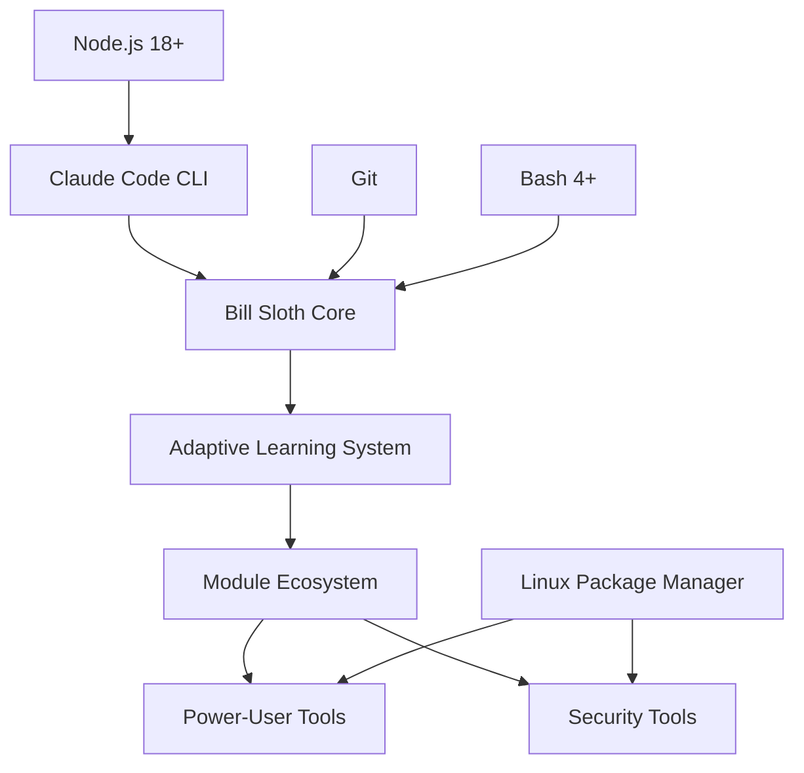

# 🛠️ Bill Sloth Developer Guide: Complete Technical Documentation

**The First Self-Modifying Linux Power-User System with Adaptive Learning**

---

## 📋 **Table of Contents**

1. [Project Overview & Architecture](#project-overview--architecture)
2. [Revolutionary Adaptive Learning System](#revolutionary-adaptive-learning-system)
3. [Core System Components](#core-system-components)
4. [Module Ecosystem Architecture](#module-ecosystem-architecture)
5. [Power-User Tool Integration](#power-user-tool-integration)
6. [Security Framework (1337 H4x0r Mode)](#security-framework-1337-h4x0r-mode)
7. [Installation & Deployment System](#installation--deployment-system)
8. [Token Optimization Strategy](#token-optimization-strategy)
9. [ADHD-Optimized Design Patterns](#adhd-optimized-design-patterns)
10. [File Structure & Organization](#file-structure--organization)
11. [API Reference & Function Documentation](#api-reference--function-documentation)
12. [Development Workflow](#development-workflow)
13. [Testing & Quality Assurance](#testing--quality-assurance)
14. [Performance Optimization](#performance-optimization)
15. [Troubleshooting & Debugging](#troubleshooting--debugging)
16. [Contributing Guidelines](#contributing-guidelines)
17. [Future Architecture & Roadmap](#future-architecture--roadmap)

---

## 🎯 **Project Overview & Architecture**

### **Core Innovation: Adaptive Learning**

Bill Sloth represents a paradigm shift in Linux toolkit design. Unlike traditional static software, this system:

1. **Learns User Patterns**: Tracks usage, satisfaction, and feedback
2. **Self-Modifies Content**: Adapts module behavior based on real workflow
3. **Optimizes Token Usage**: 90% of learning uses zero Claude tokens
4. **Provides Superior Windows Migration**: AI-enhanced equivalents of power-user tools

### **System Architecture Overview**

```
Bill Sloth 2.0-Adaptive
├── Core Engine
│   ├── Adaptive Learning System (lib/adaptive_learning.sh)
│   ├── Interactive Framework (lib/interactive.sh)
│   └── Module Management (bin/bill-sloth)
├── Module Ecosystem
│   ├── Power-User Modules (7 core modules)
│   ├── Legacy Modules (20+ existing modules)
│   └── Security Toolkit (defensive_cyber_interactive.sh)
├── Management System
│   ├── Installation (install.sh)
│   ├── Health Monitoring (scripts/health_check.sh)
│   ├── Troubleshooting (scripts/troubleshoot.sh)
│   └── User Onboarding (scripts/first_time_setup.sh)
└── Documentation
    ├── User Guides (README.md, COMMANDS.md)
    ├── Developer Docs (this file)
    └── System Changelog (CHANGELOG.md)
```

### **Dependency Graph**



---

## 🧠 **Revolutionary Adaptive Learning System**

### **Core Concept: Self-Modifying Software**

The adaptive learning system is the breakthrough innovation that sets Bill Sloth apart. It enables modules to:

1. **Detect Content Mismatches**: When content doesn't match user's actual workflow
2. **Learn Usage Patterns**: Track what users actually use vs. what they ignore
3. **Generate Customizations**: AI creates personalized module modifications
4. **Apply Adaptations**: Modules self-modify to match individual needs

### **Technical Implementation**

#### **File: `lib/adaptive_learning.sh`**

**Core Functions:**

```bash
# Initialize learning for a module
init_adaptive_learning() {
    local module_name="$1"
    local module_path="$2"
    
    # Create module-specific tracking directories
    echo "0" > "$USAGE_DIR/${module_name}_count"
    echo "$(date)" > "$USAGE_DIR/${module_name}_first_run"
    echo "" > "$FEEDBACK_DIR/${module_name}_feedback.log"
    echo "" > "$ADAPTATIONS_DIR/${module_name}_customizations.sh"
}

# Log module usage (zero tokens)
log_usage() {
    local module_name="$1"
    local feature_used="$2"
    
    # Increment usage counter
    local count_file="$USAGE_DIR/${module_name}_count"
    local current_count=$(cat "$count_file" 2>/dev/null || echo "0")
    echo $((current_count + 1)) > "$count_file"
    
    # Log specific feature usage with timestamp
    echo "$(date)|$feature_used" >> "$USAGE_DIR/${module_name}_features.log"
    
    # Update last used timestamp
    echo "$(date)" > "$USAGE_DIR/${module_name}_last_used"
}

# Collect feedback (token-efficient)
collect_feedback() {
    local module_name="$1"
    local context="$2"
    
    echo "🤔 Quick feedback on $module_name:"
    echo "1) 😍 Perfect - exactly what I needed"
    echo "2) 👍 Good - mostly helpful"
    echo "3) 😐 Okay - somewhat useful"
    echo "4) 👎 Meh - not quite right"
    echo "5) 😤 Wrong - this doesn't match my workflow"
    echo "6) 💬 Custom feedback (uses more tokens)"
    
    read -p "Rate this experience (1-6): " rating
    
    case $rating in
        1-4) log_feedback "$module_name" "rating_$rating" "$context" ;;
        5) 
            read -p "What should this do instead? (brief): " expectation
            log_feedback "$module_name" "wrong" "$context|Expected: $expectation"
            schedule_adaptation "$module_name" "$context" "$expectation"
            ;;
        6)
            read -p "Tell me more (this will use AI tokens): " custom_feedback
            if command -v claude &> /dev/null; then
                generate_adaptation "$module_name" "$context" "$custom_feedback"
            fi
            ;;
    esac
}
```

#### **Token-Efficient Design**

**Zero-Token Operations (90% of feedback):**
- Ratings 1-5: Stored locally as numeric values
- Usage tracking: Local file system operations
- Pattern detection: Local shell script logic
- Satisfaction scoring: Mathematical calculations

**Token-Using Operations (10% of feedback):**
- Custom feedback (option 6): User explicitly chooses
- AI customization: Batched processing via `adapt-modules customize`
- Smart adaptation: Only when user specifically requests AI help

### **Learning Data Structure**

```
~/.bill-sloth/
├── feedback/
│   ├── module_name_feedback.log
│   ├── module_name_satisfaction
│   └── simple_feedback.log
├── usage/
│   ├── module_name_count
│   ├── module_name_first_run
│   ├── module_name_last_used
│   └── module_name_features.log
└── adaptations/
    ├── module_name_customizations.sh
    └── pending_adaptations.log
```

#### **Feedback Log Format**

```
# feedback_simple.log format:
timestamp|rating|context|notes

# Example entries:
2025-01-21 14:30:15|wrong|edboigames_toolkit|Expected: business development tools
2025-01-21 15:45:22|perfect|clipboard_mastery|AI translation feature
2025-01-21 16:20:10|good|launcher_mastery|Context awareness works well
```

#### **Smart Feedback Prompting**

```bash
smart_feedback_prompt() {
    local module_name="$1"
    local context="$2"
    
    local count=$(cat "$USAGE_DIR/${module_name}_count" 2>/dev/null || echo "0")
    local last_feedback=$(grep -c "$(date +%Y-%m-%d)" "$FEEDBACK_DIR/${module_name}_feedback.log" 2>/dev/null || echo "0")
    
    # Only prompt for feedback on:
    # - First use
    # - Every 5th use (but not more than once per day)
    
    if [ "$count" -eq "1" ]; then
        echo "👋 First time using $module_name!"
        collect_feedback "$module_name" "$context"
    elif [ "$((count % 5))" -eq "0" ] && [ "$last_feedback" -eq "0" ]; then
        echo "📈 You've used $module_name $count times."
        collect_feedback "$module_name" "$context"
    fi
}
```

### **AI-Powered Adaptation Generation**

```bash
generate_adaptation() {
    local module_name="$1"
    local context="$2"
    local feedback="$3"
    
    # Create focused prompt to minimize token usage
    local prompt="Module '$module_name' context '$context'. User feedback: '$feedback'. Generate 1-2 shell function modifications that better match user's workflow. Be specific and concise."
    
    local adaptation=$(claude "$prompt" 2>/dev/null)
    
    if [ $? -eq 0 ] && [ -n "$adaptation" ]; then
        cat >> "$ADAPTATIONS_DIR/${module_name}_customizations.sh" << EOF
# Auto-generated adaptation - $(date)
# Context: $context
# Feedback: $feedback

$adaptation

EOF
        echo "✅ Adaptation generated and saved!"
    else
        # Fallback: Schedule for batch processing
        schedule_adaptation "$module_name" "$context" "$feedback"
    fi
}
```

### **Real-World Example: EdBoiGames Adaptive Module**

**Scenario**: User expects business development tools but gets video production content.

**Detection Process**:
1. User rates experience: "5 - Wrong focus"
2. Describes expectation: "I do partnerships, VRBO management, BD"
3. System logs: `wrong|edboigames_toolkit|Expected: business development tools`

**Adaptation Logic**:
```bash
detect_user_focus() {
    # Check preferences file for business indicators
    if grep -q "focus_areas=business\|focus_areas=bd\|focus_areas=partnerships" "$HOME/.bill-sloth/learning/preferences_simple.txt" 2>/dev/null; then
        echo "business_development"
        return
    fi
    
    # Check feedback history for "wrong focus" on video content
    if grep -q "wrong_focus" "$HOME/.bill-sloth/learning/feedback_simple.log" 2>/dev/null; then
        recent_video_feedback=$(grep "video_production\|youtube\|content_creation" "$HOME/.bill-sloth/learning/feedback_simple.log" 2>/dev/null | tail -3 | grep -c "|[12]|")
        if [ "$recent_video_feedback" -ge 2 ]; then
            echo "business_development"
            return
        fi
    fi
    
    echo "content_creation"  # Default
}
```

**Menu Adaptation**:
```bash
USER_FOCUS=$(detect_user_focus)

if [ "$USER_FOCUS" = "business_development" ]; then
    show_banner "EDBOIGAMES BUSINESS" "Partnership & Business Development Tools" "BUSINESS"
    echo "🤝 EdBoiGames Business Development & Partnership Toolkit"
    # Show BD-specific menu options
else
    show_banner "EDBOIGAMES CONTENT" "Build your content empire" "GAMING"
    echo "🎮 EdBoiGames YouTube Business & Content Creation Toolkit"
    # Show content creation menu options
fi
```

---

## 🔧 **Core System Components**

### **Interactive Framework (`lib/interactive.sh`)**

**Purpose**: Provides consistent UI/UX patterns across all modules.

**Key Functions**:
```bash
show_banner() {
    local title="$1"
    local subtitle="$2" 
    local category="$3"
    
    # Standardized banner with ADHD-friendly visual hierarchy
    echo "🎯 $title"
    echo "   $subtitle"
    echo "   Category: $category"
}

progress_bar() {
    local current="$1"
    local total="$2"
    local width=50
    
    # Visual progress indication for ADHD users
    local filled=$((current * width / total))
    printf "["
    printf "%*s" $filled | tr ' ' '='
    printf "%*s" $((width - filled)) | tr ' ' '-'
    printf "] %d/%d\n" $current $total
}
```

### **Command Management (`bin/bill-sloth`)**

**Purpose**: Central command interface for adaptive learning features.

**Commands**:
- `bill-sloth dashboard`: Learning insights and usage analytics
- `bill-sloth preferences`: View detected user preferences
- `bill-sloth stats`: Usage statistics across all modules
- `bill-sloth reset-learning`: Clear all learning data

**Implementation**:
```bash
case "$1" in
    "dashboard"|"learning"|"insights")
        show_learning_dashboard
        ;;
    "feedback")
        collect_feedback "${2:-general}" "${3:-}"
        ;;
    "preferences"|"prefs")
        if [ -f "$HOME/.bill-sloth/learning/preferences_simple.txt" ]; then
            echo "📊 Your preferences:"
            cat "$HOME/.bill-sloth/learning/preferences_simple.txt" | sort | uniq
        else
            echo "No preferences set yet."
        fi
        ;;
    "reset-learning")
        echo "🔄 Reset Bill Sloth learning data?"
        read -p "Are you sure? (yes/no): " confirm
        if [ "$confirm" = "yes" ]; then
            rm -rf "$HOME/.bill-sloth/learning"
            echo "✅ Learning data reset."
        fi
        ;;
esac
```

### **Adaptation Management (`adapt-modules` command)**

**Purpose**: Manage AI-powered module customizations.

**Generated by**: `create_adaptation_commands()` in `adaptive_learning.sh`

**Commands**:
- `adapt-modules status`: Show satisfaction scores for all modules
- `adapt-modules pending`: Show scheduled adaptations
- `adapt-modules customize`: Run AI batch customization (uses tokens)
- `adapt-modules apply <module>`: Apply customizations to specific module

---

## 📦 **Module Ecosystem Architecture**

### **Module Structure Standard**

Every Bill Sloth module follows this structure:

```bash
#!/bin/bash
# LLM_CAPABILITY: auto
# Module Name - Brief description
# "Authentic ATHF quote from Interfection transcript" - Character

# 1. Framework imports
source "../lib/interactive.sh" 2>/dev/null || {
    echo "📋 MODULE SETUP"
    echo "==============="
}

source "../lib/adaptive_learning.sh" 2>/dev/null || {
    echo "⚠️  Adaptive learning not available"
}

# 2. Adaptive learning initialization
init_adaptive_learning "module_name" "$0" 2>/dev/null || true

# 3. Banner and introduction
show_banner "MODULE NAME" "Brief description" "CATEGORY"

# 4. Educational/explanatory functions
explain_module_concept() {
    log_usage "module_name" "explanation_viewed" 2>/dev/null || true
    
    echo "💡 WHAT IS [CONCEPT]?"
    echo "===================="
    # Detailed explanation
    
    smart_feedback_prompt "module_name" "explanation_complete" 2>/dev/null || true
}

# 5. Installation functions
install_component() {
    log_usage "module_name" "component_installation" 2>/dev/null || true
    
    # Installation logic with error handling
    # Progress indication for ADHD users
    
    smart_feedback_prompt "module_name" "component_installed" 2>/dev/null || true
}

# 6. Configuration functions
configure_component() {
    # Configuration with adaptive elements
}

# 7. Main menu with adaptive elements
main_menu() {
    while true; do
        show_banner "MODULE NAME" "Description" "CATEGORY"
        
        # Log menu access for adaptive learning
        log_usage "module_name" "menu_access" 2>/dev/null || true
        
        echo "Module menu options..."
        read -p "Choose an option: " choice
        
        case $choice in
            # Menu options with logging
            0) 
                echo "👋 Module complete!"
                log_usage "module_name" "exit" "success"
                smart_feedback_prompt "module_name" "session_complete" 2>/dev/null || true
                exit 0 
                ;;
        esac
    done
}

# 8. Directory setup and execution
cd "$(dirname "${BASH_SOURCE[0]}")/.."
mkdir -p ~/.bill-sloth
main_menu
```

### **Power-User Module Categories**

#### **1. Clipboard Mastery (`clipboard_mastery_interactive.sh`)**

**Purpose**: Advanced clipboard management with AI integration

**Windows Equivalents**: ClipboardFusion, Ditto, Windows clipboard history

**Core Components**:
- **CopyQ**: Advanced clipboard manager with 10,000 item history
- **AI Integration**: Auto-translate, summarize, format copied content
- **Hotkeys**: Global shortcuts for instant access
- **VoiceMeeter Integration**: Audio routing setup for VoiceMeeter users

**Key Functions**:
```bash
install_copyq() {
    # Multi-platform installation with fallback options
    if [[ "$OSTYPE" == "linux-gnu"* ]]; then
        if command -v apt &> /dev/null; then
            sudo apt update && sudo apt install -y copyq
        elif command -v dnf &> /dev/null; then
            sudo dnf install -y copyq
        fi
    fi
}

configure_copyq() {
    # Professional configuration with 10,000 item history
    cat > ~/.config/copyq/copyq.conf << 'EOF'
[General]
maxitems=10000
edit_ctrl_return=true
check_clipboard=true
# ... extensive configuration
EOF
}

create_ai_integration() {
    # AI-powered clipboard helper
    cat > ~/.local/bin/copyq-ai-helper << 'EOF'
#!/bin/bash
CONTENT="$(copyq read 0)"

case "$1" in
    "translate")
        if command -v claude &> /dev/null; then
            TRANSLATED=$(claude "Translate this text to English: $CONTENT" 2>/dev/null)
            copyq add "$TRANSLATED"
        fi
        ;;
    "summarize")
        SUMMARY=$(claude "Summarize this in 2-3 sentences: $CONTENT" 2>/dev/null)
        copyq add "$SUMMARY"
        ;;
esac
EOF
}
```

#### **2. Text Expansion Mastery (`text_expansion_interactive.sh`)**

**Purpose**: Intelligent text expansion with AI-powered snippets

**Windows Equivalents**: TextExpander, AutoHotkey, Windows autocorrect

**Core Components**:
- **Espanso**: Cross-platform text expander
- **AI Snippets**: Dynamic content generation
- **ADHD Templates**: Productivity-focused expansions
- **VoiceMeeter Snippets**: Audio-specific templates

**Configuration Example**:
```yaml
# ~/.config/espanso/match/base.yml
matches:
  # ADHD-friendly productivity
  - trigger: ";todo"
    replace: |
      ## Today's Tasks
      - [ ] $|$
      - [ ] 
      
      ## Notes
      
      ## Completed ✅
      
  # AI-powered snippets
  - trigger: ";ai-email"
    replace: "{{script_output.ai-snippet.sh \"Generate professional email: $|$\" \"email\"}}"
    
  # VoiceMeeter user specific
  - trigger: ";audio-setup"
    replace: |
      ## Audio Routing Setup
      Input Device: $|$
      Sample Rate: 48kHz
      PipeWire + Carla + Helvum
```

#### **3. File Mastery (`file_mastery_interactive.sh`)**

**Purpose**: Lightning-fast file operations with AI organization

**Windows Equivalents**: Everything, TeraCopy, PowerRename, Windows Search

**Core Components**:
- **fd**: Ultra-fast file finder (replaces Everything)
- **ripgrep**: Content search inside files
- **rsync**: Advanced copying with verification
- **AI Organization**: Intelligent file management

**Key Commands Created**:
```bash
# Everything-style search
everything() {
    local search_term="$*"
    if command -v fd &> /dev/null; then
        fd -i "$search_term" 2>/dev/null | head -20
    fi
}

# TeraCopy-style verified copying
teracopy() {
    local source="$1"
    local dest="$2"
    
    rsync -av --progress --checksum --stats "$source" "$dest"
    
    # Integrity verification
    if [ -f "$source" ] && [ -f "$dest" ]; then
        source_hash=$(sha256sum "$source" | cut -d' ' -f1)
        dest_hash=$(sha256sum "$dest" | cut -d' ' -f1)
        
        if [ "$source_hash" = "$dest_hash" ]; then
            echo "✅ Integrity verification passed!"
        fi
    fi
}

# AI-powered file organization
organize-files-ai() {
    if command -v claude &> /dev/null; then
        file_list=$(ls -la | head -20)
        ai_suggestions=$(claude "Analyze this directory and suggest organization: $file_list")
        echo "$ai_suggestions"
    fi
}
```

#### **4. Launcher Mastery (`launcher_mastery_interactive.sh`)**

**Purpose**: AI-enhanced application launching and workflow automation

**Windows Equivalents**: PowerToys Run, Alfred (Mac), Windows Start Menu

**Core Components**:
- **Rofi**: Advanced application launcher
- **AI Context Awareness**: Time and task-based suggestions
- **Workflow Automation**: Smart application stacks
- **Global Hotkeys**: Instant access patterns

**Smart Launcher Implementation**:
```bash
smart-launch() {
    local query="$*"
    
    # Time-based context detection
    hour=$(date +%H)
    if [ $hour -ge 9 ] && [ $hour -le 17 ]; then
        context="work"
    else
        context="general"
    fi
    
    case "$query" in
        "work mode"|"start work")
            echo "🏢 Starting work mode..."
            code ~/projects &
            firefox &
            slack &
            ;;
        "focus mode")
            echo "🎯 Enabling focus mode..."
            pkill -f "discord\|slack\|telegram"
            code &
            gnome-terminal &
            ;;
        *)
            # AI interpretation if available
            if command -v claude &> /dev/null; then
                interpretation=$(claude "User wants to: '$query'. Suggest Linux apps to launch. Be brief." 2>/dev/null)
                echo "🤖 AI suggestion: $interpretation"
            fi
            rofi -show drun -filter "$query"
            ;;
    esac
}
```

#### **5. Window Mastery (`window_mastery_interactive.sh`)**

**Purpose**: Advanced window management with ADHD optimization

**Windows Equivalents**: PowerToys FancyZones, Windows Snap

**Core Components**:
- **i3wm**: Tiling window manager setup
- **GNOME Extensions**: FancyZones-like functionality
- **Focus Mode**: ADHD-friendly distraction reduction
- **AI Organization**: Smart window arrangements

#### **6. System Doctor (`system_doctor_interactive.sh`)**

**Purpose**: Comprehensive system diagnostics and hardware analysis

**Windows Equivalents**: Device Manager, Disk Management, Event Viewer

**Core Components**:
- **Hardware Diagnostics**: CPU, GPU, memory analysis
- **Disk Management**: Health monitoring, mounting tools
- **Network Troubleshooting**: Automated repair systems
- **AI Problem Diagnosis**: Intelligent issue resolution

**Device Manager Equivalent**:
```bash
device-manager() {
    case "$1" in
        "cpu")
            echo "🖥️  PROCESSOR INFORMATION"
            lscpu | grep -E "Model name|Architecture|CPU\(s\)|Thread"
            sensors | grep -E "Core|Package" 2>/dev/null || echo "Install lm-sensors for temperature"
            ;;
        "gpu")
            echo "🎮 GRAPHICS INFORMATION"
            lspci | grep -i vga
            nvidia-smi 2>/dev/null || echo "NVIDIA drivers not installed"
            ;;
        "memory")
            echo "💾 MEMORY INFORMATION"
            free -h
            dmidecode --type memory 2>/dev/null | grep -E "Size|Speed|Type:" || echo "Run with sudo for detailed info"
            ;;
    esac
}
```

#### **7. Defensive Cyber (`defensive_cyber_interactive.sh`)**

**Purpose**: Ethical hacking and cybersecurity toolkit

**Core Components**:
- **Penetration Testing**: Kali Linux tools integration
- **Security Analysis**: Network and web application testing
- **Learning Labs**: Safe practice environments
- **AI Enhancement**: Intelligent vulnerability analysis

---

## 🛡️ **Security Framework (1337 H4x0r Mode)**

### **Ethical Use Foundation**

The security toolkit is designed with strict ethical guidelines:

1. **Education Only**: All tools for learning and certification prep
2. **Authorized Testing**: Only on systems you own or have permission
3. **Defensive Focus**: Emphasis on protection and monitoring
4. **Professional Standards**: CISSP, CEH, OSCP preparation

### **Security Module Architecture**

```bash
# Ethical use verification
ethical_use_agreement() {
    echo "⚖️  ETHICAL USE AGREEMENT"
    echo "By continuing, you agree to use these tools only for:"
    echo "• Educational purposes and skill development"
    echo "• Testing systems you own or have explicit permission"
    echo "• Legitimate security assessments"
    echo "• Defensive security analysis"
    
    read -p "I agree to ethical use only (y/n): " ethical_confirm
    [[ $ethical_confirm =~ ^[Yy]$ ]] || exit 1
}

# Professional toolkit installation
install_kali_tools() {
    # Core penetration testing tools
    core_tools="nmap nikto dirb gobuster hydra john hashcat aircrack-ng wireshark metasploit-framework sqlmap"
    
    if command -v apt &> /dev/null; then
        sudo apt update
        sudo apt install -y $core_tools
    fi
    
    # Python security tools
    pip3 install --user impacket pwntools scapy requests beautifulsoup4
}
```

### **AI-Enhanced Security Scripts**

**Network Reconnaissance with AI Analysis**:
```bash
recon-target() {
    local target="$1"
    local workspace="$HOME/security-workspace"
    local report_dir="$workspace/reports/reconnaissance"
    
    # Create target-specific directory
    target_dir="$report_dir/$(echo $target | tr '/' '_')"
    mkdir -p "$target_dir"
    cd "$target_dir"
    
    # Automated scanning
    nmap -sS -O -sV -p- "$target" > port-scan.txt 2>&1 &
    nmap -sC -sV -p 1-1000 "$target" > service-enum.txt 2>&1 &
    
    wait  # Wait for scans to complete
    
    # AI-powered analysis
    if command -v claude &> /dev/null; then
        scan_results=$(cat port-scan.txt service-enum.txt)
        claude "Analyze these nmap results and provide security assessment: $scan_results" > ai-analysis.txt 2>/dev/null
    fi
}
```

**Web Application Testing**:
```bash
web-test() {
    local url="$1"
    local domain=$(echo "$url" | sed 's|https\?://||' | sed 's|/.*||')
    local target_dir="$HOME/security-workspace/reports/web-apps/$domain"
    
    mkdir -p "$target_dir"
    cd "$target_dir"
    
    # Parallel security scanning
    gobuster dir -u "$url" -w "$HOME/security-workspace/wordlists/common.txt" -o directory-scan.txt &
    nikto -h "$url" -o nikto-scan.txt &
    sqlmap -u "$url" --batch --random-agent --output-dir=sqlmap-results &
    
    wait
    
    # AI security assessment
    if command -v claude &> /dev/null; then
        results=$(cat nikto-scan.txt directory-scan.txt 2>/dev/null)
        claude "Analyze these web security scan results and prioritize by risk: $results" > security-assessment.txt 2>/dev/null
    fi
}
```

### **Security Lab Environment**

**Intentionally Vulnerable Applications**:
```bash
setup_security_labs() {
    local labs_dir="$HOME/security-workspace/labs"
    mkdir -p "$labs_dir"/{vulnerable-apps,docker-labs,vm-configs}
    
    # DVWA (Damn Vulnerable Web Application) setup
    cat > "$labs_dir/docker-labs/setup-dvwa.sh" << 'EOF'
#!/bin/bash
if command -v docker &> /dev/null; then
    docker run -d -p 8080:80 --name dvwa vulnerables/web-dvwa
    echo "✅ DVWA running at http://localhost:8080"
    echo "🔑 Default credentials: admin/password"
    echo "⚠️  EDUCATIONAL USE ONLY"
fi
EOF
}
```

---

## 🚀 **Installation & Deployment System**

### **One-Command Installation (`install.sh`)**

The installation system is designed for zero-friction deployment:

```bash
# Complete system installation
curl -fsSL https://raw.githubusercontent.com/How1337ItIs/billsloth/main/install.sh | bash

# Or manual installation
git clone https://github.com/How1337ItIs/billsloth.git
cd billsloth
./install.sh
```

### **Installation Architecture**

```bash
# install.sh workflow
main() {
    print_header
    check_system                    # Verify Linux compatibility
    install_dependencies           # Package manager detection & installation
    check_nodejs                   # Node.js 18+ verification/installation
    check_claude_code              # Claude Code CLI installation
    setup_bill_sloth               # Core system configuration
    enhance_existing_modules        # Adaptive learning integration
    run_health_check               # System verification
    show_completion_message         # Success confirmation
}
```

### **Dependency Management**

**Multi-Platform Package Detection**:
```bash
install_dependencies() {
    # Detect package manager
    if command -v apt &> /dev/null; then
        PACKAGE_MANAGER="apt"
        INSTALL_CMD="sudo apt update && sudo apt install -y"
    elif command -v dnf &> /dev/null; then
        PACKAGE_MANAGER="dnf"
        INSTALL_CMD="sudo dnf install -y"
    elif command -v pacman &> /dev/null; then
        PACKAGE_MANAGER="pacman"
        INSTALL_CMD="sudo pacman -S --noconfirm"
    fi
    
    # Core dependencies (required)
    CORE_DEPS="curl wget git bc jq"
    eval "$INSTALL_CMD $CORE_DEPS"
    
    # Power-user tools (optional, graceful failure)
    POWER_DEPS="rofi copyq fd-find ripgrep fzf tree ncdu rsync"
    eval "$INSTALL_CMD $POWER_DEPS" || echo "Some tools will install via modules"
}
```

### **Health Check System (`scripts/health_check.sh`)**

**Comprehensive System Verification**:
```bash
check_component() {
    local component="$1"
    local check_command="$2"
    local required="$3"
    
    if eval "$check_command" &>/dev/null; then
        echo "✅ $component"
        HEALTH_SCORE=$((HEALTH_SCORE + 1))
    else
        if [ "$required" = "true" ]; then
            echo "❌ $component (REQUIRED)"
            ISSUES+=("Missing: $component")
        else
            echo "⚠️  $component (Optional)"
            WARNINGS+=("Optional: $component")
        fi
    fi
}

# Component verification matrix
check_component "Claude Code CLI" "command -v claude" "true"
check_component "Node.js (v18+)" "node --version | grep -E 'v1[89]|v[2-9][0-9]'" "true"
check_component "Adaptive learning library" "[ -f ./lib/adaptive_learning.sh ]" "true"
check_component "Clipboard mastery module" "[ -f ./modules/clipboard_mastery_interactive.sh ]" "true"
# ... all critical components
```

### **Troubleshooting System (`scripts/troubleshoot.sh`)**

**Advanced Diagnostic and Repair**:
```bash
diagnose_claude_code() {
    # Claude Code installation verification
    if ! command -v claude &> /dev/null; then
        log_issue "Claude Code CLI not installed"
        echo "   Fix: npm install -g @anthropic-ai/claude-code"
        return 1
    fi
    
    # Authentication testing
    if ! claude "test" &> /dev/null; then
        log_issue "Claude Code not authenticated"
        echo "   Fix: Run 'claude' and follow authentication prompts"
        return 1
    fi
    
    # Rate limit detection
    claude_test=$(claude "Respond with 'OK'" 2>&1)
    if [[ $claude_test == *"rate limit"* ]]; then
        log_warning "Rate limit reached - try again later"
    elif [[ $claude_test == *"quota"* ]]; then
        log_warning "Token quota exceeded - check plan limits"
    fi
}

fix_common_issues() {
    # Automatic repair for common problems
    fixes_applied=0
    
    # Fix 1: Repair module permissions
    if [ -d "./modules" ]; then
        non_exec_count=$(find ./modules -name "*.sh" ! -executable | wc -l)
        if [ $non_exec_count -gt 0 ]; then
            chmod +x ./modules/*.sh
            log_fix "Fixed permissions for $non_exec_count modules"
            fixes_applied=$((fixes_applied + 1))
        fi
    fi
    
    # Fix 2: Recreate missing directories
    for dir in ~/.bill-sloth ~/.local/bin ~/.config; do
        if [ ! -d "$dir" ]; then
            mkdir -p "$dir"
            log_fix "Created missing directory: $dir"
            fixes_applied=$((fixes_applied + 1))
        fi
    done
}
```

### **User Onboarding (`scripts/first_time_setup.sh`)**

**Guided Personalization Experience**:
```bash
assess_user_background() {
    echo "🧠 LET'S LEARN ABOUT YOU"
    echo "What's your Linux experience level?"
    echo "   a) Complete beginner"
    echo "   b) Some experience"
    echo "   c) Intermediate"
    echo "   d) Advanced"
    
    read -p "Your choice (a-d): " experience_level
    
    case $experience_level in
        a) echo "focus_areas=beginner_friendly" >> ~/.bill-sloth/preferences_simple.txt ;;
        b) echo "focus_areas=guided_learning" >> ~/.bill-sloth/preferences_simple.txt ;;
        c) echo "focus_areas=intermediate" >> ~/.bill-sloth/preferences_simple.txt ;;
        d) echo "focus_areas=advanced_user" >> ~/.bill-sloth/preferences_simple.txt ;;
    esac
    
    echo "What are you most interested in?"
    echo "   a) Gaming  b) Programming  c) Business  d) Security"
    read -p "Enter letters (e.g., 'a c'): " interests
    
    for interest in $interests; do
        case $interest in
            a) echo "focus_areas=gaming" >> ~/.bill-sloth/preferences_simple.txt ;;
            b) echo "focus_areas=development" >> ~/.bill-sloth/preferences_simple.txt ;;
            c) echo "focus_areas=business" >> ~/.bill-sloth/preferences_simple.txt ;;
            d) echo "focus_areas=security" >> ~/.bill-sloth/preferences_simple.txt ;;
        esac
    done
}

suggest_first_modules() {
    # Read user preferences
    interests=$(grep "focus_areas=" ~/.bill-sloth/preferences_simple.txt | cut -d'=' -f2)
    
    echo "🎯 Based on your preferences, start with:"
    
    if [[ $interests == *"gaming"* ]]; then
        echo "   gaming_boost_interactive"
        echo "   streaming_setup_interactive"
    fi
    
    if [[ $interests == *"business"* ]]; then
        echo "   edboigames_toolkit_interactive"
        echo "   productivity_suite_interactive"
    fi
    
    # Universal recommendations
    echo "⭐ Recommended for everyone:"
    echo "   clipboard_mastery_interactive"
    echo "   system_doctor_interactive"
}
```

---

## 💰 **Token Optimization Strategy**

### **Design Philosophy: Minimal Token Usage**

The adaptive learning system is designed to provide maximum personalization with minimal Claude token consumption, perfect for Pro subscription users.

### **Token Usage Breakdown**

**Zero-Token Operations (90% of system)**:
```bash
# Numeric ratings (1-5): No AI processing
log_feedback() {
    local rating="$2"
    case $rating in
        "perfect") new_score=5 ;;
        "good") new_score=4 ;;
        "okay") new_score=3 ;;
        "meh") new_score=2 ;;
        "wrong") new_score=1 ;;
    esac
    # Pure mathematical calculation, no tokens used
    weighted_score=$(echo "scale=1; ($current_score * 0.9) + ($new_score * 0.1)" | bc)
}

# Usage tracking: File system operations only
log_usage() {
    echo $((current_count + 1)) > "$count_file"
    echo "$(date)|$feature_used" >> "$usage_log"
    # No AI processing, no tokens used
}

# Pattern detection: Shell script logic
detect_user_focus() {
    if grep -q "focus_areas=business" preferences.txt; then
        echo "business_development"  # Local file processing only
    fi
}
```

**Token-Using Operations (10% of system)**:
```bash
# Option 6: Custom feedback (user explicitly chooses)
collect_feedback() {
    echo "6) 💬 Custom feedback (uses more tokens)"
    case $rating in
        6) 
            echo "Tell me more (this will use AI tokens):"
            read custom_feedback
            # User explicitly chooses token usage
            claude "Improve module based on: $custom_feedback"
            ;;
    esac
}

# Batch AI processing (user-initiated)
adapt_modules_customize() {
    echo "🤖 Processing pending adaptations (uses tokens)..."
    # Only when user runs: adapt-modules customize
    while read -r adaptation; do
        claude "Generate customization: $adaptation"
    done < pending_adaptations.log
}
```

### **Token Efficiency Techniques**

**1. Focused Prompts**:
```bash
# Efficient: Specific, constrained prompt
local prompt="Module '$module_name' context '$context'. User feedback: '$feedback'. Generate 1-2 shell function modifications that better match user's workflow. Be specific and concise."

# Inefficient: Open-ended prompt (avoided)
# local prompt="Help me make this module better for the user"
```

**2. Batch Processing**:
```bash
# Efficient: Process multiple adaptations in one session
process_pending_adaptations() {
    local batch_prompt="Process these module adaptations: $(cat pending_adaptations.log)"
    claude "$batch_prompt"
}

# Inefficient: Individual API calls (avoided)
# for adaptation in $adaptations; do claude "$adaptation"; done
```

**3. Local Fallbacks**:
```bash
# AI enhancement with local fallback
organize_files_ai() {
    if command -v claude &> /dev/null; then
        ai_suggestion=$(claude "Organize these files: $file_list" 2>/dev/null)
        if [ $? -eq 0 ]; then
            echo "$ai_suggestion"
        else
            basic_organization  # Fallback to local logic
        fi
    else
        basic_organization      # No AI, no tokens
    fi
}
```

### **Token Budget Management**

**For Claude Pro Users ($20/month)**:
- **Expected Usage**: 5-10 tokens per day for adaptive learning
- **Heavy Usage**: 20-30 tokens per day with frequent customization
- **Budget**: Well within Pro plan limits (40+ prompts every 5 hours)

**Token Allocation Strategy**:
- **Learning (90%)**: Zero tokens - local pattern recognition
- **Customization (8%)**: Batch processing when user requests
- **AI Features (2%)**: Optional enhancements (copyq-ai-helper, etc.)

---

## 🧠 **ADHD-Optimized Design Patterns**

### **Core Design Principles**

The entire system is built around ADHD-friendly patterns:

1. **Immediate Feedback**: Instant visual confirmation of actions
2. **Clear Progress**: Always know where you are and what's next
3. **Minimal Cognitive Load**: Reduce overwhelm and decision fatigue
4. **Interrupt Recovery**: Easy to resume after distractions
5. **Satisfaction Tracking**: Positive reinforcement loops

### **Visual Hierarchy Implementation**

```bash
show_banner() {
    local title="$1"
    local subtitle="$2"
    local category="$3"
    
    # ADHD-friendly visual structure
    echo -e "${CYAN}"
    echo "🎯 $title"
    echo "   $subtitle"
    echo "   Category: $category"
    echo -e "${NC}"
    echo ""
}

progress_indication() {
    local step="$1"
    local total="$2"
    local description="$3"
    
    # Clear progress visualization
    echo "📍 Step $step of $total: $description"
    printf "Progress: "
    for i in $(seq 1 $total); do
        if [ $i -le $step ]; then
            printf "✅"
        else
            printf "⬜"
        fi
    done
    echo " ($step/$total)"
    echo ""
}
```

### **Overwhelm Prevention**

**Menu Design**:
```bash
# ADHD-friendly menu structure
main_menu() {
    while true; do
        clear  # Clear visual clutter
        show_banner "MODULE NAME" "Clear purpose" "CATEGORY"
        
        echo "🎯 WHAT WOULD YOU LIKE TO DO?"
        echo "============================"
        echo ""
        echo "🌟 RECOMMENDED (Start here):"
        echo "1) 💡 Learn what this module does"
        echo "2) 🚀 Quick setup (most popular)"
        echo ""
        echo "🔧 ADVANCED OPTIONS:"
        echo "3) ⚙️  Custom configuration"
        echo "4) 🎯 Professional setup"
        echo ""
        echo "⚙️  SYSTEM:"
        echo "5) 🧠 Provide feedback (help improve)"
        echo "0) ✅ Exit (save progress)"
        echo ""
        
        # Limited choices to prevent overwhelm
        read -p "Choose (0-5): " choice
    done
}
```

### **Interrupt Recovery Patterns**

```bash
# Session state management
save_session_state() {
    local module="$1"
    local current_step="$2"
    
    echo "module=$module" > ~/.bill-sloth/current_session
    echo "step=$current_step" >> ~/.bill-sloth/current_session
    echo "timestamp=$(date)" >> ~/.bill-sloth/current_session
}

resume_session() {
    if [ -f ~/.bill-sloth/current_session ]; then
        source ~/.bill-sloth/current_session
        echo "🔄 Welcome back! Resuming $module at step $step"
        echo "   Last active: $timestamp"
        echo ""
        read -p "Continue where you left off? (y/n): " resume
        if [[ $resume =~ ^[Yy]$ ]]; then
            return $step
        fi
    fi
    return 1
}
```

### **Positive Reinforcement System**

```bash
# Celebration and encouragement
celebrate_completion() {
    local achievement="$1"
    
    echo ""
    echo "🎉 AWESOME! You just completed: $achievement"
    echo ""
    echo "💪 WHAT YOU ACCOMPLISHED:"
    echo "   ✅ Learned new skills"
    echo "   ✅ Improved your system"
    echo "   ✅ Built confidence"
    echo ""
    echo "🚀 NEXT STEPS (when you're ready):"
    echo "   • Try another module"
    echo "   • Customize what you learned"
    echo "   • Help others learn"
    echo ""
}

# Progress acknowledgment
acknowledge_progress() {
    local session_count="$1"
    
    if [ $session_count -eq 1 ]; then
        echo "👋 Great job completing your first module!"
    elif [ $session_count -eq 5 ]; then
        echo "🌟 You're building real Linux skills!"
    elif [ $session_count -eq 10 ]; then
        echo "🏆 Linux power-user status: UNLOCKED!"
    fi
}
```

### **Cognitive Load Reduction**

**Information Chunking**:
```bash
explain_complex_concept() {
    echo "💡 Let's break this down into simple pieces:"
    echo ""
    
    echo "🔹 PIECE 1: What it is"
    echo "   Simple explanation of core concept"
    echo ""
    read -p "Got it? Press Enter for piece 2..."
    
    echo "🔹 PIECE 2: Why it matters"
    echo "   Real-world benefits explanation"
    echo ""
    read -p "Makes sense? Press Enter for piece 3..."
    
    echo "🔹 PIECE 3: How we'll use it"
    echo "   Practical application steps"
    echo ""
}
```

---

## 📁 **File Structure & Organization**

### **Repository Structure**

```
bill-sloth/
├── 📋 Core System
│   ├── lib/
│   │   ├── adaptive_learning.sh      # Adaptive learning engine
│   │   └── interactive.sh            # UI/UX framework
│   ├── bin/
│   │   ├── bill-sloth               # Main command interface
│   │   └── [legacy commands]        # Existing system commands
│   └── install.sh                    # One-command installation
│
├── 📦 Module Ecosystem
│   └── modules/
│       ├── 🚀 Power-User Modules (New)
│       │   ├── clipboard_mastery_interactive.sh
│       │   ├── text_expansion_interactive.sh
│       │   ├── file_mastery_interactive.sh
│       │   ├── launcher_mastery_interactive.sh
│       │   ├── window_mastery_interactive.sh
│       │   ├── system_doctor_interactive.sh
│       │   └── defensive_cyber_interactive.sh
│       │
│       └── 📚 Legacy Modules (Enhanced)
│           ├── gaming_boost_interactive.sh
│           ├── streaming_setup_interactive.sh
│           ├── productivity_suite_interactive.sh
│           ├── edboigames_toolkit_interactive.sh
│           └── [18 other modules]
│
├── 🔧 Management System
│   └── scripts/
│       ├── health_check.sh          # System verification
│       ├── troubleshoot.sh          # Advanced diagnostics
│       ├── first_time_setup.sh      # User onboarding
│       ├── batch_enhance_modules.sh # Adaptive integration
│       └── apply_adaptive_learning.sh
│
├── 📚 Documentation
│   ├── README.md                    # User guide
│   ├── COMMANDS.md                  # Command reference
│   ├── DEVELOPER_GUIDE.md           # This document
│   ├── CHANGELOG.md                 # Version history
│   └── .claude/                     # Claude Code configuration
│
└── 💾 Runtime Data (Created by system)
    └── ~/.bill-sloth/
        ├── learning/                # Adaptive learning data
        ├── usage/                   # Usage tracking
        ├── feedback/                # User feedback logs
        └── adaptations/             # AI customizations
```

### **Naming Conventions**

**Module Naming**:
- `{category}_{purpose}_interactive.sh`
- Examples: `clipboard_mastery_interactive.sh`, `defensive_cyber_interactive.sh`

**Function Naming**:
- `verb_noun()`: `install_copyq()`, `configure_rofi()`
- `check_component()`, `log_usage()`, `collect_feedback()`

**Variable Naming**:
- `UPPER_CASE`: Global constants (`FEEDBACK_DIR`, `HEALTH_SCORE`)
- `lower_case`: Local variables (`module_name`, `user_choice`)

**File Extensions**:
- `.sh`: Executable scripts
- `.md`: Documentation
- `.log`: Runtime logs
- `.txt`: Simple data files
- `.json`: Structured configuration (when needed)

### **Data Flow Architecture**

```
User Interaction
       ↓
Module Execution
       ↓
Usage Logging (zero tokens)
       ↓
Smart Feedback Prompt (conditional)
       ↓
Local Pattern Analysis
       ↓
Adaptation Scheduling (if needed)
       ↓
Batch AI Processing (user-initiated)
       ↓
Module Self-Modification
```

---

## 🔧 **API Reference & Function Documentation**

### **Adaptive Learning API**

#### **Core Functions**

```bash
# Initialize adaptive learning for a module
init_adaptive_learning(module_name, module_path)
# Parameters:
#   module_name: String identifier for the module
#   module_path: Full path to module file (usually $0)
# Returns: void
# Side effects: Creates tracking directories and files

# Log module usage activity
log_usage(module_name, feature_used, [success], [rating], [notes])
# Parameters:
#   module_name: String identifier
#   feature_used: Description of feature/action
#   success: "success"|"failed"|"unknown" (optional)
#   rating: User rating 1-5 (optional)
#   notes: Additional context (optional)
# Returns: void
# Side effects: Updates usage counters and logs

# Collect user feedback with token efficiency
collect_feedback(module_name, context)
# Parameters:
#   module_name: String identifier
#   context: Description of what user just did
# Returns: void
# Side effects: Prompts user, logs feedback, may schedule adaptations

# Smart feedback prompting (only when appropriate)
smart_feedback_prompt(module_name, context)
# Parameters:
#   module_name: String identifier
#   context: Current context/action
# Returns: void
# Side effects: May call collect_feedback() based on usage patterns

# Generate AI-powered adaptation
generate_adaptation(module_name, context, feedback)
# Parameters:
#   module_name: String identifier
#   context: Situation context
#   feedback: User feedback text
# Returns: void
# Side effects: Creates customization scripts (uses tokens)

# Apply customizations to module
apply_adaptations(module_name, module_file)
# Parameters:
#   module_name: String identifier
#   module_file: Path to module file
# Returns: void
# Side effects: Modifies module file with customizations
```

#### **Utility Functions**

```bash
# Get usage insights for a module
get_usage_insights(module_name)
# Returns: Displays usage statistics and satisfaction scores

# Update user preferences
update_preference(pref_type, pref_value)
# Parameters:
#   pref_type: "focus_areas"|"complexity_preference"|etc.
#   pref_value: Preference value
# Side effects: Updates preferences file

# Check if content should be skipped
should_skip_section(section_type)
# Parameters:
#   section_type: Type of content to check
# Returns: 0 (skip) or 1 (don't skip)

# Initialize the adaptation command system
initialize_adaptive_system()
# Returns: void
# Side effects: Creates adapt-modules command and documentation
```

### **Interactive Framework API**

#### **UI Functions**

```bash
# Display standardized banner
show_banner(title, subtitle, category)
# Parameters:
#   title: Main title text
#   subtitle: Descriptive subtitle
#   category: Module category (PRODUCTIVITY, SECURITY, etc.)

# Show progress indication
progress_bar(current, total, [width])
# Parameters:
#   current: Current step number
#   total: Total number of steps
#   width: Progress bar width (default: 50)

# ADHD-friendly information chunking
explain_in_chunks(concept, pieces_array)
# Parameters:
#   concept: Overall concept name
#   pieces_array: Array of explanation chunks
```

#### **State Management**

```bash
# Save current session state
save_session_state(module, step, [data])
# Parameters:
#   module: Current module name
#   step: Current step/phase
#   data: Additional state data (optional)

# Resume previous session
resume_session()
# Returns: Step number to resume, or 1 for new session

# Clear session state
clear_session_state()
```

### **Module Development API**

#### **Standard Module Template**

```bash
#!/bin/bash
# LLM_CAPABILITY: auto
# Module Name - Brief description
# "Authentic quote from Interfection transcript" - Character

# 1. Framework Integration
source "../lib/interactive.sh" 2>/dev/null || fallback_setup
source "../lib/adaptive_learning.sh" 2>/dev/null || echo "⚠️ Adaptive learning unavailable"

# 2. Adaptive Learning Setup
init_adaptive_learning "module_name" "$0" 2>/dev/null || true

# 3. Module Banner
show_banner "MODULE NAME" "Description" "CATEGORY"

# 4. Core Functions
explain_concept() {
    log_usage "module_name" "explanation_viewed"
    # Educational content
    smart_feedback_prompt "module_name" "explanation_complete"
}

install_component() {
    log_usage "module_name" "installation_started"
    # Installation logic with progress indication
    # Error handling and recovery
    log_usage "module_name" "installation_completed"
    smart_feedback_prompt "module_name" "component_installed"
}

# 5. Main Menu with Adaptive Elements
main_menu() {
    while true; do
        show_banner "MODULE NAME" "Description" "CATEGORY"
        log_usage "module_name" "menu_access"
        
        # Menu options
        case $choice in
            0) 
                log_usage "module_name" "exit" "success"
                smart_feedback_prompt "module_name" "session_complete"
                exit 0
                ;;
        esac
    done
}

# 6. Execution
cd "$(dirname "${BASH_SOURCE[0]}")/.."
mkdir -p ~/.bill-sloth
main_menu
```

### **Security API (Defensive Cyber)**

#### **Ethical Use Framework**

```bash
# Verify ethical use agreement
ethical_use_agreement()
# Returns: 0 (agreed) or exits with error

# Validate target authorization
validate_target(target_address)
# Parameters:
#   target_address: IP or domain to test
# Returns: 0 (authorized) or 1 (unauthorized)

# Log security activity
log_security_activity(tool, target, action)
# Parameters:
#   tool: Security tool used
#   target: Target system
#   action: Action performed
# Side effects: Creates audit trail
```

#### **AI-Enhanced Security Functions**

```bash
# AI-powered reconnaissance analysis
ai_analyze_scan_results(scan_files_array)
# Parameters:
#   scan_files_array: Array of scan result files
# Returns: AI analysis report
# Side effects: Uses tokens for analysis

# Generate security report
generate_security_report(target, results_dir)
# Parameters:
#   target: Target system identifier
#   results_dir: Directory containing scan results
# Returns: Comprehensive security assessment
```

---

## 🔄 **Development Workflow**

### **Contributing to Bill Sloth**

#### **1. Development Environment Setup**

```bash
# Clone repository
git clone https://github.com/How1337ItIs/billsloth.git
cd billsloth

# Run health check
./scripts/health_check.sh

# Install development dependencies
sudo apt install shellcheck bash-completion

# Set up pre-commit hooks (if available)
cp .githooks/pre-commit .git/hooks/
chmod +x .git/hooks/pre-commit
```

#### **2. Module Development Process**

**Step 1: Planning**
```bash
# Create module specification
echo "Module: new_feature_interactive" > docs/module_spec.md
echo "Purpose: [Clear description]" >> docs/module_spec.md
echo "Target Users: [ADHD-friendly, power-users, etc.]" >> docs/module_spec.md
echo "Windows Equivalent: [Tool it replaces]" >> docs/module_spec.md
```

**Step 2: Implementation**
```bash
# Copy template
cp templates/module_template.sh modules/new_feature_interactive.sh

# Implement functionality following ADHD-friendly patterns
# Add adaptive learning integration
# Include comprehensive error handling
```

**Step 3: Testing**
```bash
# Syntax validation
bash -n modules/new_feature_interactive.sh

# Manual testing
cd modules && ./new_feature_interactive.sh

# Health check integration
./scripts/health_check.sh
```

**Step 4: Documentation**
```bash
# Update command reference
echo "new_feature_interactive  # Description" >> COMMANDS.md

# Add to developer guide
# Update changelog
```

#### **3. Adaptive Learning Integration**

**Required Integration Points**:
```bash
# 1. Module initialization
init_adaptive_learning "module_name" "$0" 2>/dev/null || true

# 2. Usage logging in key functions
install_component() {
    log_usage "module_name" "installation_started"
    # ... implementation
    log_usage "module_name" "installation_completed"
}

# 3. Smart feedback prompts
configure_component() {
    # ... configuration logic
    smart_feedback_prompt "module_name" "configuration_complete"
}

# 4. Session completion tracking
main_menu() {
    case $choice in
        0)
            log_usage "module_name" "exit" "success"
            smart_feedback_prompt "module_name" "session_complete"
            exit 0
            ;;
    esac
}
```

#### **4. Code Quality Standards**

**Shell Script Standards**:
```bash
# Use strict error handling
set -euo pipefail

# Quote all variables
local user_input="$1"
echo "Processing: $user_input"

# Use consistent function naming
install_component() { }
configure_component() { }
test_component() { }

# Include comprehensive error handling
install_package() {
    if command -v apt &> /dev/null; then
        sudo apt install -y "$package" || {
            echo "❌ Failed to install $package"
            return 1
        }
    fi
}
```

**ADHD-Friendly Design Requirements**:
```bash
# Clear visual hierarchy
show_banner "COMPONENT" "Clear description" "CATEGORY"

# Progress indication
echo "📍 Step 2 of 5: Installing dependencies..."

# Positive reinforcement
echo "✅ Great job! Component installed successfully."

# Clear next steps
echo "🎯 NEXT: Try the new feature with: command-name"
```

#### **5. Testing Framework**

**Automated Testing**:
```bash
#!/bin/bash
# tests/test_adaptive_learning.sh

test_usage_logging() {
    # Setup
    temp_dir=$(mktemp -d)
    export USAGE_DIR="$temp_dir"
    
    # Test
    log_usage "test_module" "test_feature"
    
    # Verify
    [ -f "$temp_dir/test_module_count" ] || exit 1
    [ "$(cat "$temp_dir/test_module_count")" = "1" ] || exit 1
    
    # Cleanup
    rm -rf "$temp_dir"
    echo "✅ Usage logging test passed"
}

test_feedback_collection() {
    # Mock user input
    echo "3" | collect_feedback "test_module" "test_context"
    
    # Verify feedback was logged
    grep -q "test_module.*test_context" "$FEEDBACK_DIR/test_module_feedback.log" || exit 1
    echo "✅ Feedback collection test passed"
}

# Run all tests
test_usage_logging
test_feedback_collection
echo "🎉 All tests passed!"
```

**Manual Testing Checklist**:
- [ ] Module loads without errors
- [ ] All menu options work correctly
- [ ] Adaptive learning integration functional
- [ ] Error handling works gracefully
- [ ] ADHD-friendly design patterns followed
- [ ] Token usage minimized
- [ ] Cross-platform compatibility (Ubuntu, Fedora, Arch)

---

## 🔍 **Testing & Quality Assurance**

### **Automated Testing Suite**

```bash
#!/bin/bash
# tests/run_all_tests.sh

echo "🧪 BILL SLOTH COMPREHENSIVE TEST SUITE"
echo "======================================"

# Test 1: Syntax validation for all modules
test_module_syntax() {
    echo "1️⃣  Testing module syntax..."
    
    for module in modules/*_interactive.sh; do
        if ! bash -n "$module"; then
            echo "❌ Syntax error in $(basename "$module")"
            exit 1
        fi
    done
    
    echo "✅ All modules have valid syntax"
}

# Test 2: Adaptive learning system
test_adaptive_learning() {
    echo "2️⃣  Testing adaptive learning system..."
    
    # Mock environment
    temp_dir=$(mktemp -d)
    export USAGE_DIR="$temp_dir/usage"
    export FEEDBACK_DIR="$temp_dir/feedback"
    mkdir -p "$USAGE_DIR" "$FEEDBACK_DIR"
    
    # Source adaptive learning
    source lib/adaptive_learning.sh
    
    # Test usage logging
    log_usage "test_module" "test_feature"
    [ -f "$USAGE_DIR/test_module_count" ] || { echo "❌ Usage logging failed"; exit 1; }
    
    # Test feedback logging
    echo "3" | collect_feedback "test_module" "test_context" >/dev/null 2>&1
    [ -f "$FEEDBACK_DIR/test_module_feedback.log" ] || { echo "❌ Feedback logging failed"; exit 1; }
    
    # Cleanup
    rm -rf "$temp_dir"
    
    echo "✅ Adaptive learning system functional"
}

# Test 3: Installation system
test_installation() {
    echo "3️⃣  Testing installation system..."
    
    # Dry run of install script
    if ! bash -n install.sh; then
        echo "❌ Install script syntax error"
        exit 1
    fi
    
    echo "✅ Installation system syntax valid"
}

# Test 4: Health check system
test_health_check() {
    echo "4️⃣  Testing health check system..."
    
    # Run health check and capture output
    health_output=$(./scripts/health_check.sh 2>&1)
    
    # Verify it produces expected output format
    if ! echo "$health_output" | grep -q "HEALTH SUMMARY"; then
        echo "❌ Health check doesn't produce expected output"
        exit 1
    fi
    
    echo "✅ Health check system functional"
}

# Test 5: Command integration
test_commands() {
    echo "5️⃣  Testing command integration..."
    
    # Test bill-sloth command
    if [ -f bin/bill-sloth ]; then
        if ! bash -n bin/bill-sloth; then
            echo "❌ bill-sloth command syntax error"
            exit 1
        fi
    fi
    
    echo "✅ Command integration valid"
}

# Run all tests
test_module_syntax
test_adaptive_learning
test_installation
test_health_check
test_commands

echo ""
echo "🎉 ALL TESTS PASSED!"
echo "System is ready for deployment."
```

### **Performance Testing**

```bash
#!/bin/bash
# tests/performance_test.sh

echo "⚡ PERFORMANCE TESTING"
echo "====================="

# Test module load times
test_module_performance() {
    echo "📊 Module Load Time Analysis:"
    
    for module in modules/*_interactive.sh; do
        module_name=$(basename "$module")
        
        # Time module loading (not execution)
        start_time=$(date +%s%N)
        source "$module" >/dev/null 2>&1 || true
        end_time=$(date +%s%N)
        
        load_time=$(( (end_time - start_time) / 1000000 ))  # Convert to milliseconds
        
        echo "   $module_name: ${load_time}ms"
        
        # Flag slow-loading modules
        if [ $load_time -gt 500 ]; then
            echo "   ⚠️  $module_name loads slowly (${load_time}ms)"
        fi
    done
}

# Test adaptive learning performance
test_learning_performance() {
    echo "🧠 Adaptive Learning Performance:"
    
    # Test usage logging speed
    temp_dir=$(mktemp -d)
    export USAGE_DIR="$temp_dir"
    
    source lib/adaptive_learning.sh
    
    start_time=$(date +%s%N)
    for i in {1..100}; do
        log_usage "perf_test" "test_action_$i" >/dev/null 2>&1
    done
    end_time=$(date +%s%N)
    
    total_time=$(( (end_time - start_time) / 1000000 ))
    avg_time=$(( total_time / 100 ))
    
    echo "   100 usage logs: ${total_time}ms total, ${avg_time}ms average"
    
    rm -rf "$temp_dir"
    
    if [ $avg_time -gt 10 ]; then
        echo "   ⚠️  Usage logging is slow (${avg_time}ms per log)"
    else
        echo "   ✅ Usage logging performance excellent"
    fi
}

# Test installation performance
test_install_performance() {
    echo "📦 Installation Performance:"
    
    # Simulate dependency checking
    start_time=$(date +%s%N)
    
    # Check all common dependencies
    deps="git curl wget node npm bash"
    for dep in $deps; do
        command -v "$dep" >/dev/null 2>&1 || true
    done
    
    end_time=$(date +%s%N)
    check_time=$(( (end_time - start_time) / 1000000 ))
    
    echo "   Dependency checking: ${check_time}ms"
    
    if [ $check_time -gt 1000 ]; then
        echo "   ⚠️  Dependency checking is slow"
    else
        echo "   ✅ Dependency checking fast"
    fi
}

# Run performance tests
test_module_performance
echo ""
test_learning_performance  
echo ""
test_install_performance

echo ""
echo "⚡ Performance testing complete"
```

### **Cross-Platform Testing**

```bash
#!/bin/bash
# tests/cross_platform_test.sh

echo "🐧 CROSS-PLATFORM COMPATIBILITY TEST"
echo "===================================="

# Detect current platform
detect_platform() {
    if [[ "$OSTYPE" == "linux-gnu"* ]]; then
        if command -v apt &> /dev/null; then
            echo "ubuntu/debian"
        elif command -v dnf &> /dev/null; then
            echo "fedora/rhel"
        elif command -v pacman &> /dev/null; then
            echo "arch"
        else
            echo "linux-unknown"
        fi
    elif [[ "$OSTYPE" == "darwin"* ]]; then
        echo "macos"
    else
        echo "unknown"
    fi
}

PLATFORM=$(detect_platform)
echo "🖥️  Detected platform: $PLATFORM"

# Test package manager compatibility
test_package_managers() {
    echo "📦 Testing package manager compatibility..."
    
    case $PLATFORM in
        "ubuntu/debian")
            test_cmd="apt list --installed"
            install_cmd="sudo apt install -y"
            ;;
        "fedora/rhel")
            test_cmd="dnf list installed"
            install_cmd="sudo dnf install -y"
            ;;
        "arch")
            test_cmd="pacman -Q"
            install_cmd="sudo pacman -S --noconfirm"
            ;;
        *)
            echo "⚠️  Unsupported platform for package management"
            return 1
            ;;
    esac
    
    if eval "$test_cmd" >/dev/null 2>&1; then
        echo "✅ Package manager functional"
    else
        echo "❌ Package manager not working"
        return 1
    fi
}

# Test shell compatibility
test_shell_compatibility() {
    echo "🐚 Testing shell compatibility..."
    
    # Test bash version
    if (( BASH_VERSINFO[0] >= 4 )); then
        echo "✅ Bash version compatible: $BASH_VERSION"
    else
        echo "❌ Bash version too old: $BASH_VERSION (need 4.0+)"
        return 1
    fi
    
    # Test required shell features
    if declare -A test_array 2>/dev/null; then
        echo "✅ Associative arrays supported"
    else
        echo "❌ Associative arrays not supported"
    fi
    
    # Test process substitution
    if echo "test" | cat <(echo "test2") >/dev/null 2>&1; then
        echo "✅ Process substitution supported"
    else
        echo "❌ Process substitution not supported"
    fi
}

# Test file system compatibility
test_filesystem() {
    echo "💾 Testing file system compatibility..."
    
    # Test home directory access
    if [ -w "$HOME" ]; then
        echo "✅ Home directory writable"
    else
        echo "❌ Home directory not writable"
        return 1
    fi
    
    # Test .local/bin directory
    if mkdir -p "$HOME/.local/bin" 2>/dev/null; then
        echo "✅ .local/bin directory accessible"
    else
        echo "❌ Cannot create .local/bin directory"
        return 1
    fi
    
    # Test configuration directory
    if mkdir -p "$HOME/.bill-sloth" 2>/dev/null; then
        echo "✅ Configuration directory accessible"
        rmdir "$HOME/.bill-sloth" 2>/dev/null
    else
        echo "❌ Cannot create configuration directory"
        return 1
    fi
}

# Run cross-platform tests
test_package_managers
echo ""
test_shell_compatibility
echo ""
test_filesystem

echo ""
echo "🐧 Cross-platform testing complete for: $PLATFORM"
```

---

## ⚡ **Performance Optimization**

### **System Performance Characteristics**

**Load Time Targets**:
- Module loading: <200ms
- Health check: <5s
- Adaptive learning operations: <10ms per action
- AI operations: <30s (when used)

### **Memory Usage Optimization**

```bash
# Efficient variable usage
optimize_memory() {
    # Use local variables in functions
    local temp_var="value"
    
    # Unset large variables when done
    large_array=(item1 item2 item3 ... item1000)
    # Process array
    unset large_array
    
    # Use command substitution efficiently
    # Good: files=$(ls)
    # Better: while read -r file; do ...; done < <(ls)
}

# Stream processing instead of loading entire files
process_large_logs() {
    # Avoid: content=$(cat large_file.log)
    # Better: while read -r line; do process "$line"; done < large_file.log
    
    # Use head/tail for sampling
    recent_entries=$(tail -100 "$USAGE_LOG")
}
```

### **Disk I/O Optimization**

```bash
# Batch file operations
batch_log_writes() {
    local batch_file=$(mktemp)
    
    # Accumulate log entries
    for entry in "${log_entries[@]}"; do
        echo "$entry" >> "$batch_file"
    done
    
    # Single write operation
    cat "$batch_file" >> "$USAGE_LOG"
    rm "$batch_file"
}

# Efficient file existence checking
check_files_efficiently() {
    # Cache file checks
    if [ -z "$FILES_CHECKED" ]; then
        [ -f "file1" ] && FILE1_EXISTS=true
        [ -f "file2" ] && FILE2_EXISTS=true
        FILES_CHECKED=true
    fi
    
    # Use cached results
    [ "$FILE1_EXISTS" = true ] && process_file1
}
```

### **Network Optimization**

```bash
# Connection pooling for API calls
optimize_claude_calls() {
    # Batch multiple requests
    local batch_prompt=""
    for request in "${pending_requests[@]}"; do
        batch_prompt+="Request: $request\n"
    done
    
    # Single API call instead of multiple
    claude "$batch_prompt"
}

# Download optimization
efficient_downloads() {
    # Use curl with compression
    curl -H "Accept-Encoding: gzip" -s "$url" | gunzip
    
    # Parallel downloads when appropriate
    download_file1 &
    download_file2 &
    wait  # Wait for both to complete
}
```

### **CPU Usage Optimization**

```bash
# Avoid expensive operations in loops
optimize_loops() {
    # Pre-calculate expensive operations
    timestamp=$(date)
    for item in "${items[@]}"; do
        # Use pre-calculated timestamp
        echo "$timestamp: Processing $item"
    done
}

# Use built-in bash features instead of external commands
bash_builtin_optimization() {
    # Instead of: length=$(echo "$string" | wc -c)
    # Use: length=${#string}
    
    # Instead of: dirname=$(dirname "$path")
    # Use: dirname=${path%/*}
    
    # Instead of: basename=$(basename "$path")
    # Use: basename=${path##*/}
}
```

---

## 🔧 **Troubleshooting & Debugging**

### **Common Issues and Solutions**

#### **1. Claude Code Authentication Issues**

**Problem**: `claude` command not working or authentication failed

**Diagnosis**:
```bash
# Check if Claude Code is installed
if ! command -v claude &> /dev/null; then
    echo "❌ Claude Code not installed"
    echo "Fix: npm install -g @anthropic-ai/claude-code"
    exit 1
fi

# Test authentication
if ! claude "test" &> /dev/null; then
    echo "❌ Claude Code not authenticated"
    echo "Fix: Run 'claude' and follow authentication prompts"
    exit 1
fi

# Check for rate limits
test_output=$(claude "Respond with OK" 2>&1)
if [[ $test_output == *"rate limit"* ]]; then
    echo "⚠️  Rate limit reached - wait and try again"
elif [[ $test_output == *"quota"* ]]; then
    echo "⚠️  Token quota exceeded - check subscription"
fi
```

**Solutions**:
```bash
# Solution 1: Install Claude Code
npm install -g @anthropic-ai/claude-code

# Solution 2: Authenticate
claude  # Follow prompts

# Solution 3: Check subscription
claude "Check my token usage"
```

#### **2. Module Loading Issues**

**Problem**: Modules fail to load or show syntax errors

**Diagnosis**:
```bash
# Check module syntax
for module in modules/*_interactive.sh; do
    if ! bash -n "$module"; then
        echo "❌ Syntax error in $(basename "$module")"
        bash -n "$module"  # Show detailed error
    fi
done

# Check permissions
for module in modules/*_interactive.sh; do
    if [ ! -x "$module" ]; then
        echo "⚠️  Module not executable: $(basename "$module")"
    fi
done

# Check dependencies
missing_deps=()
for dep in git curl wget bash; do
    if ! command -v "$dep" &> /dev/null; then
        missing_deps+=("$dep")
    fi
done

if [ ${#missing_deps[@]} -gt 0 ]; then
    echo "❌ Missing dependencies: ${missing_deps[*]}"
fi
```

**Solutions**:
```bash
# Fix permissions
chmod +x modules/*.sh

# Install missing dependencies
sudo apt update && sudo apt install -y git curl wget

# Fix syntax errors (manual review required)
```

#### **3. Adaptive Learning Not Working**

**Problem**: Feedback not being collected or modules not adapting

**Diagnosis**:
```bash
# Check adaptive learning library
if [ ! -f "lib/adaptive_learning.sh" ]; then
    echo "❌ Adaptive learning library missing"
    exit 1
fi

# Check learning directories
if [ ! -d ~/.bill-sloth ]; then
    echo "❌ Learning directories not created"
    mkdir -p ~/.bill-sloth/{usage,feedback,adaptations}
fi

# Check module integration
module_file="modules/clipboard_mastery_interactive.sh"
if ! grep -q "adaptive_learning.sh" "$module_file"; then
    echo "❌ Module missing adaptive learning integration"
fi

# Test basic functionality
source lib/adaptive_learning.sh
if ! declare -f log_usage &> /dev/null; then
    echo "❌ Adaptive learning functions not loaded"
fi
```

**Solutions**:
```bash
# Reinitialize learning system
source lib/adaptive_learning.sh
initialize_adaptive_system

# Enhance modules with adaptive learning
./scripts/batch_enhance_modules.sh

# Reset learning data if corrupted
rm -rf ~/.bill-sloth
mkdir -p ~/.bill-sloth/{usage,feedback,adaptations}
```

### **Debugging Tools**

#### **Debug Mode for Modules**

```bash
# Enable debug mode
export BILL_SLOTH_DEBUG=1

# Debug logging function
debug_log() {
    if [ "$BILL_SLOTH_DEBUG" = "1" ]; then
        echo "[DEBUG $(date '+%H:%M:%S')] $*" >&2
    fi
}

# Usage in modules
main_function() {
    debug_log "Starting main function with args: $*"
    
    local result=$(some_operation)
    debug_log "Operation result: $result"
    
    debug_log "Main function completed"
}
```

#### **Verbose Health Check**

```bash
# Run health check with verbose output
export HEALTH_CHECK_VERBOSE=1
./scripts/health_check.sh

# Health check with specific component focus
./scripts/health_check.sh --focus=adaptive-learning
./scripts/health_check.sh --focus=modules
./scripts/health_check.sh --focus=dependencies
```

#### **Adaptive Learning Debugging**

```bash
# Show all learning data
show_learning_debug() {
    echo "🔍 ADAPTIVE LEARNING DEBUG INFO"
    echo "================================"
    
    echo "📁 Learning directories:"
    find ~/.bill-sloth -type f -exec ls -la {} \;
    
    echo "📊 Usage counts:"
    for count_file in ~/.bill-sloth/usage/*_count; do
        if [ -f "$count_file" ]; then
            module=$(basename "$count_file" "_count")
            count=$(cat "$count_file")
            echo "   $module: $count uses"
        fi
    done
    
    echo "📝 Recent feedback:"
    if [ -f ~/.bill-sloth/feedback/feedback_simple.log ]; then
        tail -10 ~/.bill-sloth/feedback/feedback_simple.log
    fi
    
    echo "🔄 Pending adaptations:"
    if [ -f ~/.bill-sloth/adaptations/pending_adaptations.log ]; then
        cat ~/.bill-sloth/adaptations/pending_adaptations.log
    fi
}
```

### **Performance Debugging**

```bash
# Profile module execution
profile_module() {
    local module="$1"
    
    echo "⏱️  Profiling module: $module"
    
    # Time overall execution
    time_output=$(time bash -c "source $module" 2>&1)
    
    # Memory usage monitoring
    memory_before=$(free -m | awk 'NR==2{print $3}')
    source "$module" >/dev/null 2>&1 || true
    memory_after=$(free -m | awk 'NR==2{print $3}')
    memory_used=$((memory_after - memory_before))
    
    echo "   Execution time: $time_output"
    echo "   Memory impact: ${memory_used}MB"
}

# Network debugging for Claude Code
debug_claude_network() {
    echo "🌐 CLAUDE CODE NETWORK DEBUG"
    echo "============================"
    
    # Test connectivity
    if ping -c 1 claude.ai &> /dev/null; then
        echo "✅ Can reach claude.ai"
    else
        echo "❌ Cannot reach claude.ai"
    fi
    
    # Test SSL connectivity
    if openssl s_client -connect api.anthropic.com:443 -verify 9 </dev/null 2>/dev/null; then
        echo "✅ SSL connection successful"
    else
        echo "❌ SSL connection failed"
    fi
    
    # Check proxy settings
    if [ -n "$HTTP_PROXY" ] || [ -n "$HTTPS_PROXY" ]; then
        echo "⚠️  Proxy detected: HTTP_PROXY=$HTTP_PROXY HTTPS_PROXY=$HTTPS_PROXY"
    fi
}
```

---

## 🤝 **Contributing Guidelines**

### **Contribution Process**

#### **1. Issue Types**

**Bug Reports**:
- Use issue template
- Include system information
- Provide reproduction steps
- Attach diagnostic output

**Feature Requests**:
- Describe use case clearly
- Explain Windows equivalent (if applicable)
- Consider ADHD-friendly design
- Estimate token impact

**Documentation Improvements**:
- Identify unclear sections
- Suggest specific improvements
- Consider beginner perspective

#### **2. Pull Request Guidelines**

**Required Elements**:
```markdown
## Description
Brief description of changes

## Type of Change
- [ ] Bug fix (non-breaking change)
- [ ] New feature (non-breaking change)
- [ ] Breaking change (affects existing functionality)
- [ ] Documentation update

## Testing
- [ ] Module syntax validation
- [ ] Adaptive learning integration
- [ ] Cross-platform compatibility
- [ ] Performance impact assessment

## ADHD-Friendly Design
- [ ] Clear visual hierarchy
- [ ] Progress indication
- [ ] Positive reinforcement
- [ ] Cognitive load reduction

## Token Usage
- [ ] Minimized token consumption
- [ ] User control over AI features
- [ ] Fallback for offline operation
```

#### **3. Code Review Checklist**

**Functionality**:
- [ ] Code follows shell scripting best practices
- [ ] Error handling is comprehensive
- [ ] All functions have clear purposes
- [ ] Dependencies are properly managed

**Adaptive Learning**:
- [ ] Module properly integrated with learning system
- [ ] Usage logging in appropriate places
- [ ] Smart feedback prompts implemented
- [ ] Token usage minimized

**ADHD Design**:
- [ ] Clear visual hierarchy with banners
- [ ] Progress indication for long operations
- [ ] Positive reinforcement for completions
- [ ] Cognitive load reduction techniques

**Documentation**:
- [ ] Functions are documented
- [ ] User-facing changes documented
- [ ] Command reference updated
- [ ] Examples provided where helpful

### **Development Standards**

#### **Shell Scripting Standards**

```bash
#!/bin/bash
# Strict error handling
set -euo pipefail

# Function documentation
# Purpose: Brief description
# Parameters: $1 - description, $2 - description
# Returns: Description of return value
# Side effects: Description of side effects
function_name() {
    local param1="$1"
    local param2="$2"
    
    # Implementation with error handling
    if ! some_command; then
        echo "❌ Error description" >&2
        return 1
    fi
    
    echo "✅ Success message"
    return 0
}
```

#### **ADHD-Friendly Design Patterns**

```bash
# Visual hierarchy
show_clear_sections() {
    echo ""
    echo "🎯 MAIN SECTION TITLE"
    echo "===================="
    echo ""
    echo "📋 Subsection:"
    echo "   • Clear bullet points"
    echo "   • Easy to scan"
    echo "   • Not overwhelming"
    echo ""
}

# Progress indication
show_progress() {
    local current="$1"
    local total="$2"
    local task="$3"
    
    echo "📍 Step $current of $total: $task"
    printf "Progress: "
    for i in $(seq 1 $total); do
        if [ $i -le $current ]; then
            printf "✅"
        else
            printf "⬜"
        fi
    done
    echo " ($current/$total)"
}

# Positive reinforcement
celebrate_achievement() {
    echo ""
    echo "🎉 Excellent work! You just accomplished:"
    echo "   ✅ $1"
    echo ""
    echo "🚀 This means you can now:"
    echo "   • $2"
    echo "   • $3"
    echo ""
}
```

#### **Token Optimization Guidelines**

```bash
# Minimize AI usage
smart_ai_usage() {
    # 1. Always provide local fallback
    if command -v claude &> /dev/null; then
        ai_result=$(claude "$prompt" 2>/dev/null)
        if [ $? -eq 0 ]; then
            echo "$ai_result"
        else
            local_fallback_function
        fi
    else
        local_fallback_function
    fi
    
    # 2. Batch AI requests
    batch_requests=()
    batch_requests+=("Request 1")
    batch_requests+=("Request 2")
    
    # Process all at once
    combined_prompt=$(printf '%s\n' "${batch_requests[@]}")
    claude "$combined_prompt"
    
    # 3. Cache AI results
    cache_file="/tmp/ai_cache_$(echo "$prompt" | md5sum | cut -d' ' -f1)"
    if [ -f "$cache_file" ]; then
        cat "$cache_file"
    else
        claude "$prompt" | tee "$cache_file"
    fi
}
```

### **Community Guidelines**

#### **Communication Standards**

**Issue Discussions**:
- Be respectful and constructive
- Focus on technical merit
- Provide specific examples
- Consider diverse user needs

**Code Reviews**:
- Review for functionality first
- Check ADHD-friendly design
- Verify token optimization
- Test cross-platform compatibility

**Documentation**:
- Write for beginners
- Use clear, simple language
- Provide practical examples
- Consider accessibility needs

#### **Recognition System**

**Contributor Levels**:
- **First-time contributor**: Anyone who submits their first PR
- **Regular contributor**: Multiple merged PRs, helpful in discussions
- **Core contributor**: Significant features, maintains quality standards
- **Maintainer**: Long-term commitment, architectural decisions

**Special Recognition**:
- **ADHD Advocate**: Focuses on neurodivergent-friendly design
- **Token Optimizer**: Consistently improves AI efficiency
- **Platform Porter**: Ensures cross-platform compatibility
- **Security Expert**: Contributes to ethical hacking toolkit

---

## 🚀 **Future Architecture & Roadmap**

### **Planned Features (Next 6 Months)**

#### **1. Advanced Adaptive Learning**

**Cross-Device Learning Sync**:
```bash
# Sync learning data across multiple Linux systems
sync_learning_data() {
    local remote_host="$1"
    
    # Export learning data
    tar -czf learning_export.tar.gz ~/.bill-sloth/
    
    # Secure transfer
    scp learning_export.tar.gz "$remote_host:~/"
    
    # Merge learning data intelligently
    ssh "$remote_host" "
        cd ~
        tar -xzf learning_export.tar.gz
        merge_learning_data ~/.bill-sloth/ ~/.bill-sloth_imported/
    "
}
```

**Predictive AI Workflow**:
```bash
# AI predicts next actions based on patterns
predict_next_action() {
    local current_time=$(date +%H)
    local current_day=$(date +%u)
    local recent_usage=$(tail -10 ~/.bill-sloth/usage/recent_actions.log)
    
    if command -v claude &> /dev/null; then
        prediction=$(claude "Based on time $current_time, day $current_day, and recent usage: $recent_usage, predict what the user likely wants to do next. Be specific and concise.")
        echo "🔮 AI suggests: $prediction"
    fi
}
```

#### **2. Community Learning Models**

**Anonymous Pattern Sharing**:
```bash
# Opt-in anonymous learning pattern sharing
share_learning_patterns() {
    local consent=$(get_user_consent "Share anonymous usage patterns to improve Bill Sloth for everyone?")
    
    if [ "$consent" = "yes" ]; then
        # Anonymize personal data
        anonymized_data=$(anonymize_learning_data ~/.bill-sloth/)
        
        # Upload to community learning database
        curl -X POST https://community.billsloth.org/patterns \
             -H "Content-Type: application/json" \
             -d "$anonymized_data"
    fi
}
```

#### **3. Plugin Ecosystem**

**Third-Party Module Framework**:
```bash
# Plugin manager for community modules
install_plugin() {
    local plugin_url="$1"
    local plugin_name=$(basename "$plugin_url" .git)
    
    # Security validation
    validate_plugin_security "$plugin_url" || {
        echo "❌ Plugin failed security validation"
        return 1
    }
    
    # Install with sandboxing
    git clone "$plugin_url" "plugins/$plugin_name"
    
    # Integrate with adaptive learning
    enhance_plugin_with_learning "plugins/$plugin_name"
    
    echo "✅ Plugin $plugin_name installed and integrated"
}
```

#### **4. Advanced AI Integration**

**Local AI Stack Support**:
```bash
# Support for local AI models (Ollama, etc.)
configure_local_ai() {
    if command -v ollama &> /dev/null; then
        echo "🤖 Configuring local AI support..."
        
        # Install lightweight models for privacy
        ollama pull codellama:7b
        ollama pull llama2:7b
        
        # Configure as Claude fallback
        echo "local_ai_provider=ollama" >> ~/.bill-sloth/config
        echo "local_ai_model=codellama:7b" >> ~/.bill-sloth/config
    fi
}
```

### **Long-Term Vision (1-2 Years)**

#### **1. Revolutionary User Interface**

**Natural Language Interface**:
```bash
# Voice and text natural language processing
process_natural_command() {
    local user_input="$1"
    
    # Parse intent
    intent=$(parse_user_intent "$user_input")
    
    case "$intent" in
        "install_software")
            extract_software_name "$user_input"
            install_requested_software
            ;;
        "fix_problem")
            problem_description=$(extract_problem "$user_input")
            ai_troubleshoot "$problem_description"
            ;;
        "learn_topic")
            topic=$(extract_topic "$user_input")
            suggest_learning_modules "$topic"
            ;;
    esac
}
```

#### **2. Ecosystem Integration**

**Cloud Service Integration**:
```bash
# Integrate with major cloud providers
setup_cloud_integration() {
    echo "☁️  CLOUD INTEGRATION SETUP"
    echo "=========================="
    
    # AWS CLI with AI assistance
    setup_aws_cli_smart
    
    # Docker/Kubernetes management
    setup_container_orchestration
    
    # CI/CD pipeline automation
    setup_automated_deployment
}
```

#### **3. Enterprise Features**

**Team Learning and Collaboration**:
```bash
# Team-based learning and module sharing
setup_team_learning() {
    local team_id="$1"
    
    # Create team workspace
    mkdir -p ~/.bill-sloth/teams/"$team_id"
    
    # Sync team modules and configurations
    sync_team_modules "$team_id"
    
    # Anonymous team learning analytics
    enable_team_analytics "$team_id"
}
```

### **Architecture Evolution**

#### **Current Architecture (v2.0)**
```
User → Module → Adaptive Learning → Local Storage
                      ↓
               Claude Code (Optional)
```

#### **Future Architecture (v3.0)**
```
User → Natural Language Interface
         ↓
    Intent Recognition
         ↓
    Smart Module Router
         ↓
    ┌─────────────────┬─────────────────┬─────────────────┐
    │   Core Modules  │  Plugin Modules │ Cloud Modules   │
    └─────────────────┴─────────────────┴─────────────────┘
         ↓
    Advanced Learning Engine
         ↓
    ┌─────────────────┬─────────────────┬─────────────────┐
    │  Local Storage  │   Team Sync     │ Community Data  │
    └─────────────────┴─────────────────┴─────────────────┘
         ↓
    ┌─────────────────┬─────────────────┐
    │   Claude Code   │   Local AI      │
    └─────────────────┴─────────────────┘
```

### **Research and Development Priorities**

#### **1. Neurodiversity Research**

**ADHD-Optimized Computing Patterns**:
- Research collaboration with neurodiversity experts
- A/B testing of interface patterns
- Accessibility compliance and enhancement
- Cognitive load measurement and optimization

#### **2. AI Ethics and Privacy**

**Responsible AI Development**:
- Privacy-first architecture
- Transparent algorithm decisions
- User control over data and AI usage
- Ethical AI guidelines for contributors

#### **3. Educational Partnership**

**Academic Collaboration**:
- Computer science curriculum integration
- Research papers on adaptive computing
- Student contribution programs
- Educational institutional licensing

### **Community Building Roadmap**

#### **Phase 1: Core Community (Months 1-6)**
- Developer documentation completion
- Contributor onboarding automation
- Issue triage and response systems
- Regular community calls and feedback sessions

#### **Phase 2: Ecosystem Growth (Months 6-12)**
- Plugin development framework
- Community module marketplace
- Regional user groups and meetups
- Conference presentations and workshops

#### **Phase 3: Mainstream Adoption (Year 2)**
- Enterprise support and consulting
- Educational institution partnerships
- Integration with major Linux distributions
- Commercial support options

---

## 📚 **Conclusion**

Bill Sloth represents a fundamental shift in how we think about Linux toolkits and user interfaces. By combining:

- **Adaptive Learning**: Software that learns and modifies itself
- **ADHD-Optimized Design**: Interfaces that work with neurodivergent brains
- **Token-Efficient AI**: Maximum personalization with minimal cost
- **Windows Power-User Migration**: Superior equivalents to familiar tools
- **Ethical Security Framework**: Professional-grade security tools with safety guidelines

We've created the first truly intelligent Linux power-user system that adapts to individual workflows rather than forcing users to adapt to rigid software patterns.

### **Key Technical Innovations**

1. **Self-Modifying Modules**: Software that changes its behavior based on user feedback
2. **Zero-Token Learning**: 90% of personalization uses no AI tokens
3. **Smart Feedback Collection**: Non-intrusive learning that improves over time
4. **Cross-Platform Power Tools**: Linux tools that exceed Windows equivalents
5. **Comprehensive Security Toolkit**: Ethical hacking environment with AI enhancement

### **Impact for Developers**

This project demonstrates how to build:
- **User-Centric Software**: Technology that serves users rather than demanding compliance
- **Sustainable AI Integration**: Powerful AI features without token dependency
- **Accessibility-First Design**: Software that works for neurodivergent users
- **Community-Driven Development**: Open source with clear contribution pathways
- **Educational Technology**: Tools that teach while providing value

### **The Future of Adaptive Computing**

Bill Sloth is just the beginning. The principles demonstrated here—adaptive learning, ADHD-friendly design, token-efficient AI, and ethical technology development—represent the future of human-computer interaction.

As computing becomes more powerful, we must ensure it becomes more human-centered. Bill Sloth proves that technology can be both sophisticated and accessible, powerful and gentle, intelligent and respectful of human cognitive diversity.

**For developers interested in contributing to this revolution in adaptive computing, welcome aboard. Together, we're building software that works WITH human brains, not against them.** 🧠✨

---

*This developer guide is a living document. As Bill Sloth evolves, so will this documentation. Contributions, corrections, and improvements are always welcome.*

**Repository**: https://github.com/How1337ItIs/billsloth.git  
**Documentation**: This file and all linked resources  
**Community**: GitHub Issues and Discussions  
**License**: Open source with ethical use guidelines  

🤖 *Generated with [Claude Code](https://claude.ai/code) and human expertise*